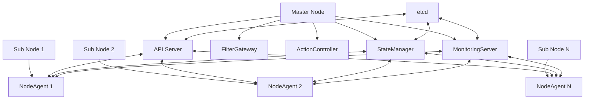
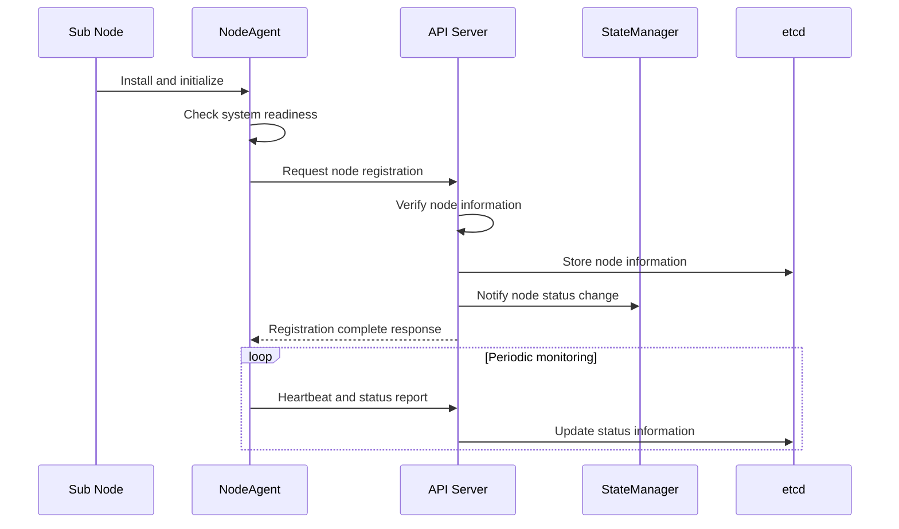
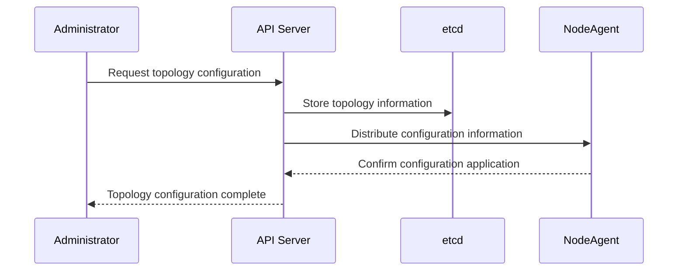

# PICCOLO Clustering System Design Document

**Document No.**: PICCOLO-CLUSTERING-HLD-2025-001  
**Version**: 1.0  
**Date**: 2025-09-04  
**Author**: PICCOLO Team  
**Classification**: HLD (High-Level Design)

## 1. Project Overview

**Project Name**: PICCOLO Clustering System  
**Purpose/Background**: Development of a lightweight container orchestration cluster system optimized for embedded environments  
**Key Features**: Node management, cluster configuration, status monitoring, inter-node communication  
**Target Users**: Embedded system developers, administrators, operators

### 1.1 Purpose

The PICCOLO Clustering System is designed to implement a distributed container management system optimized for embedded environments.

1. Provide a lightweight cluster architecture that operates efficiently in resource-constrained environments  
2. Implement seamless communication and status management between master and sub nodes  
3. Build a cluster system resilient to network instability  
4. Provide an operational model optimized for small-scale clusters

### 1.2 Key Features

1. **Node Management**
   - Manage master-sub node structure
   - Node registration and authentication
   - Node status monitoring and management
   - Node system readiness verification

2. **Cluster Topology Management**
   - Configure embedded cluster topology
   - Configure hybrid cloud connections
   - Connect multiple embedded clusters
   - Configure geographically distributed clusters

3. **State Synchronization**
   - Manage state information based on etcd
   - Synchronize state information between nodes
   - Detect and notify state changes
   - Support offline mode and resynchronization upon reconnection

4. **Deployment and Operations**
   - Automatic deployment and installation of NodeAgent
   - System checks and readiness verification
   - Heartbeat-based node status monitoring
   - Fault detection and recovery

### 1.3 Scope

- Small-scale embedded clusters of 2–10 nodes  
- Communication management between master and sub nodes  
- Integration between cloud nodes and embedded nodes  
- Podman-based container monitoring and management

## 2. Technologies and Environment

**Main Languages/Frameworks**: Rust, Bash scripts  
**Other Libraries/Tools**: gRPC, etcd, Podman, systemd  
**Deployment/Operation Environment**: Embedded Linux, cloud environment (hybrid)

## 3. Architecture

The PICCOLO Clustering System is based on a master-sub node structure and adopts a lightweight design optimized for embedded environments.

### 3.1 System Structure

Overall structure of the clustering system:



### 3.2 Core Components

| Component | Role | Interaction |
|-----------|------|-------------|
| API Server | Cluster management, node registration, policy distribution | NodeAgent, StateManager, etcd |
| NodeAgent | Node status monitoring, communication with master node | API Server, StateManager, MonitoringServer |
| StateManager | Cluster state management and synchronization | API Server, NodeAgent, etcd |
| etcd | Cluster state information storage | All components |
| Installation Script | Deploy and configure NodeAgent | Node system |
| System Check Script | Verify node readiness | Node system |

### 3.3 Technology Stack

| Layer | Technology | Description |
|-------|------------|-------------|
| Core Service | Rust | High-performance, memory-safe core service implementation language |
| Communication Protocol | gRPC | Efficient protocol for master-sub node communication |
| State Store | etcd | Distributed key-value store for cluster state management |
| Container Runtime | Podman | Daemonless lightweight container management tool |
| Service Management | systemd | Node service management and auto-start configuration |
| Deployment Tool | Bash scripts | Automation tool for node installation and configuration |

## 4. Requirements

### 4.1 Functional Requirements

1. Provide efficient communication structure between master and sub nodes  
2. Provide node registration and authentication mechanism  
3. Implement node status monitoring and reporting  
4. Provide system readiness verification mechanism  
5. Provide cluster topology configuration and management  
6. Implement inter-node state synchronization mechanism  
7. Support fault detection and recovery process  
8. Support hybrid cloud connection configuration

### 4.2 Non-Functional Requirements

1. **Performance**
   - Lightweight design to run on minimal hardware specs
   - Complete node registration and activation within 30 seconds
   - Detect and propagate node status changes within 5 seconds

2. **Security**
   - Node authentication and authorization
   - Encrypted communication (TLS-based)
   - Secure certificate management

3. **Scalability**
   - Stable expansion up to at least 10 nodes
   - Support dynamic addition of cloud nodes
   - Support various network environments

4. **Reliability**
   - Mechanisms to handle network instability
   - Automatic recovery in case of node failure
   - Local operation support in offline mode

## 5. Feature Details

### 5.1 Node Management

Node management, the core function of the PICCOLO Clustering System, includes node registration, authentication, status monitoring, and control.

#### 5.1.1 Workflow



#### 5.1.2 Core Algorithm/Logic

Node registration and management process:

```
1. Install NodeAgent on sub node
2. Perform system readiness check
3. Send registration request to master node API Server
4. Perform node authentication and authorization
5. Store node information in etcd
6. Update cluster topology
7. Start periodic heartbeat and status reporting
8. Notify StateManager upon status change detection
```

### 5.2 Cluster Topology Management

PICCOLO supports various cluster topologies for different embedded environments.

#### 5.2.1 Workflow



#### 5.2.2 Supported Topology Types

1. **Basic Embedded Topology**: Single master node with a few sub nodes  
2. **Edge-Cloud Hybrid Topology**: Connect local embedded cluster with cloud nodes  
3. **Multi-Embedded Cluster Topology**: Multiple embedded clusters connected to an upper master node  
4. **Geographically Distributed Topology**: Integrate geographically dispersed embedded systems

## 6. Data Model

### 6.1 Core Data Structures

```yaml
# Node information structure
Node:
  id: string                 # Unique node identifier
  name: string               # Node name
  ip: string                 # Node IP address
  role: "master" | "sub"     # Node role
  status: NodeStatus         # Node status
  resources:                 # Node resource information
    cpu: number              # CPU cores
    memory: number           # Memory size (MB)
    disk: number             # Disk size (GB)
  created_at: timestamp      # Creation time
  last_heartbeat: timestamp  # Last heartbeat time

# Cluster topology structure
ClusterTopology:
  id: string                 # Cluster ID
  name: string               # Cluster name
  type: TopologyType         # Topology type
  master_nodes: Node[]       # List of master nodes
  sub_nodes: Node[]          # List of sub nodes
  parent_cluster: string     # Parent cluster ID (for hierarchical structure)
  config: object             # Cluster configuration information
```

### 6.2 State Management

| State | Description | Transition Condition |
|-------|-------------|----------------------|
| Pending | Node waiting for registration | After node registration request |
| Initializing | Node being initialized | After registration approval, during configuration |
| Ready | Active node | Initialization complete, heartbeat normal |
| NotReady | Node with issues | Heartbeat failure, insufficient resources |
| Maintenance | Node under maintenance | State change by administrator |
| Terminating | Node being removed | After node removal request |

## 7. Interfaces

### 7.1 API Interfaces

#### 7.1.1 REST API

| Endpoint | Method | Description | Request Format | Response Format |
|----------|--------|-------------|----------------|-----------------|
| `/api/v1/nodes` | GET | Get all node information | - | `Node[]` |
| `/api/v1/nodes/{id}` | GET | Get specific node information | - | `Node` |
| `/api/v1/nodes/register` | POST | Request node registration | `NodeRegistrationRequest` | `NodeRegistrationResponse` |
| `/api/v1/topology` | GET | Get cluster topology | - | `ClusterTopology` |
| `/api/v1/topology` | PUT | Update cluster topology | `ClusterTopology` | `ClusterTopology` |

#### 7.1.2 gRPC API

gRPC interface between NodeAgent and API Server:

```protobuf
service NodeAgentService {
  rpc RegisterNode(NodeRegistrationRequest) returns (NodeRegistrationResponse);
  rpc ReportStatus(StatusReport) returns (StatusAck);
  rpc Heartbeat(HeartbeatRequest) returns (HeartbeatResponse);
  rpc ReceiveConfig(ConfigRequest) returns (ConfigResponse);
}

message NodeRegistrationRequest {
  string node_id = 1;
  string hostname = 2;
  string ip_address = 3;
  NodeRole role = 4;
  ResourceInfo resources = 5;
  Credentials credentials = 6;
}

message StatusReport {
  string node_id = 1;
  NodeStatus status = 2;
  map<string, string> metrics = 3;
  repeated ContainerStatus containers = 4;
  repeated AlertInfo alerts = 5;
}
```

### 7.2 Internal Interfaces

Internal interfaces between clustering components:

1. **API Server - StateManager**
   - Node status change notifications
   - Cluster configuration change synchronization

2. **API Server - etcd**
   - Store and retrieve node information
   - Manage cluster topology information

3. **NodeAgent - System Monitoring**
   - Monitor Podman container status
   - Monitor system resource usage
   - Check hardware status

## 8. Performance and Scalability

### 8.1 Performance Requirements

1. **Heartbeat and Status Reporting**
   - Default interval: 10 seconds
   - Minimum interval: 5 seconds (considering resource load)
   - Timeout: 30 seconds (switch to NotReady after 3 consecutive failures)

2. **Resource Usage**
   - NodeAgent memory usage: max 50MB
   - CPU usage: <1% idle, up to 5% active
   - Network bandwidth: up to 100KB/s

### 8.2 Scalability Strategy

1. **Node Scaling**
   - Gradual expansion: from small (2–5 nodes) to medium (10+ nodes)
   - Master node load balancing: consider multi-master structure beyond certain scale

2. **Multi-Cluster Connection**
   - Hierarchical cluster structure: manage multiple clusters via upper master node
   - Inter-cluster linkage: share data and policies between independent clusters

3. **Cloud Integration**
   - Hybrid deployment: integrated management of cloud and embedded nodes
   - Dynamic scaling: support auto-scaling in cloud environments

## 9. Security

1. **Authentication and Authorization**
   - TLS-based node authentication
   - Initial authentication token during node registration
   - Role-based access control (separate master/sub node permissions)

2. **Communication Security**
   - Apply TLS to all gRPC communications
   - API endpoint authentication and encryption
   - Automatic certificate renewal mechanism

3. **Data Security**
   - Encrypt etcd storage
   - Store sensitive information separately
   - Access logging and audit trail

## 10. Fault Handling and Recovery

1. **Node Failure Detection**
   - Heartbeat-based failure detection
   - Active status checks
   - Alerts and logging

2. **Automatic Recovery Mechanism**
   - Automatic restart of NodeAgent
   - Connection recovery attempts
   - Step-by-step recovery procedure

3. **Manual Recovery Procedure**
   - Administrator intervention process
   - Force node re-registration
   - Cluster reconfiguration

## 11. Monitoring and Logging

1. **Status Monitoring**
   - Real-time node status monitoring
   - Track resource usage
   - Visualize cluster topology

2. **Logging Strategy**
   - Distributed logging system
   - Adjustable log levels
   - Separate logging for critical events
   - Periodic log rotation

3. **Alert System**
   - Critical event alerts
   - Threshold-based alerts
   - Configurable alert channels (email, messaging systems)

## 12. Deployment and Operations

1. **Installation and Deployment**
   - Manual setup of master node
   - Automatic deployment script for sub nodes
   - Provide configuration file templates

2. **Upgrade Strategy**
   - Support rolling updates
   - Verify version compatibility
   - Rollback mechanism

3. **Operational Guidelines**
   - Cluster status check procedure
   - Troubleshooting guide
   - Performance optimization tips

## 13. Constraints and Limitations

1. **Scale Constraints**
   - Optimized for up to 10 nodes (more nodes require performance testing)
   - Potential bottleneck in single master node structure

2. **Network Constraints**
   - Performance degradation in high-latency networks
   - Limited connectivity between fully isolated networks

3. **Resource Constraints**
   - Minimum specs: 512MB RAM, 1GHz CPU
   - Monitoring features may be limited on low-spec devices

## 14. Future Improvements

1. **Multi-Master Support**
   - Multi-master architecture for large-scale clusters
   - High availability for master nodes

2. **Advanced Networking Features**
   - Support for mesh networks
   - P2P communication optimization
   - Automatic recovery from network partitioning

3. **Management Interface Improvements**
   - Web-based management console
   - Cluster visualization tools
   - Automated operation scripts

## 15. References

- PICCOLO Framework Design Document  
- API Server Design Document  
- NodeAgent Design Document  
- etcd Official Documentation (https://etcd.io/docs/)  
- Podman Official Documentation (https://podman.io/docs/)

## Appendix

### A. Glossary

| Term | Definition |
|------|------------|
| Master Node | Central node managing the cluster, running core services like API Server, StateManager |
| Sub Node | Worker node managed by the master node, running only NodeAgent |
| NodeAgent | Agent running on each node, monitoring node status and communicating with the master node |
| etcd | Distributed key-value store used for storing cluster state information |
| Podman | Daemonless container management tool, used as a Docker alternative |
| Topology | Structure and relationships of node connections within a cluster |
| Heartbeat | Periodic signal to check node activity status |

### B. Change History

| Version | Date | Change | Author |
|---------|------|--------|--------|
| 1.0 | 2025-09-04 | Initial draft | PICCOLO Team |

