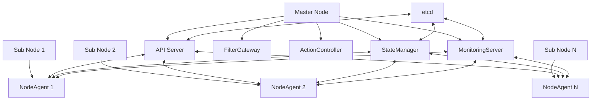
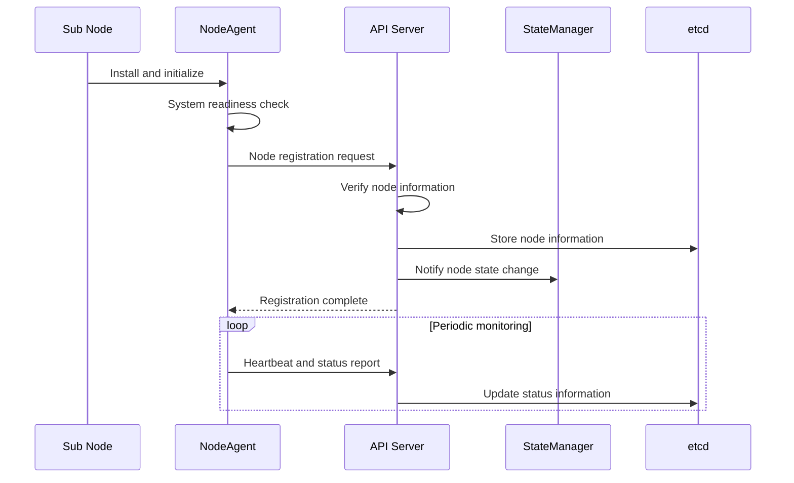
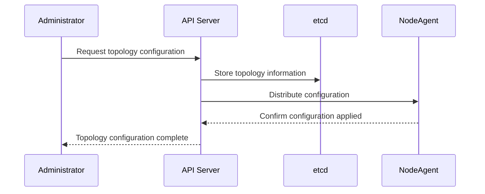

<!--
* SPDX-FileCopyrightText: Copyright 2024 LG Electronics Inc.
* SPDX-License-Identifier: Apache-2.0
-->
# PICCOLO Clustering System Design Document

**Document No.**: PICCOLO-CLUSTERING-HLD-2025-001  
**Version**: 1.0  
**Date**: 2025-09-04  
**Author**: PICCOLO Team  
**Classification**: HLD (High-Level Design)

## 1. Project Overview

**Project Name**: PICCOLO Clustering System  
**Purpose/Background**: Development of a lightweight container orchestration cluster system optimized for embedded environments  
**Key Features**: Node management, cluster configuration, status monitoring, inter-node communication  
**Target Users**: Embedded system developers, administrators, operators

### 1.1 Purpose

The PICCOLO Clustering System is designed to implement a distributed container management system optimized for embedded environments.

1. Provide a lightweight cluster architecture that operates efficiently in resource-constrained environments  
2. Implement seamless communication and status management between master and sub nodes  
3. Build a cluster system resilient to network instability  
4. Provide an operational model optimized for small-scale clusters  

### 1.2 Key Features

1. **Node Management**
   - Manage master-sub node structure
   - Node registration and authentication
   - Node status monitoring and management
   - Node system readiness verification

2. **Cluster Topology Management**
   - Configure embedded cluster topology
   - Configure hybrid cloud connections
   - Connect multiple embedded clusters
   - Configure geographically distributed clusters

3. **State Synchronization**
   - Manage state information based on etcd
   - Synchronize state information between nodes
   - Detect and notify state changes
   - Support offline mode and resynchronization upon reconnection

4. **Deployment and Operations**
   - Automatic deployment and installation of NodeAgent
   - System checks and readiness verification
   - Heartbeat-based node status monitoring
   - Fault detection and recovery

### 1.3 Scope

- Small-scale embedded clusters of 2–10 nodes  
- Communication management between master and sub nodes  
- Integration between cloud nodes and embedded nodes  
- Podman-based container monitoring and management  

## 2. Technologies and Environment

**Main Languages/Frameworks**: Rust, Bash scripts  
**Other Libraries/Tools**: gRPC, etcd, Podman, systemd  
**Deployment/Operation Environment**: Embedded Linux, cloud environment (hybrid)

## 3. Architecture

The PICCOLO Clustering System is based on a master-sub node structure and adopts a lightweight design optimized for embedded environments.

### 3.1 System Structure



### 3.2 Core Components

| Component | Role | Interaction |
|-----------|------|-------------|
| API Server | Cluster management, node registration, policy distribution | NodeAgent, StateManager, etcd |
| NodeAgent | Node status monitoring, communication with master node | API Server, StateManager, MonitoringServer |
| StateManager | Cluster state management and synchronization | API Server, NodeAgent, etcd |
| etcd | Cluster state information storage | All components |
| Installation Script | Deploy and configure NodeAgent | Node system |
| System Check Script | Verify node readiness | Node system |

### 3.3 Technology Stack

| Layer | Technology | Description |
|-------|------------|-------------|
| Core Service | Rust | High-performance, memory-safe core service implementation language |
| Communication Protocol | gRPC | Efficient protocol for master-sub node communication |
| State Storage | etcd | Distributed key-value store for cluster state management |
| Container Runtime | Podman | Daemonless lightweight container management tool |
| Service Management | systemd | Node service management and auto-start configuration |
| Deployment Tool | Bash scripts | Automation tool for node installation and configuration |

## 4. Requirements

### 4.1 Functional Requirements

1. Provide efficient communication structure between master and sub nodes  
2. Provide node registration and authentication mechanism  
3. Implement node status monitoring and reporting  
4. Provide system readiness verification mechanism  
5. Provide cluster topology configuration and management  
6. Implement inter-node state synchronization mechanism  
7. Support fault detection and recovery process  
8. Support hybrid cloud connection configuration  

### 4.2 Non-Functional Requirements

1. **Performance**
   - Lightweight design to run on minimal hardware specs
   - Complete node registration and activation within 30 seconds
   - Detect and propagate node status changes within 5 seconds

2. **Security**
   - Node authentication and authorization
   - Encrypted communication (TLS-based)
   - Secure certificate management

3. **Scalability**
   - Stable expansion up to at least 10 nodes
   - Dynamic addition of cloud nodes
   - Support for various network environments

4. **Reliability**
   - Mechanisms to handle network instability
   - Automatic recovery in case of node failure
   - Local operation support in offline mode

## 5. Key Feature Details

### 5.1 Node Management

#### 5.1.1 Flow



#### 5.1.2 Core Logic

```
1. Install NodeAgent on sub node
2. Perform system readiness check
3. Send registration request to master node API Server
4. Perform node authentication and authorization
5. Store node information in etcd
6. Update cluster topology
7. Start periodic heartbeat and status reporting
8. Notify StateManager on status change
```

### 5.2 Cluster Topology Management

#### 5.2.1 Flow



#### 5.2.2 Supported Topologies

1. **Basic Embedded Topology**: Single master node with a few sub nodes  
2. **Edge-Cloud Hybrid Topology**: Local embedded cluster connected to cloud nodes  
3. **Multi-Embedded Cluster Topology**: Multiple embedded clusters connected to an upper master node  
4. **Geographically Distributed Topology**: Integrated geographically dispersed embedded systems  

## 6. Data Model

### 6.1 Core Data Structures

```yaml
Node:
  id: string
  name: string
  ip: string
  role: "master" | "sub"
  status: NodeStatus
  resources:
    cpu: number
    memory: number
    disk: number
  created_at: timestamp
  last_heartbeat: timestamp

ClusterTopology:
  id: string
  name: string
  type: TopologyType
  master_nodes: Node[]
  sub_nodes: Node[]
  parent_cluster: string
  config: object
```

### 6.2 State Management

| State | Description | Transition Condition |
|-------|-------------|----------------------|
| Pending | Node awaiting registration | After registration request |
| Initializing | Node initializing | After approval, during setup |
| Ready | Active node | Initialization complete, heartbeat normal |
| NotReady | Node with issues | Heartbeat failure, resource shortage |
| Maintenance | Node under maintenance | Manual change by admin |
| Terminating | Node shutting down | After removal request |

## 7. Interfaces

### 7.1 API Interfaces

#### 7.1.1 gRPC API

```protobuf
service ApiServerService {
  rpc GetNodes(GetNodesRequest) returns (GetNodesResponse);
  rpc GetNode(GetNodeRequest) returns (GetNodeResponse);
  rpc RegisterNode(NodeRegistrationRequest) returns (NodeRegistrationResponse);
  rpc GetTopology(GetTopologyRequest) returns (GetTopologyResponse);
  rpc UpdateTopology(UpdateTopologyRequest) returns (UpdateTopologyResponse);
}
```

#### 7.1.2 NodeAgent gRPC API

```protobuf
service NodeAgentService {
  rpc RegisterNode(NodeRegistrationRequest) returns (NodeRegistrationResponse);
  rpc ReportStatus(StatusReport) returns (StatusAck);
  rpc Heartbeat(HeartbeatRequest) returns (HeartbeatResponse);
  rpc ReceiveConfig(ConfigRequest) returns (ConfigResponse);
}
```

### 7.2 Internal Interfaces

- API Server ↔ StateManager: Node state change notifications, topology sync  
- API Server ↔ etcd: Store/retrieve node and topology info  
- NodeAgent ↔ System Monitoring: Podman container status, resource usage, hardware checks  

## 8. Performance & Scalability

- Heartbeat interval: default 10s, min 5s, timeout 30s  
- NodeAgent memory ≤ 50MB, CPU idle <1%, active ≤5%  
- Network ≤ 100KB/s  

Scaling strategies: gradual node scaling, multi-cluster hierarchy, hybrid cloud integration  

## 9. Security

- TLS-based node authentication  
- Role-based access control  
- Encrypted gRPC communication  
- etcd encryption, audit logging  

## 10. Fault Handling & Recovery

- Heartbeat-based failure detection  
- Auto-restart NodeAgent  
- Manual recovery procedures  

## 11. Monitoring & Logging

- Real-time node monitoring  
- Distributed logging with rotation  
- Event-based alerts  

## 12. Deployment & Operations

- Manual master setup, automated sub node deployment  
- Rolling updates, rollback support  
- Operational guidelines  

## 13. Constraints & Limitations

- Optimized for ≤10 nodes  
- Single master bottleneck possible  
- Network latency impact  
- Minimum spec: 512MB RAM, 1GHz CPU  

## 14. Future Improvements

- Multi-master support  
- Advanced networking (mesh, P2P)  
- Web-based management console  

## 15. References

- PICCOLO framework design docs  
- API Server design docs  
- NodeAgent design docs  
- etcd docs: https://etcd.io/docs/  
- Podman docs: https://podman.io/docs/  

## Appendix

### A. Glossary

| Term | Definition |
|------|------------|
| Master Node | Central node managing the cluster |
| Sub Node | Worker node managed by master |
| NodeAgent | Agent running on each node |
| etcd | Distributed key-value store |
| Podman | Daemonless container tool |
| Topology | Node connection structure |
| Heartbeat | Periodic signal for liveness check |

### B. Change History

| Version | Date | Change | Author |
|---------|------|--------|--------|
| 1.0 | 2025-09-04 | Initial draft | PICCOLO Team |

