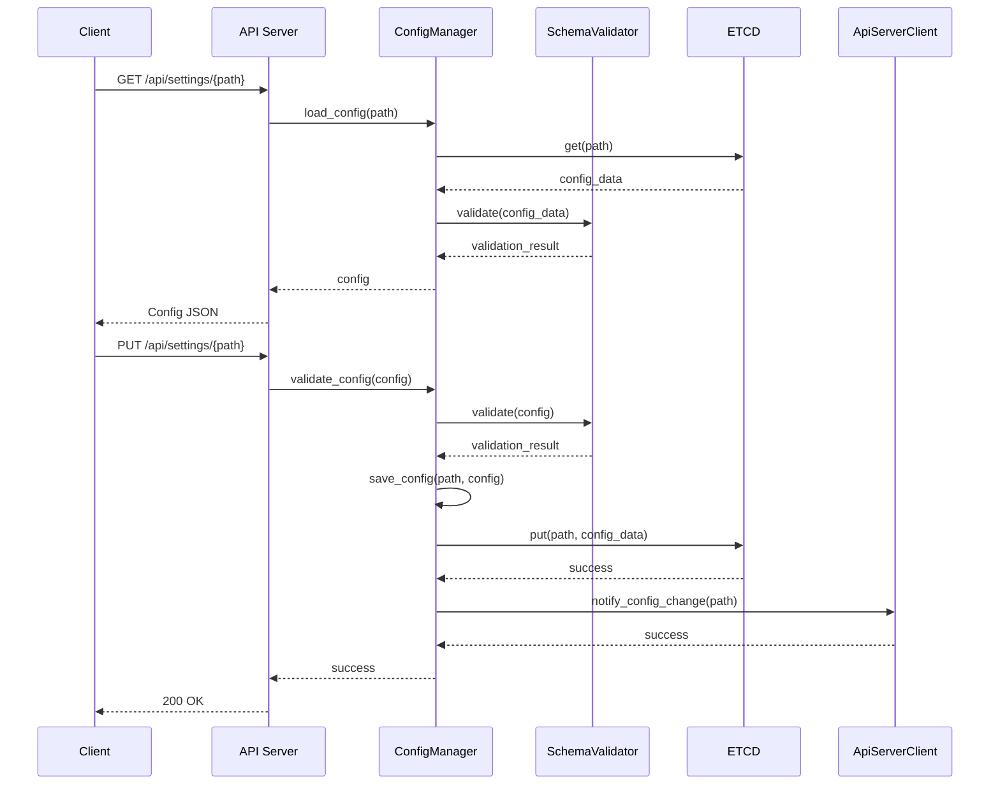
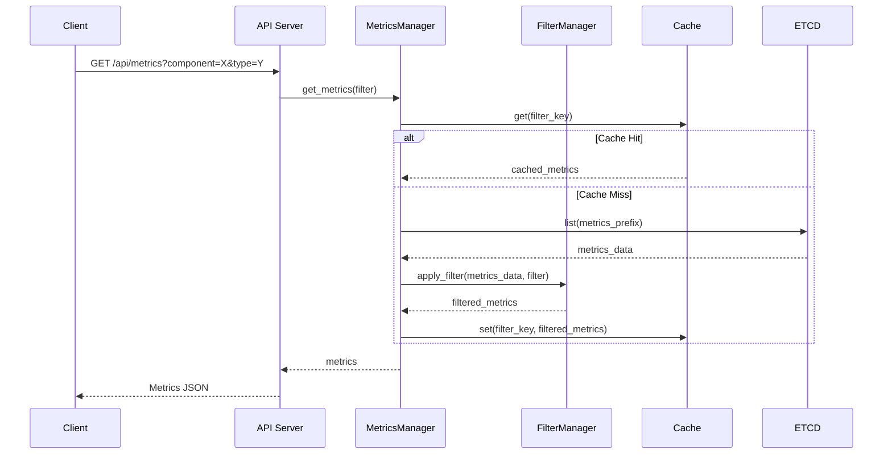
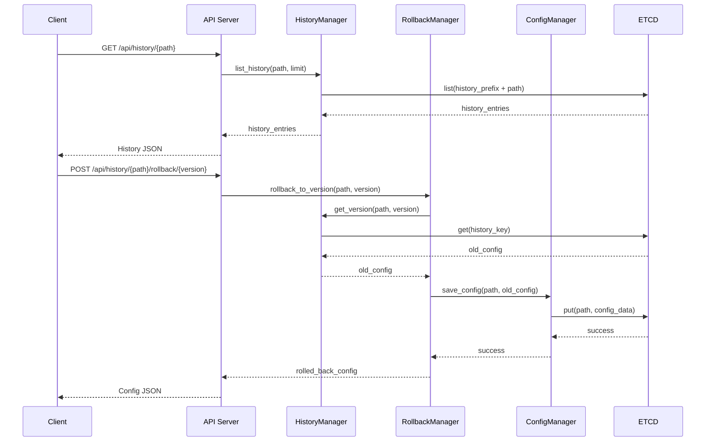

<!--
* SPDX-FileCopyrightText: Copyright 2024 LG Electronics Inc.
* SPDX-License-Identifier: Apache-2.0
-->
# Settings Service Detailed Design Document (LLD)

**Document Number**: PICCOLO-SETTINGS-LLD-2025-001  
**Version**: 1.0  
**Date**: 2025-08-11  
**Author**: PICCOLO Team  
**Classification**: LLD (Low-Level Design)

## 1. Overview

Settings Service is a core component in the PICCOLO framework responsible for system configuration management and providing metric information. This document provides detailed design specifications for implementing the functionality defined in the HLD.

### 1.1 Purpose and Scope

This document includes:
- Detailed implementation methods for each module of the Settings Service
- Class and function definitions
- Data structures and algorithms
- Interface specifications
- Error handling mechanisms
- Detailed flow of key sequences

### 1.2 Key Functionality Summary

1. **Configuration Management** - Creation, modification, deletion, validation, and application of YAML-based configuration files
2. **Metrics Information Provision** - Filtering of metric data stored in ETCD and providing REST API
3. **Multiple Interfaces** - Web UI and CLI interfaces
4. **Change History Management** - Configuration change history tracking and rollback functionality

## 2. System Architecture

### 2.1 Component Structure

Settings Service consists of the following main modules:

```
settingsservice/
├── src/
│   ├── main.rs                 # Entry point and service initialization
│   ├── config/                 # Configuration management module
│   │   └── mod.rs              # All configuration management, validation, schema definition
│   ├── history/                # History management module
│   │   └── mod.rs              # All history storage/retrieval, diff calculation, rollback
│   ├── metrics/                # Metrics management module
│   │   └── mod.rs              # All metrics data retrieval/filtering, caching
│   ├── storage/                # Storage management module
│   │   └── mod.rs              # ETCD client and data model implementation
│   ├── api/                    # API server module
│   │   ├── mod.rs              # API base definitions and common functionality
│   │   ├── rest/               # REST API implementation
│   │   │   └── mod.rs          # All API endpoints and server implementation
│   │   └── client/             # Client implementation
│   │       └── mod.rs          # API server client implementation
│   ├── web/                    # Web interface module
│   │   ├── mod.rs              # Web server and routing configuration
│   │   └── ui/                 # UI components
│   │       └── mod.rs          # All UI component implementation
│   ├── cli/                    # CLI module
│   │   └── mod.rs              # All CLI commands, shell, formatting implementation
│   └── utils/                  # Utility module
│       └── mod.rs              # All error handling, logging, YAML processing
└── Cargo.toml                  # Dependencies and metadata
```

### 2.2 Module Description

The main functions and areas of responsibility for each module are as follows:

1. **config**: Responsible for system configuration file management. Handles loading, parsing, validating, and saving YAML files.
2. **history**: Manages configuration change history, calculates differences between versions, and provides rollback functionality.
3. **metrics**: Provides functionality to query and filter metric data stored in ETCD.
4. **storage**: Handles communication with ETCD and serves as a persistent store for configuration and metric data.
5. **api**: Implements a REST API server and manages communication with external systems.
6. **web**: Provides a web-based UI allowing users to manage configurations and view metrics.
7. **cli**: Provides a command-line interface to support scripting and automation.
8. **utils**: Provides common utility functions such as error handling, logging, and YAML processing.

### 2.3 Service Dependencies

Settings Service interacts with the following external systems:

1. **ETCD**: Persistent storage for configuration and metric data
2. **API Server**: Propagation of configuration changes
3. **Monitoring Server**: Source of metric data

## 3. Detailed Design by Module

### 3.1 Config Module

#### 3.1.1 Class and Function Definitions

```rust
// mod.rs - All configuration management functionality
pub struct ConfigManager {
    etcd_client: Arc<EtcdClient>,
}

impl ConfigManager {
    pub fn new(etcd_client: Arc<EtcdClient>) -> Self;
    pub async fn load_config(&self, config_path: &str) -> Result<Config, ConfigError>;
    pub async fn save_config(&self, config_path: &str, config: &Config) -> Result<(), ConfigError>;
    pub async fn validate_config(&self, config: &Config) -> Result<ValidationResult, ConfigError>;
    pub async fn apply_config(&self, config: &Config) -> Result<ApplyResult, ConfigError>;
    pub async fn list_configs(&self, prefix: &str) -> Result<Vec<ConfigSummary>, ConfigError>;
    pub async fn delete_config(&self, config_path: &str) -> Result<(), ConfigError>;
}

// SchemaValidator - implemented in the same file
pub struct SchemaValidator {
    schemas: HashMap<String, JsonSchema>,
}

impl SchemaValidator {
    pub fn new() -> Self;
    pub fn load_schema(&mut self, schema_type: &str, schema: &str) -> Result<(), SchemaError>;
    pub fn validate(&self, schema_type: &str, data: &Value) -> ValidationResult;
}

// JsonSchema - implemented in the same file
pub struct JsonSchema {
    schema: Value,
}

impl JsonSchema {
    pub fn new(schema: Value) -> Self;
    pub fn validate(&self, data: &Value) -> ValidationResult;
}
```

#### 3.1.2 Data Structures

```rust
// Configuration data structures
pub struct Config {
    pub path: String,
    pub content: Value,
    pub metadata: ConfigMetadata,
}

pub struct ConfigMetadata {
    pub version: u64,
    pub created_at: DateTime<Utc>,
    pub modified_at: DateTime<Utc>,
    pub schema_type: String,
}

pub struct ConfigSummary {
    pub path: String,
    pub schema_type: String,
    pub version: u64,
    pub modified_at: DateTime<Utc>,
}

pub struct ValidationResult {
    pub is_valid: bool,
    pub errors: Vec<ValidationError>,
}

pub struct ValidationError {
    pub path: String,
    pub message: String,
    pub severity: ValidationSeverity,
}

pub enum ValidationSeverity {
    Error,
    Warning,
    Info,
}

pub struct ApplyResult {
    pub success: bool,
    pub message: String,
    pub affected_components: Vec<String>,
}
```

### 3.2 History Module

#### 3.2.1 Class and Function Definitions

```rust
// mod.rs - All history management functionality
pub struct HistoryManager {
    etcd_client: Arc<EtcdClient>,
}

impl HistoryManager {
    pub fn new(etcd_client: Arc<EtcdClient>) -> Self;
    pub async fn record_change(&self, config_path: &str, old_config: Option<&Config>, new_config: &Config) -> Result<u64, HistoryError>;
    pub async fn list_history(&self, config_path: &str, limit: usize) -> Result<Vec<HistoryEntry>, HistoryError>;
    pub async fn get_version(&self, config_path: &str, version: u64) -> Result<Config, HistoryError>;
    pub fn calculate_diff(old_config: &Value, new_config: &Value) -> Vec<DiffEntry>;
    pub fn format_diff(diff: &[DiffEntry]) -> String;
    pub async fn rollback_to_version(&self, config_path: &str, version: u64, config_manager: &ConfigManager) -> Result<Config, RollbackError>;
}
```

#### 3.2.2 Data Structures

```rust
pub struct HistoryEntry {
    pub config_path: String,
    pub version: u64,
    pub timestamp: DateTime<Utc>,
    pub author: String,
    pub comment: Option<String>,
}

pub enum DiffOperation {
    Add,
    Remove,
    Change,
}

pub struct DiffEntry {
    pub path: String,
    pub operation: DiffOperation,
    pub old_value: Option<Value>,
    pub new_value: Option<Value>,
}
```

### 3.3 Metrics Module

#### 3.3.1 Class and Function Definitions

```rust
// mod.rs - All metrics management functionality
pub struct MetricsManager {
    etcd_client: Arc<EtcdClient>,
    cache: RwLock<HashMap<String, CacheEntry<Metric>>>,
    ttl: Duration,
}

impl MetricsManager {
    pub fn new(etcd_client: Arc<EtcdClient>, ttl: Duration) -> Self;
    pub async fn get_metrics(&self, filter: Option<&MetricsFilter>) -> Result<Vec<Metric>, MetricsError>;
    pub async fn get_metric_by_id(&self, id: &str) -> Result<Metric, MetricsError>;
    pub async fn get_metrics_by_component(&self, component: &str) -> Result<Vec<Metric>, MetricsError>;
    pub async fn get_metrics_by_type(&self, metric_type: &str) -> Result<Vec<Metric>, MetricsError>;
    
    // Filter management functions
    pub async fn create_filter(&self, filter: &MetricsFilter) -> Result<String, FilterError>;
    pub async fn get_filter(&self, id: &str) -> Result<MetricsFilter, FilterError>;
    pub async fn update_filter(&self, id: &str, filter: &MetricsFilter) -> Result<(), FilterError>;
    pub async fn delete_filter(&self, id: &str) -> Result<(), FilterError>;
    pub async fn list_filters(&self) -> Result<Vec<FilterSummary>, FilterError>;
    
    // Cache management functions
    pub async fn get_cached(&self, key: &str) -> Option<Metric>;
    pub async fn set_cached(&self, key: &str, metric: Metric);
    pub async fn invalidate_cache(&self, key: &str);
    pub async fn clear_cache(&self);
}
```

#### 3.3.2 Data Structures

```rust
pub struct Metric {
    pub id: String,
    pub component: String,
    pub metric_type: String,
    pub labels: HashMap<String, String>,
    pub value: MetricValue,
    pub timestamp: DateTime<Utc>,
}

pub enum MetricValue {
    Counter(u64),
    Gauge(f64),
    Histogram(Vec<HistogramBucket>),
    Summary(Vec<SummaryQuantile>),
}

pub struct HistogramBucket {
    pub upper_bound: f64,
    pub count: u64,
}

pub struct SummaryQuantile {
    pub quantile: f64,
    pub value: f64,
}

pub struct MetricsFilter {
    pub id: String,
    pub name: String,
    pub components: Option<Vec<String>>,
    pub metric_types: Option<Vec<String>>,
    pub label_selectors: Option<HashMap<String, String>>,
    pub time_range: Option<TimeRange>,
}

pub struct TimeRange {
    pub start: DateTime<Utc>,
    pub end: Option<DateTime<Utc>>,
}

pub struct FilterSummary {
    pub id: String,
    pub name: String,
    pub component_count: usize,
    pub metric_type_count: usize,
}

pub struct CacheEntry<T> {
    pub data: T,
    pub expiry: Instant,
}
```

### 3.4 Storage Module

#### 3.4.1 Class and Function Definitions

```rust
// mod.rs - All storage management functionality
pub struct EtcdClient {
    client: Client,
    endpoints: Vec<String>,
}

impl EtcdClient {
    pub fn new(endpoints: Vec<String>) -> Result<Self, EtcdError>;
    pub async fn get(&self, key: &str) -> Result<Option<KeyValue>, EtcdError>;
    pub async fn put(&self, key: &str, value: &str) -> Result<(), EtcdError>;
    pub async fn delete(&self, key: &str) -> Result<bool, EtcdError>;
    pub async fn list(&self, prefix: &str) -> Result<Vec<KeyValue>, EtcdError>;
    pub async fn watch(&self, prefix: &str) -> EtcdWatcher;
    pub async fn transaction(&self, txn: &Transaction) -> Result<TxnResponse, EtcdError>;
}

pub struct EtcdWatcher {
    inner: Pin<Box<dyn Stream<Item = Result<WatchEvent, EtcdError>> + Send>>,
}

impl EtcdWatcher {
    pub async fn next(&mut self) -> Option<Result<WatchEvent, EtcdError>>;
    pub fn close(self);
}

// Data model structures (implemented in the same file)
pub struct KeyValue {
    pub key: Vec<u8>,
    pub value: Vec<u8>,
    pub create_revision: i64,
    pub mod_revision: i64,
    pub version: i64,
}

pub struct Transaction {
    pub compare: Vec<Compare>,
    pub success: Vec<TxnOp>,
    pub failure: Vec<TxnOp>,
}

pub enum Compare {
    Value(String, CompareOp, Vec<u8>),
    Version(String, CompareOp, i64),
    CreateRevision(String, CompareOp, i64),
    ModRevision(String, CompareOp, i64),
}

pub enum CompareOp {
    Equal,
    Greater,
    Less,
}

pub enum TxnOp {
    Put(String, Vec<u8>),
    Get(String),
    Delete(String),
}

pub enum WatchEvent {
    Put(KeyValue),
    Delete(KeyValue),
}
```

### 3.5 API Module

#### 3.5.1 Class and Function Definitions

```rust
// api/mod.rs - API module base definitions
pub struct ApiServer {
    config: ApiServerConfig,
    router: Router,
}

impl ApiServer {
    pub fn new(config: ApiServerConfig) -> Self;
    pub fn configure_routes(&mut self);
    pub async fn start(&self) -> Result<(), ApiError>;
    pub async fn stop(&self) -> Result<(), ApiError>;
}

// api/rest/mod.rs - REST API implementation
pub struct RestApiHandler {
    metrics_manager: Arc<MetricsManager>,
    config_manager: Arc<ConfigManager>,
    history_manager: Arc<HistoryManager>,
}

impl RestApiHandler {
    pub fn new(
        metrics_manager: Arc<MetricsManager>,
        config_manager: Arc<ConfigManager>,
        history_manager: Arc<HistoryManager>
    ) -> Self;
    
    // Metrics API handlers
    pub async fn get_metrics(&self, query: Query<MetricsQuery>) -> Result<Json<Vec<Metric>>, ApiError>;
    pub async fn get_metric_by_id(&self, id: String) -> Result<Json<Metric>, ApiError>;
    pub async fn get_filters(&self) -> Result<Json<Vec<FilterSummary>>, ApiError>;
    pub async fn get_filter(&self, id: String) -> Result<Json<MetricsFilter>, ApiError>;
    pub async fn create_filter(&self, filter: Json<MetricsFilter>) -> Result<Json<FilterResponse>, ApiError>;
    pub async fn update_filter(&self, id: String, filter: Json<MetricsFilter>) -> Result<StatusCode, ApiError>;
    pub async fn delete_filter(&self, id: String) -> Result<StatusCode, ApiError>;
    
    // Settings API handlers
    pub async fn get_config(&self, path: String) -> Result<Json<Config>, ApiError>;
    pub async fn list_configs(&self, prefix: Option<String>) -> Result<Json<Vec<ConfigSummary>>, ApiError>;
    pub async fn create_config(&self, config: Json<Config>) -> Result<StatusCode, ApiError>;
    pub async fn update_config(&self, path: String, config: Json<Config>) -> Result<StatusCode, ApiError>;
    pub async fn delete_config(&self, path: String) -> Result<StatusCode, ApiError>;
    pub async fn validate_config(&self, config: Json<Config>) -> Result<Json<ValidationResult>, ApiError>;
    
    // History API handlers
    pub async fn get_history(&self, path: String, limit: Option<usize>) -> Result<Json<Vec<HistoryEntry>>, ApiError>;
    pub async fn get_version(&self, path: String, version: u64) -> Result<Json<Config>, ApiError>;
    pub async fn rollback(&self, path: String, version: u64) -> Result<Json<Config>, ApiError>;
    pub async fn diff_versions(&self, path: String, version1: u64, version2: u64) -> Result<Json<Vec<DiffEntry>>, ApiError>;
}

// api/client/mod.rs - API client implementation
pub struct ApiClient {
    base_url: String,
    client: reqwest::Client,
}

impl ApiClient {
    pub fn new(base_url: String) -> Self;
    pub async fn notify_config_change(&self, config_path: &str) -> Result<(), ClientError>;
    pub async fn get_status(&self) -> Result<ApiServerStatus, ClientError>;
    pub async fn get_metrics(&self, query: &MetricsQuery) -> Result<Vec<Metric>, ClientError>;
    pub async fn get_config(&self, path: &str) -> Result<Config, ClientError>;
    pub async fn save_config(&self, config: &Config) -> Result<(), ClientError>;
    pub async fn get_history(&self, path: &str, limit: Option<usize>) -> Result<Vec<HistoryEntry>, ClientError>;
    pub async fn rollback(&self, path: &str, version: u64) -> Result<Config, ClientError>;
}
```

#### 3.5.2 Data Structures

```rust
pub struct ApiServerConfig {
    pub bind_address: String,
    pub bind_port: u16,
    pub tls_enabled: bool,
    pub tls_cert_path: Option<String>,
    pub tls_key_path: Option<String>,
}

pub struct MetricsQuery {
    pub component: Option<String>,
    pub metric_type: Option<String>,
    pub filter_id: Option<String>,
    pub labels: Option<HashMap<String, String>>,
    pub start_time: Option<DateTime<Utc>>,
    pub end_time: Option<DateTime<Utc>>,
}

pub struct FilterResponse {
    pub id: String,
    pub name: String,
}

pub struct ApiServerStatus {
    pub version: String,
    pub uptime: Duration,
    pub connected_clients: u32,
    pub request_count: u64,
}
```

### 3.6 Web Module

#### 3.6.1 Class and Function Definitions

```rust
// web/mod.rs - Web server and routing implementation
pub struct WebServer {
    config: WebServerConfig,
    router: Router,
    api_client: Arc<ApiClient>,
}

impl WebServer {
    pub fn new(config: WebServerConfig, api_client: Arc<ApiClient>) -> Self;
    pub fn configure_routes(&mut self);
    pub async fn start(&self) -> Result<(), WebError>;
    pub async fn stop(&self) -> Result<(), WebError>;
}

// web/ui/mod.rs - UI component implementation
pub struct UiComponents {
    api_client: Arc<ApiClient>,
}

impl UiComponents {
    pub fn new(api_client: Arc<ApiClient>) -> Self;
    
    // Dashboard component
    pub async fn render_dashboard(&self) -> Html;
    pub async fn handle_dashboard_refresh(&self) -> Result<Vec<Metric>, ComponentError>;
    
    // Config editor component
    pub async fn render_config_editor(&self, config_path: Option<&str>) -> Html;
    pub async fn handle_config_save(&self, config: &Config) -> Result<(), ComponentError>;
    pub async fn handle_config_validate(&self, config: &Config) -> Result<ValidationResult, ComponentError>;
    
    // History browser component
    pub async fn render_history_browser(&self, config_path: &str) -> Html;
    pub async fn handle_history_rollback(&self, config_path: &str, version: u64) -> Result<(), ComponentError>;
    pub async fn handle_history_view_diff(&self, config_path: &str, version1: u64, version2: u64) -> Result<Vec<DiffEntry>, ComponentError>;
    
    // Metrics viewer component
    pub async fn render_metrics_viewer(&self, filter: Option<&MetricsFilter>) -> Html;
    pub async fn handle_metrics_apply_filter(&self, filter: &MetricsFilter) -> Result<Vec<Metric>, ComponentError>;
    pub async fn handle_metrics_save_filter(&self, filter: &MetricsFilter) -> Result<String, ComponentError>;
}
```

### 3.7 CLI Module

#### 3.7.1 Class and Function Definitions

```rust
// cli/mod.rs - All CLI module functionality
pub struct CommandRegistry {
    commands: HashMap<String, Box<dyn Command>>,
    api_client: Arc<ApiClient>,
}

impl CommandRegistry {
    pub fn new(api_client: Arc<ApiClient>) -> Self;
    pub fn register_default_commands(&mut self);
    pub fn execute(&self, args: &[String]) -> Result<(), CommandError>;
    pub fn get_help(&self) -> String;
}

pub trait Command {
    fn name(&self) -> &'static str;
    fn description(&self) -> &'static str;
    fn execute(&self, args: &[String]) -> Result<(), CommandError>;
    fn help(&self) -> String;
}

// Built-in commands (implemented in the same file)
pub struct GetConfigCommand;
pub struct SetConfigCommand;
pub struct ListConfigsCommand;
pub struct GetMetricsCommand;
pub struct FilterMetricsCommand;
pub struct HistoryCommand;
pub struct RollbackCommand;
pub struct HelpCommand;

// Interactive shell (implemented in the same file)
pub struct InteractiveShell {
    registry: Arc<CommandRegistry>,
    history: Vec<String>,
}

impl InteractiveShell {
    pub fn new(registry: Arc<CommandRegistry>) -> Self;
    pub async fn run(&mut self) -> Result<(), ShellError>;
    pub fn handle_line(&mut self, line: &str) -> Result<(), ShellError>;
    pub fn complete(&self, line: &str) -> Vec<String>;
    pub fn load_history(&mut self, path: &Path) -> Result<(), ShellError>;
    pub fn save_history(&self, path: &Path) -> Result<(), ShellError>;
}

// Output formatter (implemented in the same file)
pub struct OutputFormatter;

impl OutputFormatter {
    pub fn format_json(value: &Value, pretty: bool) -> String;
    pub fn format_yaml(value: &Value) -> String;
    pub fn format_table<T: Serialize>(items: &[T], headers: &[&str]) -> String;
    pub fn format_metrics(metrics: &[Metric], format: OutputFormat) -> String;
}

pub enum OutputFormat {
    Json,
    Yaml,
    Table,
    Text,
}
```

### 3.8 Utils Module

#### 3.8.1 Class and Function Definitions

```rust
// utils/mod.rs - All utility module functionality
// Error handling
pub enum ErrorKind {
    ConfigError,
    ValidationError,
    HistoryError,
    MetricsError,
    StorageError,
    ApiError,
    WebError,
    CommandError,
    SystemError,
}

pub struct Error {
    pub kind: ErrorKind,
    pub message: String,
    pub source: Option<Box<dyn std::error::Error + Send + Sync>>,
}

impl Error {
    pub fn new(kind: ErrorKind, message: &str) -> Self;
    pub fn with_source<E>(kind: ErrorKind, message: &str, source: E) -> Self
    where
        E: std::error::Error + Send + Sync + 'static;
}

// Logging (implemented in the same file)
pub struct Logger;

impl Logger {
    pub fn init(config: &LogConfig) -> Result<(), LogError>;
    pub fn debug(target: &str, message: &str);
    pub fn info(target: &str, message: &str);
    pub fn warn(target: &str, message: &str);
    pub fn error(target: &str, message: &str);
}

// YAML processing (implemented in the same file)
pub struct YamlParser;

impl YamlParser {
    pub fn parse(content: &str) -> Result<Value, YamlError>;
    pub fn serialize(value: &Value) -> Result<String, YamlError>;
    pub fn merge(base: &mut Value, overlay: &Value) -> Result<(), YamlError>;
    pub fn path_get(value: &Value, path: &str) -> Option<&Value>;
    pub fn path_set(value: &mut Value, path: &str, new_value: Value) -> Result<(), YamlError>;
}

### 3.9 Deployment and Packaging

#### 3.9.1 Binary Package

The Settings Service will be built as a single binary that includes all required functionality:
- Configuration server
- Web UI
- CLI tool

This binary will be packaged with default configuration files and documentation.

#### 3.9.2 Docker Container

A Docker container will be provided for easy deployment:
- Based on a minimal Alpine Linux image
- Includes the Settings Service binary
- Configured to expose the API port and Web UI port
- Has a health check endpoint
- Configurable via environment variables or mounted config files

#### 3.9.3 Installation Methods

The Settings Service will support the following installation methods:
- Direct binary installation on supported operating systems
- Docker container deployment
- Integration with the PICCOLO system deployment process

#### 3.9.4 System Requirements

- CPU: 1+ cores
- RAM: 128MB minimum
- Disk space: 50MB for the binary, additional space for configuration storage
- Operating systems: Linux (all major distributions)
- Dependencies: None (statically linked)
```

#### 3.8.2 Data Structures

```rust
pub struct LogConfig {
    pub level: LogLevel,
    pub file: Option<String>,
    pub stdout: bool,
    pub format: LogFormat,
}

pub enum LogLevel {
    Debug,
    Info,
    Warn,
    Error,
}

pub enum LogFormat {
    Text,
    Json,
}

pub struct YamlError {
    pub message: String,
    pub line: Option<usize>,
    pub column: Option<usize>,
}
```

## 4. Key Sequence Flows

### 4.1 Configuration File Loading and Application



### 4.2 Metrics Data Retrieval



### 4.3 Configuration Change History and Rollback



## 5. Error Handling Strategy

### 5.1 Error Type Classification

Settings Service defines and handles the following types of errors:

1. **Configuration Errors** - Configuration file format errors, missing required fields, etc.
2. **Validation Errors** - Schema validation failures, business rule violations, etc.
3. **Storage Errors** - ETCD connection failures, data corruption, etc.
4. **API Errors** - Invalid request formats, non-existent resources, etc.
5. **System Errors** - Out of memory, file system errors, etc.

### 5.2 Error Handling Mechanisms

1. **Integrated Error Type** - Use of common error types across all modules to provide consistent error information
2. **Context Preservation** - Propagation of cause and context information when errors occur
3. **Graduated Recovery** - Implementation of strategies to recover from errors when possible
4. **User-Friendly Messages** - Conversion of error messages transmitted in API responses to be user-friendly
5. **Logging** - Recording of all errors at appropriate log levels

### 5.3 Error Response Format

```json
{
  "error": {
    "code": "CONFIG_VALIDATION_ERROR",
    "message": "Configuration validation failed",
    "details": [
      {
        "path": "resources.cpu",
        "message": "Value must be a positive integer",
        "severity": "ERROR"
      }
    ],
    "requestId": "req-123456"
  }
}
```

## 6. Component Communication

### 6.1 Internal Communication

Communication between internal modules of the Settings Service takes place in the following ways:

1. **Dependency Injection** - Dependencies between modules are shared via Arc (Atomic Reference Counted) pointers
2. **Asynchronous Pattern** - Use of Rust's async/await pattern to handle asynchronous operations
3. **Event-Based Communication** - Some modules asynchronously notify state changes via event channels

### 6.2 External System Communication

Settings Service communicates with the following external systems:

1. **ETCD** - Use of gRPC-based client for storing/retrieving configuration and metric data
2. **API Server** - Notification of configuration changes via REST API
3. **Web Clients** - UI communication via HTTP/WebSocket

## 7. Performance and Scalability Considerations

### 7.1 Performance Optimization

1. **Caching Strategy** - Caching of frequently accessed metric data and configurations in memory
2. **Asynchronous Processing** - Asynchronous processing of I/O-bound operations to prevent thread blocking
3. **Batch Processing** - Batch operations for processing large amounts of metric data to improve efficiency
4. **Indexing** - Consideration of indexing in ETCD key design for efficient searching

### 7.2 Scalability Design

1. **Modular Architecture** - Modularization by functionality allowing independent scaling
2. **Plugin System** - Consideration of plugin architecture for future additional functionality
3. **Horizontal Scaling** - Support for running multiple instances for load distribution
4. **Configuration-Based Limits** - Control of resource usage (memory, connections, etc.) via configuration

## 8. Security Considerations

### 8.1 Data Security

1. **Encryption in Transit** - Encryption of all API communications via TLS
2. **Stored Data Protection** - Encrypted storage of sensitive configuration data
3. **Access Control** - Implementation of path-based configuration access control

### 8.2 Security Logging

1. **Audit Logs** - Detailed audit logs for all configuration changes
2. **Log Retention** - Implementation of log data retention policies for security audits
3. **Log Integrity** - Integrity verification mechanisms to prevent log tampering

## 9. Testing Strategy

### 9.1 Test Levels

1. **Unit Tests** - Verification of individual function and class behavior
2. **Integration Tests** - Verification of interactions between modules
3. **System Tests** - Verification of overall system behavior
4. **Performance Tests** - Measurement of performance under load conditions

### 9.2 Test Automation

1. **CI/CD Integration** - Building of automated build and test pipelines
2. **Test Coverage** - Measurement and monitoring of code coverage
3. **Mock Objects** - Implementation of mock objects for external dependencies

## 10. Deployment and Operations Considerations

### 10.1 Packaging and Deployment

1. **Containerization** - Packaging as Docker containers
2. **Configuration Management** - Strategy for managing configurations by environment
3. **Version Management** - Clear version management and change history

### 10.2 Monitoring and Logging

1. **Health Checks** - Provision of endpoints for monitoring service status
2. **Metric Exposure** - Exposure of internal performance metrics
3. **Distributed Logging** - Support for centralized log collection

### 10.3 Failure Recovery

1. **Automatic Restart** - Automatic restart mechanisms in case of process failures
2. **State Backup** - Regular backup of critical state data
3. **Rollback Plan** - Strategy for rolling back to previous versions in case of deployment failures

## 11. Conclusion

Settings Service is a core component of the PICCOLO framework responsible for system configuration management and metric information provision. This document has presented a detailed design for implementing it. A modular architecture, scalable design, and robust error handling mechanisms will enable the implementation of a solid and maintainable service.
3. Offers a CLI interface supporting command-line resource management, batch operations, and pipeline integration.
4. Supports change management through change validation, conflict detection, atomic change application, and rollback capabilities.
5. Provides user management through permission-based access control, user authentication and authorization, and change audit logging.
6. Communicates with API Server to apply changes system-wide.

### Main Dataflow

1. Receives configuration change requests from users via web UI or CLI.
2. Validates requested changes and performs impact analysis.
3. Stores valid changes in ETCD and manages history.
4. Passes changes to API Server for system-wide application.
5. Monitors the application of changes and provides feedback to users.
6. Supports rollback to previous configurations when necessary.

## 2. File information

```text
settingsservice
├── settingsservice.md
├── Cargo.toml
└── src
    ├── auth
    │   ├── manager.rs
    │   ├── mod.rs
    │   ├── permissions.rs
    │   └── user.rs
    ├── cli
    │   ├── commands.rs
    │   ├── mod.rs
    │   └── shell.rs
    ├── config
    │   ├── manager.rs
    │   ├── mod.rs
    │   └── validator.rs
    ├── etcd
    │   ├── client.rs
    │   └── mod.rs
    ├── grpc
    │   ├── client
    │   │   ├── api_server.rs
    │   │   └── mod.rs
    │   └── mod.rs
    ├── history
    │   ├── manager.rs
    │   ├── mod.rs
    │   └── rollback.rs
    ├── main.rs
    ├── manager.rs
    ├── templates
    │   ├── library.rs
    │   └── mod.rs
    └── web
        ├── api.rs
        ├── mod.rs
        ├── routes.rs
        ├── server.rs
        └── ui
            ├── components.rs
            ├── mod.rs
            └── pages.rs
```

- **main.rs** - SettingsService initialization and execution
- **manager.rs** - Control of data flow between modules
- **auth/mod.rs** - Authentication and permission management
- **auth/manager.rs** - Authentication management
- **auth/permissions.rs** - Permission definitions and validation
- **auth/user.rs** - User management
- **cli/mod.rs** - CLI interface
- **cli/commands.rs** - CLI command implementation
- **cli/shell.rs** - Interactive shell interface
- **config/mod.rs** - Configuration management
- **config/manager.rs** - Configuration loading and saving
- **config/validator.rs** - Configuration validation
- **etcd/mod.rs** - ETCD integration
- **etcd/client.rs** - Common ETCD library usage
- **grpc/mod.rs** - gRPC communication management
- **grpc/client/mod.rs** - gRPC client management
- **grpc/client/api_server.rs** - gRPC communication with API Server
- **history/mod.rs** - Change history management
- **history/manager.rs** - History storage and retrieval
- **history/rollback.rs** - Rollback functionality implementation
- **templates/mod.rs** - Template management
- **templates/library.rs** - Template library
- **web/mod.rs** - Web interface management
- **web/api.rs** - REST API implementation
- **web/routes.rs** - Web route definitions
- **web/server.rs** - Web server implementation
- **web/ui/mod.rs** - UI component management
- **web/ui/components.rs** - Reusable UI components
- **web/ui/pages.rs** - Page layouts and composition

## 3. Function information

The function information in this section is written in the format used by rustdoc comments.
For more information, refer to [this link](https://doc.rust-lang.org/stable/rustdoc/index.html).

### `main.rs`

```rust
/// Main function of Piccolo Settings Service
#[tokio::main]
async fn main() {}
```

### `manager.rs`

```rust
/// Initialize and start the SettingsService
pub async fn initialize() {}

/// Start all services
pub async fn start_services() {}

/// Stop all services
pub async fn stop_services() {}

/// Handle configuration update request
///
/// ### Parameters
/// * `update: ConfigUpdate` - Configuration update data
/// ### Returns
/// * `Result<UpdateResponse, Error>` - Update result or error
pub async fn handle_config_update(update: ConfigUpdate) -> Result<UpdateResponse, Error> {}

/// Apply configuration changes
///
/// ### Parameters
/// * `changes: ConfigChanges` - Configuration changes to apply
/// ### Returns
/// * `Result<(), Error>` - Application result
pub async fn apply_changes(changes: ConfigChanges) -> Result<(), Error> {}
```

### `auth/manager.rs`

```rust
/// Initialize authentication manager
///
/// ### Parameters
/// * `config: AuthConfig` - Authentication configuration
/// ### Returns
/// * `AuthManager` - Initialized authentication manager
pub fn new(config: AuthConfig) -> AuthManager {}

/// Authenticate user
///
/// ### Parameters
/// * `username: &str` - Username
/// * `password: &str` - Password
/// ### Returns
/// * `Result<AuthToken, AuthError>` - Authentication token or error
pub async fn authenticate(&self, username: &str, password: &str) -> Result<AuthToken, AuthError> {}

/// Validate authentication token
///
/// ### Parameters
/// * `token: &AuthToken` - Token to validate
/// ### Returns
/// * `Result<UserInfo, AuthError>` - User information or error
pub async fn validate_token(&self, token: &AuthToken) -> Result<UserInfo, AuthError> {}

/// Logout user
///
/// ### Parameters
/// * `token: &AuthToken` - Token to invalidate
/// ### Returns
/// * `Result<(), AuthError>` - Logout result
pub async fn logout(&self, token: &AuthToken) -> Result<(), AuthError> {}

/// Refresh authentication token
///
/// ### Parameters
/// * `token: &AuthToken` - Token to refresh
/// ### Returns
/// * `Result<AuthToken, AuthError>` - New token or error
pub async fn refresh_token(&self, token: &AuthToken) -> Result<AuthToken, AuthError> {}
```

### `auth/permissions.rs`

```rust
/// Check if user has permission
///
/// ### Parameters
/// * `user: &UserInfo` - User information
/// * `permission: Permission` - Permission to check
/// ### Returns
/// * `bool` - True if user has permission
pub fn has_permission(user: &UserInfo, permission: Permission) -> bool {}

/// Get user permissions
///
/// ### Parameters
/// * `user: &UserInfo` - User information
/// ### Returns
/// * `Vec<Permission>` - List of user permissions
pub fn get_user_permissions(user: &UserInfo) -> Vec<Permission> {}

/// Add permission to role
///
/// ### Parameters
/// * `role: &str` - Role name
/// * `permission: Permission` - Permission to add
/// ### Returns
/// * `Result<(), Error>` - Result of adding permission
pub async fn add_permission_to_role(role: &str, permission: Permission) -> Result<(), Error> {}

/// Remove permission from role
///
/// ### Parameters
/// * `role: &str` - Role name
/// * `permission: Permission` - Permission to remove
/// ### Returns
/// * `Result<(), Error>` - Result of removing permission
pub async fn remove_permission_from_role(role: &str, permission: Permission) -> Result<(), Error> {}
```

### `auth/user.rs`

```rust
/// Create new user
///
/// ### Parameters
/// * `user_info: UserInfo` - User information
/// * `password: &str` - User password
/// ### Returns
/// * `Result<UserId, UserError>` - User ID or error
pub async fn create_user(user_info: UserInfo, password: &str) -> Result<UserId, UserError> {}

/// Update user information
///
/// ### Parameters
/// * `user_id: UserId` - ID of the user to update
/// * `user_info: UserInfo` - Updated user information
/// ### Returns
/// * `Result<(), UserError>` - Update result
pub async fn update_user(user_id: UserId, user_info: UserInfo) -> Result<(), UserError> {}

/// Delete user
///
/// ### Parameters
/// * `user_id: UserId` - ID of the user to delete
/// ### Returns
/// * `Result<(), UserError>` - Deletion result
pub async fn delete_user(user_id: UserId) -> Result<(), UserError> {}

/// Get user information
///
/// ### Parameters
/// * `user_id: UserId` - ID of the user
/// ### Returns
/// * `Result<UserInfo, UserError>` - User information or error
pub async fn get_user(user_id: UserId) -> Result<UserInfo, UserError> {}

/// List all users
///
/// ### Returns
/// * `Result<Vec<UserInfo>, UserError>` - List of users
pub async fn list_users() -> Result<Vec<UserInfo>, UserError> {}

/// Change user password
///
/// ### Parameters
/// * `user_id: UserId` - ID of the user
/// * `old_password: &str` - Current password
/// * `new_password: &str` - New password
/// ### Returns
/// * `Result<(), UserError>` - Password change result
pub async fn change_password(user_id: UserId, old_password: &str, new_password: &str) -> Result<(), UserError> {}

/// Add user to role
///
/// ### Parameters
/// * `user_id: UserId` - ID of the user
/// * `role: &str` - Role to add
/// ### Returns
/// * `Result<(), UserError>` - Role addition result
pub async fn add_user_to_role(user_id: UserId, role: &str) -> Result<(), UserError> {}

/// Remove user from role
///
/// ### Parameters
/// * `user_id: UserId` - ID of the user
/// * `role: &str` - Role to remove
/// ### Returns
/// * `Result<(), UserError>` - Role removal result
pub async fn remove_user_from_role(user_id: UserId, role: &str) -> Result<(), UserError> {}
```

### `cli/commands.rs`

```rust
/// Register CLI commands
///
/// ### Parameters
/// * `app: &mut App` - Command line application
pub fn register_commands(app: &mut App) {}

/// Execute CLI command
///
/// ### Parameters
/// * `matches: &ArgMatches` - Command line arguments
/// ### Returns
/// * `Result<CommandOutput, CommandError>` - Command execution result
pub async fn execute_command(matches: &ArgMatches) -> Result<CommandOutput, CommandError> {}

/// Handle get configuration command
///
/// ### Parameters
/// * `args: &GetConfigArgs` - Command arguments
/// ### Returns
/// * `Result<CommandOutput, CommandError>` - Command execution result
async fn handle_get_config(args: &GetConfigArgs) -> Result<CommandOutput, CommandError> {}

/// Handle set configuration command
///
/// ### Parameters
/// * `args: &SetConfigArgs` - Command arguments
/// ### Returns
/// * `Result<CommandOutput, CommandError>` - Command execution result
async fn handle_set_config(args: &SetConfigArgs) -> Result<CommandOutput, CommandError> {}

/// Handle apply configuration command
///
/// ### Parameters
/// * `args: &ApplyConfigArgs` - Command arguments
/// ### Returns
/// * `Result<CommandOutput, CommandError>` - Command execution result
async fn handle_apply_config(args: &ApplyConfigArgs) -> Result<CommandOutput, CommandError> {}

/// Handle rollback command
///
/// ### Parameters
/// * `args: &RollbackArgs` - Command arguments
/// ### Returns
/// * `Result<CommandOutput, CommandError>` - Command execution result
async fn handle_rollback(args: &RollbackArgs) -> Result<CommandOutput, CommandError> {}

/// Handle history command
///
/// ### Parameters
/// * `args: &HistoryArgs` - Command arguments
/// ### Returns
/// * `Result<CommandOutput, CommandError>` - Command execution result
async fn handle_history(args: &HistoryArgs) -> Result<CommandOutput, CommandError> {}

/// Handle validate command
///
/// ### Parameters
/// * `args: &ValidateArgs` - Command arguments
/// ### Returns
/// * `Result<CommandOutput, CommandError>` - Command execution result
async fn handle_validate(args: &ValidateArgs) -> Result<CommandOutput, CommandError> {}
```

### `cli/shell.rs`

```rust
/// Start interactive shell
///
/// ### Returns
/// * `Result<(), Error>` - Shell execution result
pub async fn start_shell() -> Result<(), Error> {}

/// Process shell command
///
/// ### Parameters
/// * `line: &str` - Command line input
/// ### Returns
/// * `Result<(), Error>` - Command processing result
async fn process_command(line: &str) -> Result<(), Error> {}

/// Complete shell command
///
/// ### Parameters
/// * `line: &str` - Partial command line input
/// ### Returns
/// * `Vec<String>` - List of completion suggestions
fn complete_command(line: &str) -> Vec<String> {}

/// Print shell help
fn print_help() {}

/// Initialize shell history
///
/// ### Returns
/// * `Result<(), Error>` - Initialization result
fn init_history() -> Result<(), Error> {}
```

### `config/manager.rs`

```rust
/// Initialize configuration manager
///
/// ### Parameters
/// * `config: ManagerConfig` - Configuration manager settings
/// ### Returns
/// * `ConfigManager` - Initialized configuration manager
pub fn new(config: ManagerConfig) -> ConfigManager {}

/// Load configuration
///
/// ### Parameters
/// * `key: &str` - Configuration key
/// ### Returns
/// * `Result<Config, ConfigError>` - Loaded configuration or error
pub async fn load_config(&self, key: &str) -> Result<Config, ConfigError> {}

/// Save configuration
///
/// ### Parameters
/// * `key: &str` - Configuration key
/// * `config: &Config` - Configuration to save
/// ### Returns
/// * `Result<(), ConfigError>` - Save result
pub async fn save_config(&self, key: &str, config: &Config) -> Result<(), ConfigError> {}

/// Delete configuration
///
/// ### Parameters
/// * `key: &str` - Configuration key
/// ### Returns
/// * `Result<(), ConfigError>` - Deletion result
pub async fn delete_config(&self, key: &str) -> Result<(), ConfigError> {}

/// List configurations
///
/// ### Parameters
/// * `prefix: &str` - Key prefix to filter by
/// ### Returns
/// * `Result<Vec<String>, ConfigError>` - List of configuration keys
pub async fn list_configs(&self, prefix: &str) -> Result<Vec<String>, ConfigError> {}

/// Watch for configuration changes
///
/// ### Parameters
/// * `prefix: &str` - Key prefix to watch
/// * `handler: WatchHandler` - Change handler function
/// ### Returns
/// * `WatchId` - Identifier for the watch operation
pub async fn watch_configs(&self, prefix: &str, handler: WatchHandler) -> WatchId {}

/// Cancel configuration watch
///
/// ### Parameters
/// * `watch_id: WatchId` - Watch identifier
pub async fn cancel_watch(&self, watch_id: WatchId) {}
```

### `config/validator.rs`

```rust
/// Validate configuration
///
/// ### Parameters
/// * `config: &Config` - Configuration to validate
/// ### Returns
/// * `Result<ValidationReport, ValidationError>` - Validation result
pub fn validate_config(config: &Config) -> Result<ValidationReport, ValidationError> {}

/// Validate against schema
///
/// ### Parameters
/// * `config: &Config` - Configuration to validate
/// * `schema: &Schema` - Schema to validate against
/// ### Returns
/// * `Result<(), ValidationError>` - Validation result
pub fn validate_against_schema(config: &Config, schema: &Schema) -> Result<(), ValidationError> {}

/// Check configuration semantics
///
/// ### Parameters
/// * `config: &Config` - Configuration to check
/// ### Returns
/// * `Vec<SemanticIssue>` - List of semantic issues found
pub fn check_semantics(config: &Config) -> Vec<SemanticIssue> {}

/// Analyze configuration impact
///
/// ### Parameters
/// * `old_config: &Config` - Previous configuration
/// * `new_config: &Config` - New configuration
/// ### Returns
/// * `ImpactAnalysis` - Impact analysis report
pub fn analyze_impact(old_config: &Config, new_config: &Config) -> ImpactAnalysis {}

/// Load validation schema
///
/// ### Parameters
/// * `schema_path: &Path` - Path to schema file
/// ### Returns
/// * `Result<Schema, SchemaError>` - Loaded schema or error
pub fn load_schema(schema_path: &Path) -> Result<Schema, SchemaError> {}
```

### `etcd/client.rs`

```rust
/// Using common ETCD library for client operations
///
/// ### Parameters
/// * `config: EtcdConfig` - Configuration for ETCD client
/// ### Returns
/// * `Result<EtcdClient, EtcdError>` - Initialized ETCD client from common library or error
pub async fn new_client(config: EtcdConfig) -> Result<EtcdClient, EtcdError> {}

/// Get value from ETCD using common library
///
/// ### Parameters
/// * `key: &str` - Key to retrieve
/// ### Returns
/// * `Result<Option<String>, EtcdError>` - Value if found, or error
pub async fn get(&self, key: &str) -> Result<Option<String>, EtcdError> {}

/// Put value in ETCD using common library
///
/// ### Parameters
/// * `key: &str` - Key to store
/// * `value: &str` - Value to store
/// ### Returns
/// * `Result<(), EtcdError>` - Put result or error
pub async fn put(&self, key: &str, value: &str) -> Result<(), EtcdError> {}

/// Delete value from ETCD using common library
///
/// ### Parameters
/// * `key: &str` - Key to delete
/// ### Returns
/// * `Result<(), EtcdError>` - Delete result or error
pub async fn delete(&self, key: &str) -> Result<(), EtcdError> {}

/// Get values with prefix from ETCD using common library
///
/// ### Parameters
/// * `prefix: &str` - Key prefix
/// ### Returns
/// * `Result<HashMap<String, String>, EtcdError>` - Map of keys to values, or error
pub async fn get_prefix(&self, prefix: &str) -> Result<HashMap<String, String>, EtcdError> {}

/// Watch for key changes in ETCD using common library
///
/// ### Parameters
/// * `key: &str` - Key to watch
/// * `handler: WatchHandler` - Handler function for changes
/// ### Returns
/// * `Result<WatcherId, EtcdError>` - Watcher ID or error
pub async fn watch(&self, key: &str, handler: WatchHandler) -> Result<WatcherId, EtcdError> {}

/// Cancel ETCD watch using common library
///
/// ### Parameters
/// * `watcher_id: WatcherId` - ID of the watcher to cancel
/// ### Returns
/// * `Result<(), EtcdError>` - Cancel result or error
pub async fn cancel_watch(&self, watcher_id: WatcherId) -> Result<(), EtcdError> {}
```

### `grpc/client/api_server.rs`

```rust
/// Connect to APIServer gRPC service
///
/// ### Parameters
/// * `address: &str` - APIServer service address
/// ### Returns
/// * `Result<ApiServerClient, Error>` - Connected client or error
pub async fn connect(address: &str) -> Result<ApiServerClient, Error> {}

/// Apply configuration update
///
/// ### Parameters
/// * `config_data: &ConfigData` - Configuration data to apply
/// ### Returns
/// * `Result<ApplyResponse, Error>` - Apply result or error
pub async fn apply_config(&self, config_data: &ConfigData) -> Result<ApplyResponse, Error> {}

/// Get configuration status
///
/// ### Parameters
/// * `config_id: &str` - ID of the configuration
/// ### Returns
/// * `Result<ConfigStatus, Error>` - Configuration status or error
pub async fn get_config_status(&self, config_id: &str) -> Result<ConfigStatus, Error> {}

/// Rollback configuration
///
/// ### Parameters
/// * `version: &str` - Version to rollback to
/// ### Returns
/// * `Result<RollbackResponse, Error>` - Rollback result or error
pub async fn rollback_config(&self, version: &str) -> Result<RollbackResponse, Error> {}

/// Validate configuration
///
/// ### Parameters
/// * `config_data: &ConfigData` - Configuration data to validate
/// ### Returns
/// * `Result<ValidationResponse, Error>` - Validation result or error
pub async fn validate_config(&self, config_data: &ConfigData) -> Result<ValidationResponse, Error> {}
```

### `history/manager.rs`

```rust
/// Initialize history manager
///
/// ### Parameters
/// * `config: HistoryConfig` - History manager configuration
/// ### Returns
/// * `HistoryManager` - Initialized history manager
pub fn new(config: HistoryConfig) -> HistoryManager {}

/// Add history entry
///
/// ### Parameters
/// * `entry: HistoryEntry` - History entry to add
/// ### Returns
/// * `Result<HistoryId, Error>` - ID of the added entry or error
pub async fn add_entry(&self, entry: HistoryEntry) -> Result<HistoryId, Error> {}

/// Get history entry
///
/// ### Parameters
/// * `id: HistoryId` - ID of the entry to retrieve
/// ### Returns
/// * `Result<HistoryEntry, Error>` - History entry or error
pub async fn get_entry(&self, id: HistoryId) -> Result<HistoryEntry, Error> {}

/// List history entries
///
/// ### Parameters
/// * `filter: Option<HistoryFilter>` - Optional filter for entries
/// * `limit: Option<usize>` - Optional limit on number of entries
/// ### Returns
/// * `Result<Vec<HistoryEntry>, Error>` - List of history entries
pub async fn list_entries(&self, filter: Option<HistoryFilter>, limit: Option<usize>) -> Result<Vec<HistoryEntry>, Error> {}

/// Get configuration at point in history
///
/// ### Parameters
/// * `key: &str` - Configuration key
/// * `version: &str` - Configuration version
/// ### Returns
/// * `Result<Config, Error>` - Historical configuration or error
pub async fn get_config_at(&self, key: &str, version: &str) -> Result<Config, Error> {}

/// Compare configurations between versions
///
/// ### Parameters
/// * `key: &str` - Configuration key
/// * `version1: &str` - First configuration version
/// * `version2: &str` - Second configuration version
/// ### Returns
/// * `Result<ConfigDiff, Error>` - Configuration differences
pub async fn compare_versions(&self, key: &str, version1: &str, version2: &str) -> Result<ConfigDiff, Error> {}
```

### `history/rollback.rs`

```rust
/// Rollback configuration to previous version
///
/// ### Parameters
/// * `key: &str` - Configuration key
/// * `version: &str` - Version to rollback to
/// ### Returns
/// * `Result<RollbackResult, Error>` - Rollback result or error
pub async fn rollback_to_version(key: &str, version: &str) -> Result<RollbackResult, Error> {}

/// Create rollback plan
///
/// ### Parameters
/// * `key: &str` - Configuration key
/// * `version: &str` - Target version for rollback
/// ### Returns
/// * `Result<RollbackPlan, Error>` - Rollback plan or error
pub async fn create_rollback_plan(key: &str, version: &str) -> Result<RollbackPlan, Error> {}

/// Execute rollback plan
///
/// ### Parameters
/// * `plan: &RollbackPlan` - Rollback plan to execute
/// ### Returns
/// * `Result<RollbackResult, Error>` - Rollback execution result
pub async fn execute_rollback_plan(plan: &RollbackPlan) -> Result<RollbackResult, Error> {}

/// Verify rollback success
///
/// ### Parameters
/// * `key: &str` - Configuration key
/// * `target_version: &str` - Target version
/// ### Returns
/// * `Result<bool, Error>` - Verification result
pub async fn verify_rollback(key: &str, target_version: &str) -> Result<bool, Error> {}
```

### `templates/library.rs`

```rust
/// Initialize template library
///
/// ### Parameters
/// * `config: LibraryConfig` - Library configuration
/// ### Returns
/// * `TemplateLibrary` - Initialized template library
pub fn new(config: LibraryConfig) -> TemplateLibrary {}

/// Get template
///
/// ### Parameters
/// * `name: &str` - Template name
/// ### Returns
/// * `Result<Template, Error>` - Template or error
pub async fn get_template(&self, name: &str) -> Result<Template, Error> {}

/// List templates
///
/// ### Parameters
/// * `category: Option<&str>` - Optional category filter
/// ### Returns
/// * `Result<Vec<TemplateInfo>, Error>` - List of template information
pub async fn list_templates(&self, category: Option<&str>) -> Result<Vec<TemplateInfo>, Error> {}

/// Add template
///
/// ### Parameters
/// * `template: Template` - Template to add
/// ### Returns
/// * `Result<(), Error>` - Addition result
pub async fn add_template(&self, template: Template) -> Result<(), Error> {}

/// Remove template
///
/// ### Parameters
/// * `name: &str` - Name of template to remove
/// ### Returns
/// * `Result<(), Error>` - Removal result
pub async fn remove_template(&self, name: &str) -> Result<(), Error> {}

/// Create configuration from template
///
/// ### Parameters
/// * `template_name: &str` - Name of template to use
/// * `params: &TemplateParams` - Template parameters
/// ### Returns
/// * `Result<Config, Error>` - Generated configuration
pub async fn create_from_template(&self, template_name: &str, params: &TemplateParams) -> Result<Config, Error> {}
```

### `web/api.rs`

```rust
/// Initialize API routes
///
/// ### Parameters
/// * `app: &mut web::ServiceConfig` - Web application configuration
pub fn init_routes(app: &mut web::ServiceConfig) {}

/// Handle configuration get request
///
/// ### Parameters
/// * `req: HttpRequest` - HTTP request
/// * `path: web::Path<String>` - Configuration key path
/// ### Returns
/// * `Result<HttpResponse, Error>` - HTTP response or error
async fn handle_get_config(req: HttpRequest, path: web::Path<String>) -> Result<HttpResponse, Error> {}

/// Handle configuration set request
///
/// ### Parameters
/// * `req: HttpRequest` - HTTP request
/// * `path: web::Path<String>` - Configuration key path
/// * `data: web::Json<Config>` - Configuration data
/// ### Returns
/// * `Result<HttpResponse, Error>` - HTTP response or error
async fn handle_set_config(req: HttpRequest, path: web::Path<String>, data: web::Json<Config>) -> Result<HttpResponse, Error> {}

/// Handle configuration delete request
///
/// ### Parameters
/// * `req: HttpRequest` - HTTP request
/// * `path: web::Path<String>` - Configuration key path
/// ### Returns
/// * `Result<HttpResponse, Error>` - HTTP response or error
async fn handle_delete_config(req: HttpRequest, path: web::Path<String>) -> Result<HttpResponse, Error> {}

/// Handle configuration apply request
///
/// ### Parameters
/// * `req: HttpRequest` - HTTP request
/// * `data: web::Json<ApplyRequest>` - Apply request data
/// ### Returns
/// * `Result<HttpResponse, Error>` - HTTP response or error
async fn handle_apply_config(req: HttpRequest, data: web::Json<ApplyRequest>) -> Result<HttpResponse, Error> {}

/// Handle configuration validate request
///
/// ### Parameters
/// * `req: HttpRequest` - HTTP request
/// * `data: web::Json<ValidateRequest>` - Validate request data
/// ### Returns
/// * `Result<HttpResponse, Error>` - HTTP response or error
async fn handle_validate_config(req: HttpRequest, data: web::Json<ValidateRequest>) -> Result<HttpResponse, Error> {}

/// Handle history list request
///
/// ### Parameters
/// * `req: HttpRequest` - HTTP request
/// * `query: web::Query<HistoryQuery>` - Query parameters
/// ### Returns
/// * `Result<HttpResponse, Error>` - HTTP response or error
async fn handle_list_history(req: HttpRequest, query: web::Query<HistoryQuery>) -> Result<HttpResponse, Error> {}
```

### `web/server.rs`

```rust
/// Initialize web server
///
/// ### Parameters
/// * `config: WebServerConfig` - Server configuration
/// ### Returns
/// * `WebServer` - Initialized web server
pub fn new(config: WebServerConfig) -> WebServer {}

/// Start web server
///
/// ### Returns
/// * `Result<(), Error>` - Start result
pub async fn start(&self) -> Result<(), Error> {}

/// Stop web server
pub async fn stop(&self) {}

/// Configure server
///
/// ### Description
/// Configure web server settings
fn configure_server(&self) {}

/// Configure security
///
/// ### Description
/// Configure security settings
fn configure_security(&self) {}

/// Configure CORS
///
/// ### Description
/// Configure Cross-Origin Resource Sharing
fn configure_cors(&self) -> Cors {}

/// Configure logging middleware
///
/// ### Returns
/// * `Logger` - Configured logger middleware
fn configure_logger(&self) -> Logger {}
```

### `web/ui/components.rs`

```rust
/// Render configuration editor component
///
/// ### Parameters
/// * `config: &Config` - Configuration to edit
/// * `schema: &Schema` - Schema for validation
/// ### Returns
/// * `Html` - Rendered HTML component
fn render_config_editor(config: &Config, schema: &Schema) -> Html {}

/// Render template selector component
///
/// ### Parameters
/// * `templates: &[TemplateInfo]` - Available templates
/// ### Returns
/// * `Html` - Rendered HTML component
fn render_template_selector(templates: &[TemplateInfo]) -> Html {}

/// Render history browser component
///
/// ### Parameters
/// * `entries: &[HistoryEntry]` - History entries
/// ### Returns
/// * `Html` - Rendered HTML component
fn render_history_browser(entries: &[HistoryEntry]) -> Html {}

/// Render validation results component
///
/// ### Parameters
/// * `results: &ValidationReport` - Validation results
/// ### Returns
/// * `Html` - Rendered HTML component
fn render_validation_results(results: &ValidationReport) -> Html {}

/// Render configuration diff component
///
/// ### Parameters
/// * `diff: &ConfigDiff` - Configuration differences
/// ### Returns
/// * `Html` - Rendered HTML component
fn render_config_diff(diff: &ConfigDiff) -> Html {}
```

### `web/ui/pages.rs`

```rust
/// Render main page
///
/// ### Returns
/// * `Html` - Rendered HTML page
fn render_main_page() -> Html {}

/// Render editor page
///
/// ### Parameters
/// * `config_key: &str` - Configuration key
/// ### Returns
/// * `Html` - Rendered HTML page
fn render_editor_page(config_key: &str) -> Html {}

/// Render history page
///
/// ### Parameters
/// * `config_key: &str` - Configuration key
/// ### Returns
/// * `Html` - Rendered HTML page
fn render_history_page(config_key: &str) -> Html {}

/// Render template page
///
/// ### Returns
/// * `Html` - Rendered HTML page
fn render_template_page() -> Html {}

/// Render settings page
///
/// ### Returns
/// * `Html` - Rendered HTML page
fn render_settings_page() -> Html {}

/// Render user management page
///
/// ### Returns
/// * `Html` - Rendered HTML page
fn render_user_management_page() -> Html {}
```

## 4. Reference information

### 4.1 Related Components
- **APIServer**: Communication for applying configuration changes system-wide
- **StateManager**: Provides state information for checking system status after configuration changes
- **ETCD**: Distributed key-value store for storing configuration data and history

### 4.2 Protocols and APIs
- **REST API**: HTTP interface for web-based configuration management
- **gRPC API**: gRPC service for communication with API Server
- **ETCD API**: Common ETCD library interface for storing and retrieving configuration data
- **CLI API**: Command-line interface for configuration management

### 4.3 Data Structures
- **Config**: System configuration information structure
- **HistoryEntry**: Configuration change history item structure
- **UserInfo**: User information structure
- **Template**: Configuration template structure
- **ValidationReport**: Configuration validation results structure
- **ConfigDiff**: Configuration change differences structure

### 4.4 References
- [ETCD API Documentation](https://etcd.io/docs/v3.5/learning/api/)
- [YAML Specification](https://yaml.org/spec/1.2/spec.html)
- [JSON Schema](https://json-schema.org/)
- [REST API Design Guide](https://restfulapi.net/)
- [Actix Web Documentation](https://actix.rs/docs/)

## 7. Implementation Plan

### 7.1 Phase 1: Core Functionality

- Implement Config module (mod.rs)
- Implement Storage module (mod.rs)
- Implement basic API endpoints
- Develop integration tests for core functionality

### 7.2 Phase 2: History and Metrics

- Implement History module (mod.rs)
- Implement Metrics module (mod.rs)
- Extend API with history and metrics endpoints
- Develop integration tests for new functionality

### 7.3 Phase 3: UI and CLI

- Implement Web module and UI components (mod.rs)
- Implement CLI module (mod.rs)
- Create end-to-end tests for user interfaces
- Perform usability testing

### 7.4 Phase 4: Security and Performance

- Implement security features
- Optimize performance-critical paths
- Conduct security testing
- Perform load and stress testing

### 7.5 Phase 5: Documentation and Packaging

- Create user documentation
- Create API documentation
- Create packaging scripts
- Prepare deployment guides
