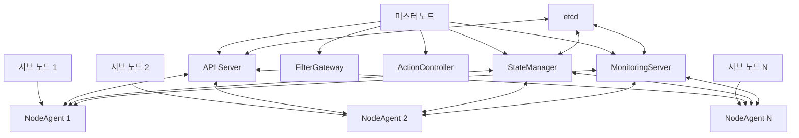
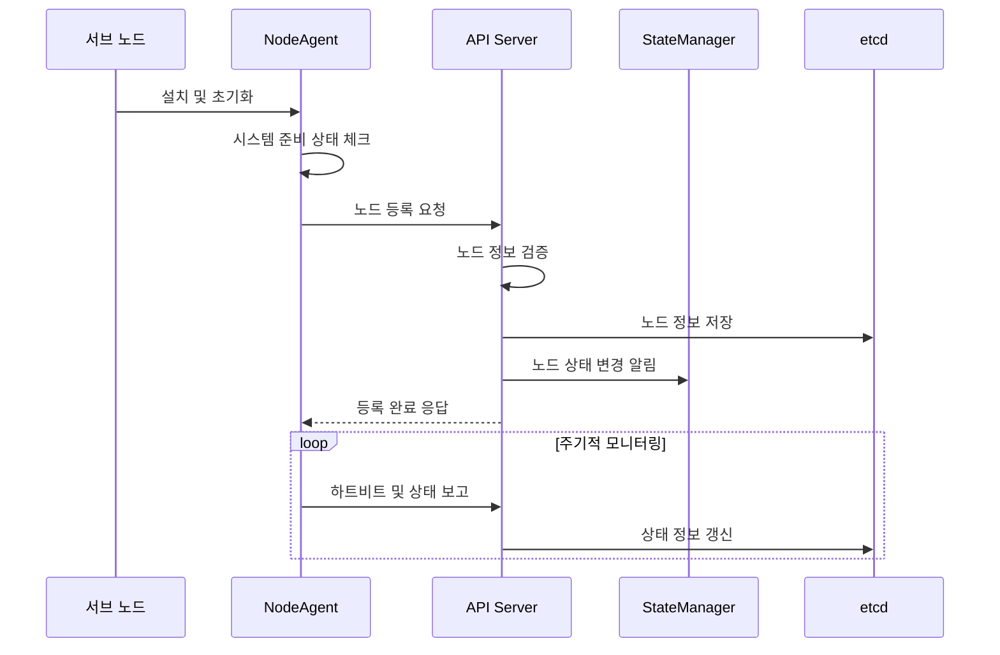
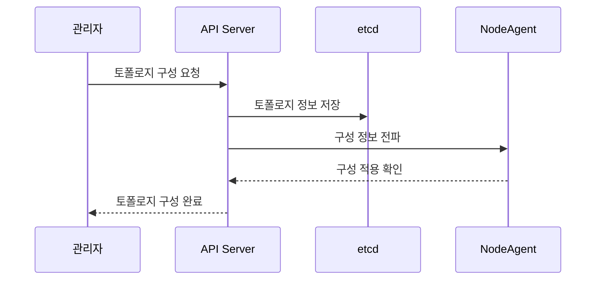

# PICCOLO 클러스터링 시스템 설계 문서

**문서 번호**: PICCOLO-CLUSTERING-HLD-2025-001  
**버전**: 1.0  
**날짜**: 2025-09-04  
**작성자**: PICCOLO 팀  
**분류**: HLD (High-Level Design)

## 1. 프로젝트 개요

**프로젝트 명**: PICCOLO 클러스터링 시스템  
**목적/배경**: 임베디드 환경에 최적화된 경량 컨테이너 오케스트레이션 클러스터 시스템 개발  
**주요 기능**: 노드 관리, 클러스터 설정, 상태 모니터링, 노드 간 통신  
**대상 사용자**: 임베디드 시스템 개발자, 관리자, 운영자

### 1.1 목적

PICCOLO 클러스터링 시스템은 임베디드 환경에 최적화된 분산 컨테이너 관리 시스템을 구현하기 위해 설계되었습니다.

1. 제한된 리소스 환경에서도 효율적으로 동작하는 경량 클러스터 아키텍처 제공
2. 마스터 노드와 서브 노드 간의 원활한 통신 및 상태 관리 구현
3. 네트워크 불안정성에 강건한 클러스터 시스템 구축
4. 소규모 클러스터에 최적화된 운영 모델 제공

### 1.2 주요 기능

1. **노드 관리**
   - 마스터-서브 노드 구조 관리
   - 노드 등록 및 인증
   - 노드 상태 모니터링 및 관리
   - 노드 시스템 준비 상태 검증

2. **클러스터 토폴로지 관리**
   - 임베디드 클러스터 토폴로지 구성
   - 하이브리드 클라우드 연결 구성
   - 다중 임베디드 클러스터 연결
   - 지역 분산 클러스터 구성

3. **상태 동기화**
   - etcd 기반 상태 정보 관리
   - 노드 간 상태 정보 동기화
   - 상태 변경 감지 및 통지
   - 오프라인 모드 지원 및 재연결 동기화

4. **배포 및 운영**
   - NodeAgent 자동 배포 및 설치
   - 시스템 체크 및 준비 상태 확인
   - 하트비트 기반 노드 상태 모니터링
   - 장애 감지 및 복구

### 1.3 적용 범위

- 2-10개 노드 규모의 소규모 임베디드 클러스터
- 마스터 노드 및 서브 노드 간 통신 관리
- 클라우드 노드와 임베디드 노드 간 연계
- Podman 기반 컨테이너 모니터링 및 관리

## 2. 사용 기술 및 환경

**주요 언어/프레임워크**: Rust, Bash 스크립트  
**기타 라이브러리/툴**: gRPC, etcd, Podman, systemd  
**배포/운영 환경**: 임베디드 리눅스, 클라우드 환경 (하이브리드)

## 3. 아키텍처

PICCOLO 클러스터링 시스템은 마스터-서브 노드 구조를 기반으로 하며, 임베디드 환경에 최적화된 경량 설계를 채택하고 있습니다.

### 3.1 시스템 구조

클러스터링 시스템의 전체 구조는 다음과 같습니다:



### 3.2 핵심 컴포넌트

| 컴포넌트 | 역할 | 상호작용 |
|---------|------|---------|
| API Server | 클러스터 관리, 노드 등록, 정책 배포 | NodeAgent, StateManager, etcd |
| NodeAgent | 노드 상태 모니터링, 마스터 노드와 통신 | API Server, StateManager, MonitoringServer |
| StateManager | 클러스터 상태 관리 및 동기화 | API Server, NodeAgent, etcd |
| etcd | 클러스터 상태 정보 저장소 | 모든 컴포넌트 |
| 설치 스크립트 | NodeAgent 배포 및 설정 | 노드 시스템 |
| 시스템 체크 스크립트 | 노드 준비 상태 검증 | 노드 시스템 |

### 3.3 기술 스택

| 계층 | 기술 | 설명 |
|------|------|------|
| 코어 서비스 | Rust | 고성능, 메모리 안전성을 위한 핵심 서비스 구현 언어 |
| 통신 프로토콜 | gRPC | 마스터-서브 노드 간 효율적인 통신을 위한 프로토콜 |
| 상태 저장소 | etcd | 분산 키-값 저장소로 클러스터 상태 정보 관리 |
| 컨테이너 런타임 | Podman | 데몬리스 아키텍처의 경량 컨테이너 관리 도구 |
| 서비스 관리 | systemd | 노드 서비스 관리 및 자동 시작 설정 |
| 배포 도구 | Bash 스크립트 | 노드 설치 및 설정 자동화 도구 |

## 4. 요구사항

### 4.1 기능적 요구사항

1. 마스터 노드와 서브 노드 간 효율적인 통신 구조 제공
2. 노드 등록 및 인증 메커니즘 제공
3. 노드 상태 모니터링 및 보고 기능 구현
4. 시스템 준비 상태 검증 메커니즘 제공
5. 클러스터 토폴로지 구성 및 관리 기능 제공
6. 노드 간 상태 동기화 메커니즘 구현
7. 장애 감지 및 복구 프로세스 지원
8. 하이브리드 클라우드 연결 구성 지원

### 4.2 비기능적 요구사항

1. **성능 요구사항**
   - 최소 하드웨어 사양에서 동작 가능한 경량 설계
   - 30초 이내 노드 등록 및 활성화 완료
   - 5초 이내 노드 상태 변경 감지 및 전파

2. **보안 요구사항**
   - 노드 간 인증 및 권한 관리
   - 통신 암호화 (TLS 기반)
   - 안전한 인증서 관리

3. **확장성 요구사항**
   - 최소 10개 노드까지 안정적 확장 지원
   - 클라우드 노드 동적 추가 지원
   - 다양한 네트워크 환경 지원

4. **신뢰성 요구사항**
   - 네트워크 불안정성 대응 메커니즘
   - 노드 장애 시 자동 복구 기능
   - 오프라인 모드에서의 로컬 운영 지원

## 5. 주요 기능 상세

### 5.1 노드 관리

PICCOLO 클러스터링 시스템의 핵심 기능인 노드 관리는 노드 등록, 인증, 상태 모니터링, 제어를 포함합니다.

#### 5.1.1 동작 흐름



#### 5.1.2 핵심 알고리즘/로직

노드 등록 및 관리 프로세스:

```
1. 서브 노드에 NodeAgent 설치
2. 시스템 준비 상태 체크 수행
3. 마스터 노드 API Server에 등록 요청
4. 노드 인증 및 인가 수행
5. 노드 정보 etcd에 저장
6. 클러스터 토폴로지 업데이트
7. 주기적 하트비트 및 상태 보고 시작
8. 상태 변경 감지 시 StateManager에 알림
```

### 5.2 클러스터 토폴로지 관리

PICCOLO는 다양한 임베디드 환경 구성을 위한 여러 클러스터 토폴로지를 지원합니다.

#### 5.2.1 동작 흐름



#### 5.2.2 지원 토폴로지 유형

1. **기본 임베디드 토폴로지**: 단일 마스터 노드와 소수의 서브 노드로 구성
2. **에지-클라우드 하이브리드 토폴로지**: 로컬 임베디드 클러스터와 클라우드 노드 연결
3. **다중 임베디드 클러스터 토폴로지**: 여러 임베디드 클러스터가 상위 마스터 노드에 연결
4. **지역 분산 토폴로지**: 지리적으로 분산된 임베디드 시스템 통합

## 6. 데이터 모델

### 6.1 핵심 데이터 구조

클러스터링 시스템에서 사용하는 주요 데이터 구조:

```yaml
# 노드 정보 구조
Node:
  id: string                 # 노드 고유 식별자
  name: string               # 노드 이름
  ip: string                 # 노드 IP 주소
  role: "master" | "sub"     # 노드 역할
  status: NodeStatus         # 노드 상태
  resources:                 # 노드 자원 정보
    cpu: number              # CPU 코어 수
    memory: number           # 메모리 용량 (MB)
    disk: number             # 디스크 용량 (GB)
  created_at: timestamp      # 생성 시간
  last_heartbeat: timestamp  # 마지막 하트비트 시간

# 클러스터 토폴로지 구조
ClusterTopology:
  id: string                 # 클러스터 ID
  name: string               # 클러스터 이름
  type: TopologyType         # 토폴로지 유형
  master_nodes: Node[]       # 마스터 노드 목록
  sub_nodes: Node[]          # 서브 노드 목록
  parent_cluster: string     # 상위 클러스터 ID (계층적 구조용)
  config: object             # 클러스터 구성 정보
```

### 6.2 상태 관리

노드 상태 관리 모델:

| 상태 | 설명 | 전이 조건 |
|------|------|---------|
| Pending | 등록 대기 중인 노드 | 노드 등록 요청 후 |
| Initializing | 초기화 중인 노드 | 등록 승인 후, 설정 적용 중 |
| Ready | 활성 상태의 노드 | 초기화 완료, 하트비트 정상 |
| NotReady | 문제가 있는 노드 | 하트비트 실패, 리소스 부족 |
| Maintenance | 유지보수 중인 노드 | 관리자에 의한 상태 전환 |
| Terminating | 종료 중인 노드 | 노드 제거 요청 후 |

## 7. 인터페이스

### 7.1 API 인터페이스

#### 7.1.1 gRPC API

API Server에서 제공하는 gRPC 인터페이스:

```protobuf
service ApiServerService {
  // 노드 관리 관련 API
  rpc GetNodes(GetNodesRequest) returns (GetNodesResponse);
  rpc GetNode(GetNodeRequest) returns (GetNodeResponse);
  rpc RegisterNode(NodeRegistrationRequest) returns (NodeRegistrationResponse);
  
  // 토폴로지 관리 관련 API
  rpc GetTopology(GetTopologyRequest) returns (GetTopologyResponse);
  rpc UpdateTopology(UpdateTopologyRequest) returns (UpdateTopologyResponse);
}

message GetNodesRequest {
  optional string filter = 1;
}

message GetNodesResponse {
  repeated Node nodes = 1;
}

message GetNodeRequest {
  string node_id = 1;
}

message GetNodeResponse {
  Node node = 1;
}

message GetTopologyRequest {}

message GetTopologyResponse {
  ClusterTopology topology = 1;
}

message UpdateTopologyRequest {
  ClusterTopology topology = 1;
}

message UpdateTopologyResponse {
  ClusterTopology updated_topology = 1;
  bool success = 2;
  optional string error_message = 3;
}
```

#### 7.1.2 NodeAgent gRPC API

NodeAgent와 API Server 간 gRPC 인터페이스:

```protobuf
service NodeAgentService {
  rpc RegisterNode(NodeRegistrationRequest) returns (NodeRegistrationResponse);
  rpc ReportStatus(StatusReport) returns (StatusAck);
  rpc Heartbeat(HeartbeatRequest) returns (HeartbeatResponse);
  rpc ReceiveConfig(ConfigRequest) returns (ConfigResponse);
}

message NodeRegistrationRequest {
  string node_id = 1;
  string hostname = 2;
  string ip_address = 3;
  NodeRole role = 4;
  ResourceInfo resources = 5;
  Credentials credentials = 6;
}

message StatusReport {
  string node_id = 1;
  NodeStatus status = 2;
  map<string, string> metrics = 3;
  repeated ContainerStatus containers = 4;
  repeated AlertInfo alerts = 5;
}
```

### 7.2 내부 인터페이스

클러스터링 컴포넌트 간 내부 인터페이스:

1. **API Server - StateManager 인터페이스**
   - 노드 상태 변경 알림
   - 클러스터 구성 변경 동기화

2. **API Server - etcd 인터페이스**
   - 노드 정보 저장 및 조회
   - 클러스터 토폴로지 정보 관리

3. **NodeAgent - 시스템 모니터링 인터페이스**
   - Podman 컨테이너 상태 모니터링
   - 시스템 리소스 사용량 모니터링
   - 하드웨어 상태 점검

## 8. 성능 및 확장성

### 8.1 성능 요구사항

1. **하트비트 및 상태 보고**
   - 기본 간격: 10초
   - 최소 간격: 5초 (리소스 부하 고려)
   - 타임아웃: 30초 (3회 연속 실패 시 NotReady 상태로 전환)

2. **리소스 사용량**
   - NodeAgent 메모리 사용량: 최대 50MB
   - CPU 사용량: 유휴 시 1% 미만, 활성 시 최대 5%
   - 네트워크 대역폭: 초당 최대 100KB

### 8.2 확장성 전략

1. **노드 스케일링**
   - 점진적 확장: 클러스터 규모를 소규모(2-5개)에서 중규모(10개 이상)로 단계적 확장
   - 마스터 노드 부하 분산: 특정 규모 이상 시 다중 마스터 구조 전환 가능성 고려

2. **다중 클러스터 연결**
   - 계층적 클러스터 구조: 상위 마스터 노드를 통한 다중 클러스터 관리
   - 클러스터 간 연동: 독립적인 클러스터 간 데이터 및 정책 공유 메커니즘

3. **클라우드 통합**
   - 하이브리드 배포: 클라우드 노드와 임베디드 노드의 통합 관리
   - 동적 스케일링: 클라우드 환경에서의 자동 스케일링 지원

## 9. 보안

1. **인증 및 권한 부여**
   - TLS 기반 노드 인증
   - 노드 등록 시 초기 인증 토큰 사용
   - 역할 기반 접근 제어 (마스터/서브 노드 권한 분리)

2. **통신 보안**
   - 모든 gRPC 통신에 TLS 적용
   - API 엔드포인트 인증 및 암호화
   - 인증서 자동 갱신 메커니즘

3. **데이터 보안**
   - etcd 저장소 암호화
   - 민감 정보 분리 저장
   - 접근 로그 및 감사 추적

## 10. 장애 처리 및 복구

1. **노드 장애 감지**
   - 하트비트 기반 장애 감지
   - 능동적 상태 점검
   - 알림 및 로깅

2. **자동 복구 메커니즘**
   - NodeAgent 자동 재시작
   - 연결 복구 시도
   - 단계적 복구 절차

3. **수동 복구 절차**
   - 관리자 개입 절차
   - 노드 강제 재등록
   - 클러스터 재구성

## 11. 모니터링 및 로깅

1. **상태 모니터링**
   - 노드 상태 실시간 모니터링
   - 리소스 사용량 추적
   - 클러스터 토폴로지 시각화

2. **로깅 전략**
   - 분산 로깅 시스템
   - 로그 수준 조정 가능
   - 중요 이벤트 별도 로깅
   - 주기적 로그 로테이션

3. **알림 시스템**
   - 중요 이벤트 알림
   - 임계값 기반 알림
   - 알림 채널 구성 (이메일, 메시징 시스템)

## 12. 배포 및 운영

1. **설치 및 배포**
   - 마스터 노드 수동 설정
   - 서브 노드 자동 배포 스크립트
   - 구성 파일 템플릿 제공

2. **업그레이드 전략**
   - 롤링 업데이트 지원
   - 버전 호환성 검증
   - 롤백 메커니즘

3. **운영 가이드라인**
   - 클러스터 상태 확인 절차
   - 문제 해결 가이드
   - 성능 최적화 팁

## 13. 제약사항 및 한계

1. **규모 제약**
   - 최대 10개 노드까지 최적화 (더 많은 노드는 성능 테스트 필요)
   - 단일 마스터 노드 구조의 병목 현상 가능성

2. **네트워크 제약**
   - 높은 네트워크 지연 환경에서 성능 저하
   - 완전 분리된 네트워크 간 연동 제한

3. **자원 제약**
   - 최소 사양: 512MB RAM, 1GHz CPU
   - 저사양 장치에서 모니터링 기능 제한 가능성

## 14. 향후 개선 계획

1. **다중 마스터 지원**
   - 대규모 클러스터를 위한 다중 마스터 아키텍처
   - 마스터 노드 고가용성 구현

2. **고급 네트워크 기능**
   - 메시 네트워크 지원
   - P2P 통신 최적화
   - 네트워크 분할 자동 복구

3. **관리 인터페이스 개선**
   - 웹 기반 관리 콘솔
   - 클러스터 시각화 도구
   - 자동화된 운영 스크립트

## 15. 참고 자료

- PICCOLO 프레임워크 설계 문서
- API Server 설계 문서
- NodeAgent 설계 문서
- etcd 공식 문서 (https://etcd.io/docs/)
- Podman 공식 문서 (https://podman.io/docs/)

## 부록

### A. 용어 정의

| 용어 | 정의 |
|------|------|
| 마스터 노드 | 클러스터를 관리하는 중앙 노드로, API Server, StateManager 등 핵심 서비스를 실행 |
| 서브 노드 | 마스터 노드의 관리를 받는 작업 노드로, NodeAgent만 실행 |
| NodeAgent | 각 노드에서 실행되는 에이전트로, 노드 상태 모니터링 및 마스터 노드와 통신 |
| etcd | 분산 키-값 저장소로, 클러스터 상태 정보 저장에 사용 |
| Podman | 데몬리스 컨테이너 관리 도구로, Docker 대체제로 사용 |
| 토폴로지 | 클러스터 내 노드 간의 연결 구조 및 관계 |
| 하트비트 | 노드 활성 상태 확인을 위한 주기적 신호 |

### B. 변경 이력

| 버전 | 날짜 | 변경 내용 | 작성자 |
|------|------|----------|-------|
| 1.0 | 2025-09-04 | 최초 작성 | PICCOLO 팀 |
