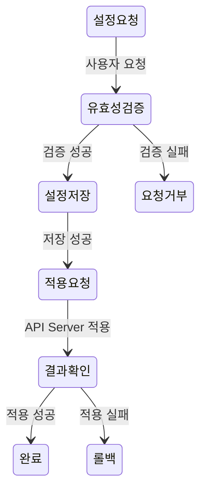
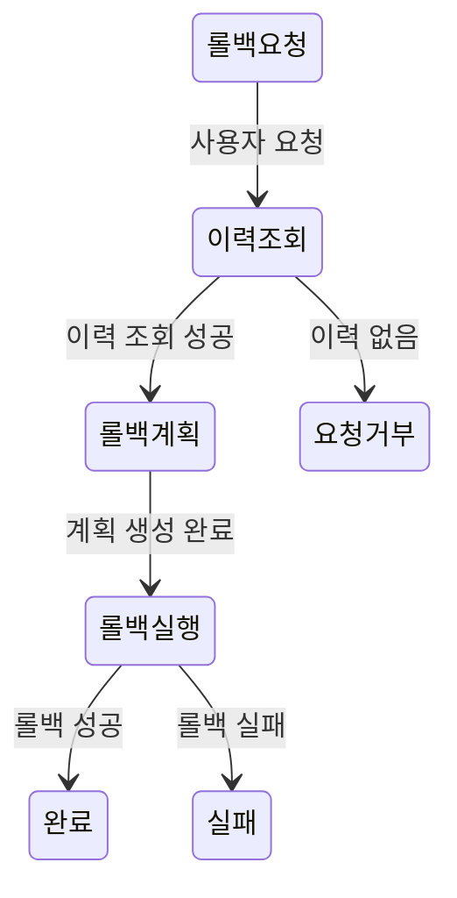
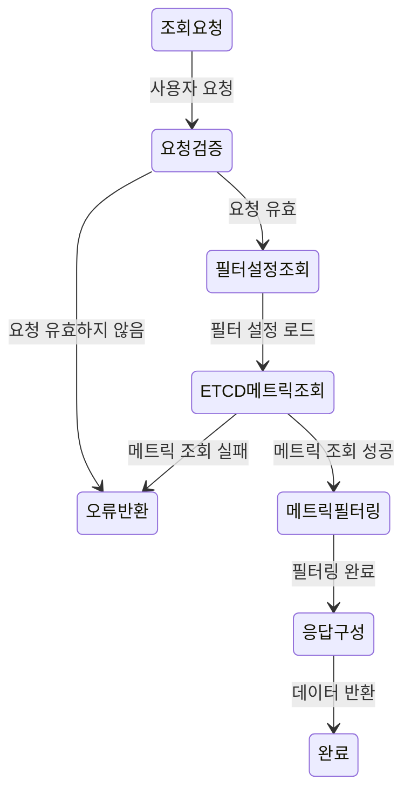
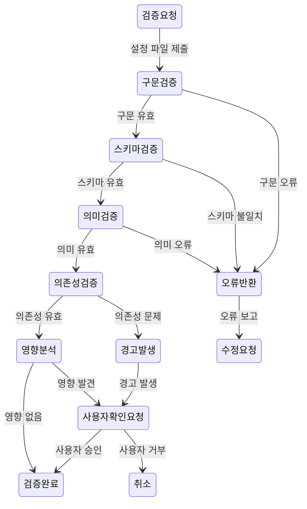
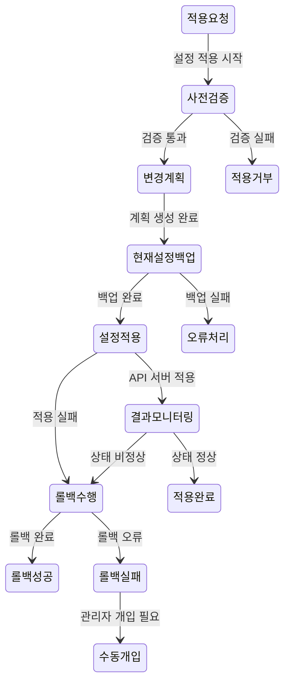
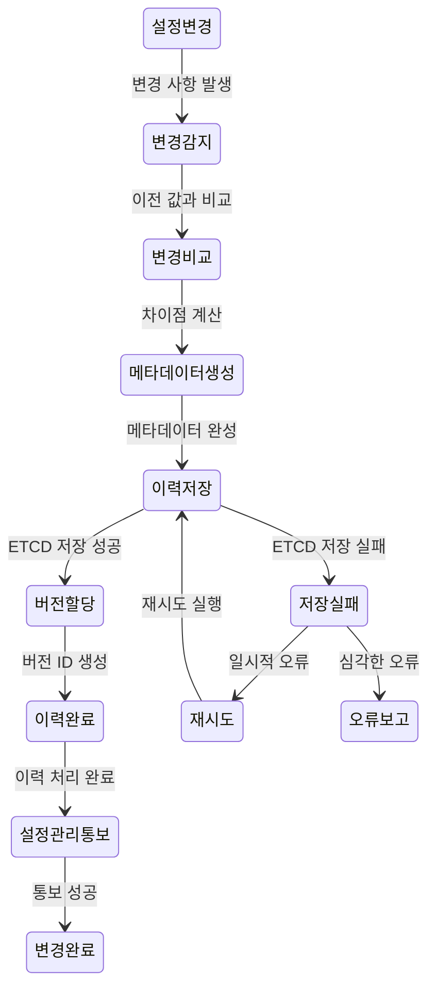
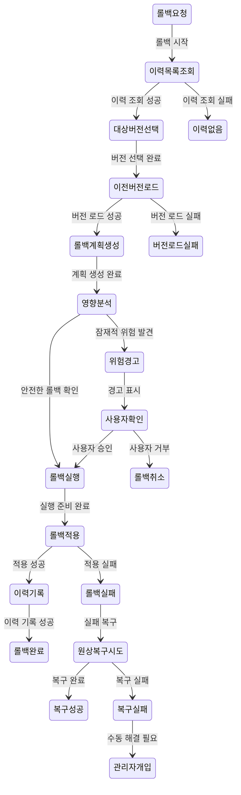
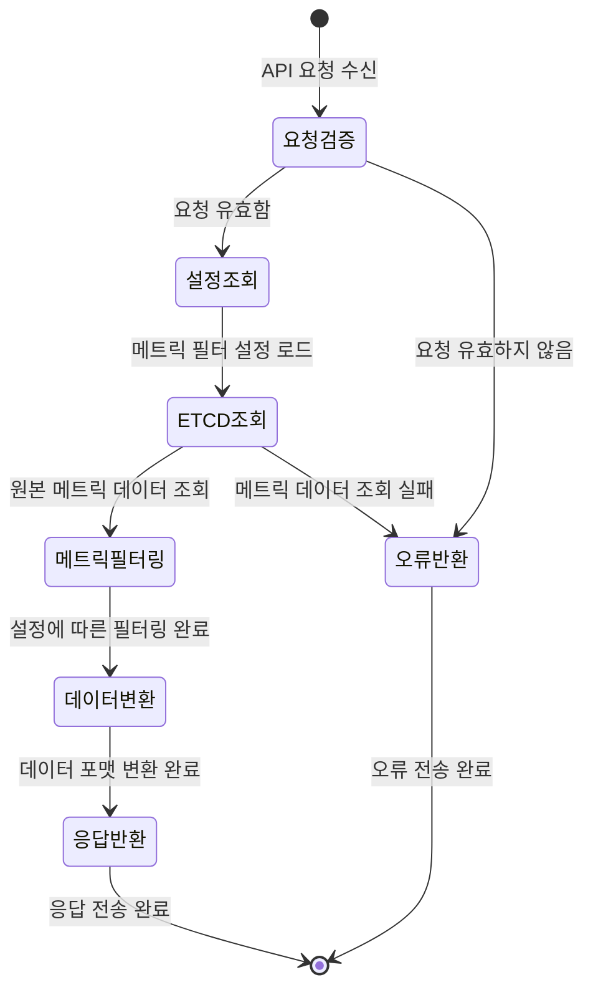

# Settings Service 상세 설계 문서

**문서 번호**: PICCOLO-SETTINGS-2025-001  
**버전**: 1.0  
**날짜**: 2025-08-05  
**작성자**: PICCOLO 팀  
**분류**: HLD (High-Level Design)

## 1. 개요

Settings Service는 PICCOLO 프레임워크에서 시스템 설정 관리를 위한 핵심 컴포넌트로, 관리자 및 개발자가 시스템 구성을 쉽게 관리할 수 있는 다양한 인터페이스를 제공합니다. 웹 기반 UI와 명령줄 인터페이스(CLI)를 통해 YAML 기반 구성 파일의 생성, 수정, 검증 및 배포를 지원하며, 설정 변경 이력 관리와 롤백 기능을 제공합니다.

### 1.1 목적

Settings Service의 주요 목적은 다음과 같습니다:

1. PICCOLO 프레임워크의 다양한 컴포넌트에 대한 중앙집중식 설정 관리 제공
2. 시스템 설정 변경을 쉽고 안전하게 적용할 수 있는 인터페이스 제공
3. 설정 변경 이력 관리 및 롤백을 통한 시스템 안정성 보장
4. 사용자 권한에 기반한 설정 관리 접근 제어
5. 설정 템플릿을 통한 일관된 구성 생성 지원

### 1.2 주요 기능

Settings Service는 다음과 같은 주요 기능을 제공합니다:

1. **설정 관리**
   - YAML 기반 구성 파일의 생성, 수정, 삭제
   - 설정 유효성 검증 및 영향 분석
   - 변경 사항의 시스템 적용 및 결과 모니터링

2. **다중 인터페이스**
   - 직관적인 웹 기반 UI
   - 강력한 명령줄 인터페이스(CLI)
   - REST API 및 gRPC 인터페이스

3. **변경 관리**
   - 설정 변경 이력 저장 및 조회
   - 이전 버전으로의 롤백 지원
   - 변경 검증 및 충돌 감지

4. **모니터링 정보 조회**
   - ETCD에 저장된 PICCOLO 리소스 상태 정보 조회
   - 리소스별 모니터링 데이터 시각화
   - 모니터링 데이터 내보내기

## 2. 아키텍처

Settings Service는 모듈화된 구조로 설계되어 각 기능 영역이 명확하게 분리되어 있습니다. 이를 통해 유지보수성과 확장성을 높이고, 개별 컴포넌트의 독립적인 개발 및 테스트가 가능합니다.

### 2.1 주요 컴포넌트

Settings Service의 주요 컴포넌트는 다음과 같습니다:

1. **Core Manager**
   - 서비스 초기화 및 컴포넌트 조정
   - 설정 변경 요청 처리 및 흐름 제어
   - 다른 모듈 간의 상호작용 관리

2. **Configuration Manager**
   - 설정 파일 로드 및 저장
   - 설정 유효성 검증
   - 변경 영향 분석

3. **History Manager**
   - 설정 변경 이력 관리
   - 버전 간 비교
   - 롤백 기능

4. **Monitoring Viewer**
   - ETCD에서 모니터링 데이터 조회
   - 리소스별 모니터링 데이터 가공
   - 모니터링 정보 시각화

5. **Web Interface**
   - 웹 서버 및 API
   - 사용자 인터페이스 컴포넌트
   - 실시간 설정 편집기

6. **CLI Interface**
   - 명령줄 명령 처리
   - 대화형 쉘
   - 배치 처리

7. **External Integration**
   - API Server 연동
   - ETCD 저장소 연동
   - 외부 시스템 통합

### 2.2 데이터 흐름

Settings Service의 주요 데이터 흐름은 다음과 같습니다:

1. **설정 변경 흐름**
   - 사용자가 웹 UI 또는 CLI를 통해 설정 변경 요청
   - 설정 유효성 검증 및 영향 분석
   - 변경 사항 ETCD에 저장 및 이력 기록
   - API Server에 변경 사항 전달
   - 변경 적용 결과 모니터링 및 피드백

### 2.3 주요 시퀀스 다이어그램

Settings Service의 주요 워크플로우에 대한 간소화된 시퀀스 다이어그램입니다.

#### 2.3.1 설정 변경 시퀀스



#### 2.3.2 설정 롤백 시퀀스



#### 2.3.3 메트릭 정보 제공 시퀀스



#### 2.4.1 데이터 흐름 추가 상세

Settings Service의 주요 데이터 흐름에 대한 추가 세부 사항은 다음과 같습니다:

1. **설정 업데이트 흐름**
   - 사용자 요청 수신 및 검증
   - ETCD 저장소에 설정 업데이트
   - 변경 이벤트 발생 및 전파
   - 결과 피드백 제공

2. **롤백 흐름**
   - 사용자가 이전 버전으로 롤백 요청
   - 이전 버전의 설정 로드
   - 롤백 계획 생성 및 검증
   - 롤백 실행 및 결과 확인
   - 롤백 이력 기록

3. **메트릭 데이터 제공 흐름**
   - 사용자가 메트릭 정보 조회 요청
   - 설정된 필터에 따라 ETCD에서 메트릭 정보 조회
   - 메트릭 데이터 필터링 및 가공
   - 요청된 형식으로 데이터 제공

### 2.3 시스템 통합

Settings Service는 다음과 같은 PICCOLO 프레임워크의 다른 컴포넌트와 통합됩니다:

1. **API Server**
   - 변경된 설정 전달
   - 설정 적용 상태 확인
   - 시스템 전체 설정 동기화

2. **State Manager**
   - 설정 변경 후 시스템 상태 확인
   - 컴포넌트 상태 모니터링
   - 상태 기반 롤백 결정

3. **ETCD**
   - 설정 데이터 저장
   - 변경 이력 관리
   - 설정 버전 관리
   - 메트릭 데이터 조회

4. **Monitoring Server**
   - 메트릭 데이터 생성 및 ETCD 저장
   - 시스템 상태 정보 제공

## 3. 인터페이스

Settings Service는 다양한 사용자 및 시스템 인터페이스를 제공합니다.

### 3.1 사용자 인터페이스

#### 3.1.1 웹 UI

웹 기반 사용자 인터페이스는 다음 기능을 제공합니다:

1. **대시보드**
   - 시스템 설정 개요
   - 최근 변경 사항
   - 설정 상태 표시
   - 메트릭 데이터 시각화

2. **설정 편집기**
   - 계층적 리소스 탐색
   - YAML/JSON 편집기
   - 스키마 기반 검증
   - 속성 기반 폼 편집

3. **이력 브라우저**
   - 설정 변경 이력 조회
   - 버전 간 비교
   - 롤백 기능

4. **메트릭 뷰어**
   - ETCD에 저장된 PICCOLO 리소스 메트릭 정보 조회
   - 리소스별 메트릭 데이터 필터링 및 표시
   - 메트릭 데이터 내보내기

#### 3.1.2 CLI

명령줄 인터페이스는 다음 기능을 제공합니다:

1. **기본 명령**
   - 설정 조회/설정/삭제
   - 설정 적용
   - 설정 검증

2. **이력 관리**
   - 변경 이력 조회
   - 버전 비교
   - 롤백 실행

3. **대화형 쉘**
   - 자동 완성
   - 명령 이력
   - 인라인 도움말

4. **배치 처리**
   - 스크립트 실행
   - 파이프라인 통합
   - 자동화 지원

5. **메트릭 조회**
   - 리소스 메트릭 정보 조회
   - 메트릭 데이터 필터링
   - 상태 정보 제공
   - 메트릭 필터 설정 관리

### 3.2 시스템 인터페이스

Settings Service는 REST API 인터페이스를 통해 메트릭 정보 제공 및 설정 관리 기능을 제공합니다.

#### 3.2.1 REST API

REST API는 대시보드와 CLI에서 호출할 때 사용되며, 다음과 같은 엔드포인트를 제공합니다:

1. **메트릭 정보 API (주요 기능)**
   - `GET /api/v1/metrics` - 모든 리소스의 필터링된 메트릭 조회
   - `GET /api/v1/metrics/{resourceType}` - 특정 리소스 타입의 메트릭 조회
   - `GET /api/v1/metrics/{resourceType}/{resourceName}` - 특정 리소스의 메트릭 조회
   - `GET /api/v1/metrics/filters` - 현재 적용된 메트릭 필터 조회
   - `PUT /api/v1/metrics/filters` - 메트릭 필터 설정 업데이트
   - `GET /api/v1/metrics/available` - 제공 가능한 모든 메트릭 목록 조회
   - `GET /api/v1/metrics/status` - 메트릭 수집 상태 조회

2. **설정 관리 API**
   - `GET /api/v1/settings` - 전체 설정 목록 조회
   - `GET /api/v1/settings/{key}` - 특정 설정 조회
   - `PUT /api/v1/settings/{key}` - 설정 변경
   - `DELETE /api/v1/settings/{key}` - 설정 삭제
   - `POST /api/v1/settings/validate` - 설정 유효성 검증

3. **이력 관리 API**
   - `GET /api/v1/history` - 전체 변경 이력 조회(페이징 지원)
   - `GET /api/v1/history/{key}` - 특정 설정의 변경 이력 조회
   - `POST /api/v1/rollback/{version}` - 특정 버전으로 롤백
   - `GET /api/v1/diff?from={version1}&to={version2}` - 버전 간 차이점 조회

4. **사용자 인터페이스 지원 API**
   - `GET /api/v1/ui/summary` - 대시보드용 설정 요약 정보
   - `GET /api/v1/ui/templates` - 설정 템플릿 목록
   - `GET /api/v1/ui/schema/{key}` - 특정 설정의 JSON 스키마 (폼 생성용)

## 4. 데이터 모델

Settings Service에서 사용하는 주요 데이터 모델은 다음과 같습니다.

### 4.1 설정 데이터

```yaml
# 설정 데이터 예시
apiVersion: piccolo.io/v1
kind: SettingsConfig
metadata:
  name: example-config
  namespace: system
  labels:
    category: network
    environment: production
spec:
  # 설정 세부 사항
  parameter1: value1
  parameter2: value2
  nestedConfig:
    subParam1: subValue1
    subParam2: subValue2
  arrayConfig:
    - item1
    - item2
    - item3
```

### 4.2 이력 항목

```yaml
# 이력 항목 예시
id: history-123456
timestamp: "2025-08-05T14:30:00Z"
user: admin
action: UPDATE
configKey: example-config
version: "v1.2.3"
changes:
  - path: spec.parameter1
    oldValue: oldValue1
    newValue: value1
  - path: spec.nestedConfig.subParam2
    oldValue: oldSubValue2
    newValue: subValue2
comment: "업데이트 네트워크 파라미터"
status: APPLIED
```

### 4.3 메트릭 데이터 

```yaml
# 메트릭 데이터 예시 (ETCD에 저장된 데이터)
resourceType: "model"
resourceId: "model-01"
timestamp: "2025-08-05T13:45:00Z"
metrics:
  phase: "Running"
  ready: true
  restartCount: 2
  cpuUsage: 0.45
  memoryUsage: 256000000
  gpuMemoryUsage: 1073741824
  networkRx: 1250
  networkTx: 850
```

### 4.4 메트릭 필터 설정

```yaml
# 메트릭 필터 설정 예시
apiVersion: piccolo.io/v1
kind: MetricsFilterConfig
metadata:
  name: default-metrics-filter
spec:
  enabled: true
  refresh: 30
  max_items: 100
  cache_ttl: 60
  filters:
    scenario:
      - currentState
      - policyStatus
      - activePackages
    package:
      - currentState
      - runningModels
      - cpuUsage
    model:
      - phase
      - restartCount
      - cpuUsage
      - memoryUsage
```

## 5. 주요 기능 상세

### 5.1 설정 관리

#### 5.1.1 설정 유효성 검증

설정 유효성 검증은 다음 단계로 수행됩니다:

1. **구문 검증**: YAML/JSON 구문 오류 확인
2. **스키마 검증**: 정의된 스키마에 대한 유효성 검증
3. **의미 검증**: 설정 값의 의미적 타당성 검증
4. **의존성 검증**: 다른 설정과의 의존성 확인
5. **영향 분석**: 변경 사항이 시스템에 미치는 영향 분석

설정 검증 세부 단계:


#### 5.1.2 설정 적용

설정 적용은 다음 단계로 수행됩니다:

1. **사전 검증**: 적용 전 유효성 검증
2. **변경 계획**: 적용할 변경 사항 계획 수립
3. **백업**: 현재 설정 백업
4. **적용**: API Server를 통한 변경 사항 적용
5. **모니터링**: 적용 결과 모니터링
6. **확인/롤백**: 성공 확인 또는 문제 시 롤백

설정 적용 세부 단계:


### 5.2 이력 관리

#### 5.2.1 변경 이력 추적

모든 설정 변경은 다음 정보와 함께 기록됩니다:

1. **시간 정보**: 변경 일시
2. **사용자 정보**: 변경 수행 사용자
3. **변경 내용**: 구체적인 변경 사항
4. **버전 정보**: 변경 전후 버전
5. **변경 이유**: 사용자 입력 설명

변경 이력 추적 세부 단계:


#### 5.2.2 롤백 기능

롤백 기능은 다음 과정으로 수행됩니다:

1. **대상 버전 선택**: 롤백할 이전 버전 선택
2. **롤백 계획 생성**: 현재 상태에서 목표 상태로의 변경 계획
3. **영향 분석**: 롤백이 시스템에 미치는 영향 분석
4. **롤백 실행**: 계획에 따른 롤백 수행
5. **결과 확인**: 롤백 성공 여부 확인
6. **이력 기록**: 롤백 작업 이력 기록

롤백 기능 세부 단계:


### 5.3 모니터링 설정 및 API

Settings Service는 모니터링 기능을 직접 수행하지 않으며, 이미 다른 서비스에 의해 ETCD에 저장된 PICCOLO 리소스의 모니터링 메트릭 중 필요한 항목을 선정하여 REST API를 통해 전달하는 역할을 합니다.

#### 5.3.1 모니터링 메트릭 설정 관리

Settings Service는 다음과 같은 모니터링 관련 설정을 관리합니다:

| 설정 키 | 설명 | 기본값 |
|---------|------|--------|
| monitoring.metrics.enabled | 모니터링 메트릭 API 활성화 여부 | true |
| monitoring.metrics.filters.scenario | 제공할 시나리오 메트릭 목록 | ["currentState", "policyStatus", "activePackages"] |
| monitoring.metrics.filters.package | 제공할 패키지 메트릭 목록 | ["currentState", "runningModels", "cpuUsage"] |
| monitoring.metrics.filters.model | 제공할 모델 메트릭 목록 | ["phase", "restartCount", "cpuUsage"] |
| monitoring.metrics.refresh | 메트릭 데이터 갱신 주기(초) | 30 |
| monitoring.metrics.max_items | 한 번에 반환할 최대 항목 수 | 100 |
| monitoring.metrics.cache_ttl | 메트릭 캐시 유효 시간(초) | 60 |

#### 5.3.2 모니터링 메트릭 API

Settings Service는 ETCD에 저장된 모니터링 메트릭을 선별하여 제공하는 API를 제공합니다:

| 메소드 | 경로 | 설명 |
|--------|------|------|
| GET | /api/v1/metrics | 설정에 따라 선별된 모든 리소스의 메트릭 조회 |
| GET | /api/v1/metrics/{resourceType} | 특정 리소스 타입의 선별된 메트릭 조회 |
| GET | /api/v1/metrics/{resourceType}/{resourceName} | 특정 리소스의 선별된 메트릭 조회 |
| GET | /api/v1/metrics/available | 제공 가능한 모든 메트릭 목록 조회 |
| GET | /api/v1/metrics/settings | 현재 모니터링 메트릭 설정 조회 |
| PUT | /api/v1/metrics/settings | 모니터링 메트릭 설정 업데이트 |
| GET | /api/v1/metrics/status | 메트릭 수집 상태 조회 |

#### 5.3.3 모니터링 메트릭 선별 및 전달 과정



#### 5.3.4 리소스별 제공 가능 메트릭

Settings Service는 다음과 같은 PICCOLO 리소스 유형의 메트릭 중에서 설정에 따라 선별하여 제공합니다. 이 메트릭들은 Settings Service가 생성하거나 저장하지 않으며, 다른 서비스에 의해 ETCD에 이미 저장된 데이터입니다.

**Scenario 제공 가능 메트릭**
| 메트릭 | 설명 | 유형 |
|--------|------|------|
| currentState | 현재 시나리오 상태 | 상태값 (idle/waiting/playing/error) |
| policyStatus | 정책 적용 상태 | 상태값 (allowed/denied) |
| activePackages | 활성화된 패키지 수 | 정수 |
| conditionsMet | 조건 충족 여부 | Boolean |
| lastTransitionTime | 마지막 상태 전환 시간 | 타임스탬프 |
| totalActiveTime | 총 활성 시간 | 시간(초) |

**Package 제공 가능 메트릭**
| 메트릭 | 설명 | 유형 |
|--------|------|------|
| currentState | 현재 패키지 상태 | 상태값 (initializing/running/degraded/error) |
| runningModels | 정상 실행 중인 모델 수 | 정수 |
| failedModels | 실패한 모델 수 | 정수 |
| cpuUsage | CPU 사용률 | 백분율 |
| memoryUsage | 메모리 사용률 | 백분율 |
| gpuUsage | GPU 사용률 | 백분율 |
| lastTransitionTime | 마지막 상태 전환 시간 | 타임스탬프 |

**Model 제공 가능 메트릭**
| 메트릭 | 설명 | 유형 |
|--------|------|------|
| phase | 모델 상태 | 상태값 (Pending/Running/Succeeded/Failed/Unknown) |
| ready | 준비 상태 | Boolean |
| restartCount | 재시작 횟수 | 정수 |
| startTime | 시작 시간 | 타임스탬프 |
| cpuUsage | CPU 사용량 | 코어 수 |
| memoryUsage | 메모리 사용량 | 바이트 |
| gpuMemoryUsage | GPU 메모리 사용량 | 바이트 |
| networkRx | 네트워크 수신량 | 바이트/초 |
| networkTx | 네트워크 송신량 | 바이트/초 |

## 6. 보안 고려사항

Settings Service는 다음과 같은 보안 측면을 고려하여 설계되었습니다:

1. **데이터 보호**
   - 중요 설정 정보 암호화
   - 전송 중 데이터 보호(TLS)
   - 저장 데이터 보호

2. **감사 및 추적**
   - 모든 변경 사항 기록
   - 시스템 활동 로깅
   - 감사 로그 보호

3. **입력 검증**
   - 모든 사용자 입력 검증
   - 악의적 입력 방지
   - 안전한 파싱 및 처리

4. **API 보안**
   - API 접근 제한
   - 속도 제한

## 7. 성능 고려사항

Settings Service는 다음과 같은 성능 측면을 고려하여 설계되었습니다:

1. **응답성**
   - 사용자 인터페이스 반응 시간 최적화
   - 비동기 처리를 통한 응답성 향상
   - 사용자 피드백 제공

2. **확장성**
   - 분산 아키텍처 지원
   - 대규모 설정 데이터 처리
   - 다수 사용자 동시 접근 지원

3. **리소스 사용**
   - 효율적인 메모리 관리
   - CPU 사용 최적화
   - 저장소 공간 효율성

4. **캐싱**
   - 자주 접근하는 설정 캐싱
   - 템플릿 캐싱
   - 인증 정보 캐싱

## 8. 구현 고려사항

Settings Service 구현 시 다음 사항을 고려해야 합니다:

1. **기술 스택**
   - Rust 언어 사용
   - Actix Web 프레임워크
   - gRPC 통신
   - ETCD 저장소

2. **모듈화**
   - 기능별 모듈 분리
   - 명확한 인터페이스 정의
   - 모듈별 독립적 테스트 가능

3. **테스트 가능성**
   - 단위 테스트 용이한 구조
   - 통합 테스트 지원
   - 모의 객체(Mock) 활용

4. **문서화**
   - 코드 내 문서화
   - API 문서화
   - 사용자 가이드

5. **국제화**
   - 다국어 지원
   - 지역화 설정
   - 문화권별 표현 방식 고려

## 9. 배포 및 운영

Settings Service의 배포 및 운영 관련 고려사항은 다음과 같습니다:

1. **컨테이너화**
   - Docker 이미지 제공
   - Kubernetes 배포 지원
   - 구성 가능한 환경 변수

2. **모니터링**
   - 상태 모니터링
   - 성능 지표 수집
   - 로그 집계

3. **백업 및 복구**
   - 정기적인 설정 데이터 백업
   - 장애 복구 절차
   - 데이터 일관성 유지

4. **업그레이드**
   - 무중단 업그레이드 지원
   - 이전 버전과의 호환성
   - 롤백 계획

5. **운영 문서**
   - 설치 가이드
   - 운영 매뉴얼
   - 문제 해결 가이드

## 10. 결론

Settings Service는 PICCOLO 프레임워크의 핵심 컴포넌트로서, 시스템 설정을 효율적이고 안전하게 관리할 수 있는 다양한 인터페이스와 기능을 제공합니다. 웹 UI와 CLI를 통한 직관적인 사용자 경험과 함께, 강력한 유효성 검증, 이력 관리, ETCD 기반 모니터링 정보 조회 기능을 제공하여 시스템 안정성과 사용자 생산성을 향상시킵니다.

이 설계 문서는 Settings Service의 기본 아키텍처와 주요 기능을 개괄적으로 설명하며, 실제 구현 과정에서 세부 사항이 추가되거나 조정될 수 있습니다. 궁극적으로 Settings Service는 PICCOLO 프레임워크의 구성 요소들이 일관되고 신뢰할 수 있는 방식으로 구성, 관리 및 모니터링될 수 있도록 지원합니다.
