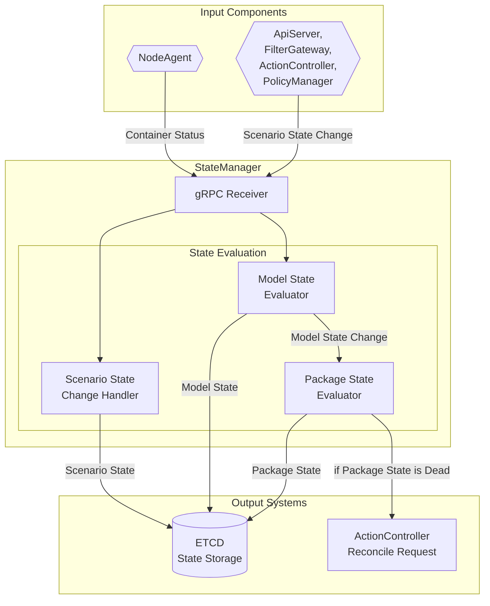
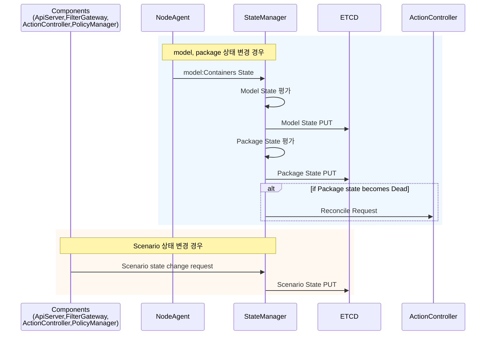
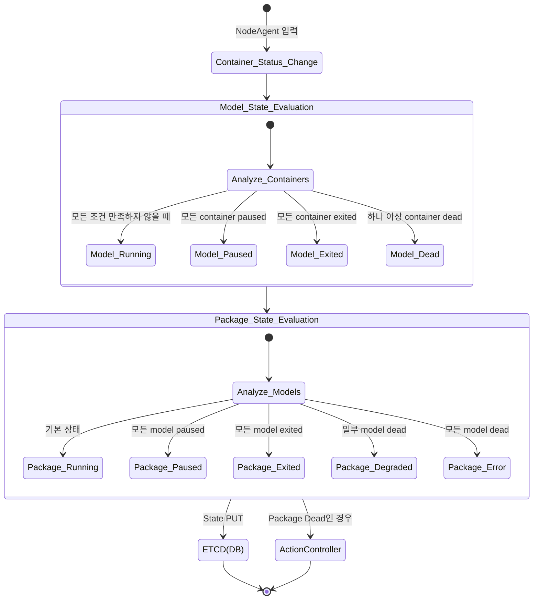

# 1. StateManager 동작 다이어그램

## 전체 시스템 구조



## 상세 처리 흐름



## model, package 연쇄 상태 전이 규칙



# 2. StateManager 핵심 기능 목록

## 3.1 핵심 기능
1. **외부 요청 수신**: Scenario 상태 변경 요청 및 Container 상태 수신 
2. **상태 관리**: 하위 리소스 상태 변경에 따른 상위 리소스 상태 자동 업데이트
3. **상태 저장**: 각 리소스의 변경된 상태값 ETCD에 저장 
4. **복구 작업**: Package Dead 상황 시 자동 복구 작업 트리거
5. **오류 처리**: 상태 전환 실패 및 시스템 오류에 대한 처리

### 3.1.1 외부 요청 수신
- **Container 상태 수신**: NodeAgent로부터 컨테이너 상태 정보 수신 및 처리
- **상태 변경 요청 수신**: 다른 컴포넌트로부터 Scenario/Package/Model 상태 변경 요청 수신
- **요청 검증**: 수신된 상태 변경 요청의 유효성 검증

### 3.1.2 상태 관리
- **Model 상태 평가**: 컨테이너 상태 기반으로 Model 상태 자동 결정
- **Package 상태 평가**: Model 상태들을 기반으로 Package 상태 자동 결정
- **Scenario 상태 처리**: 외부 요청에 따른 Scenario 상태 변경 처리

### 3.1.3 상태 저장
- **상태 정보 저장**: Scenario, Package, Model 상태를 ETCD에 영구 저장
- **상태 정보 조회**: model, package 상태 평가를 위해 ETCD에서 기존 상태 정보 로드
- **데이터 동기화**: 메모리 상태와 ETCD 저장소 간 동기화

### 3.1.4 복구 작업 
- **복구 요청**: Package Dead 상황 시 ActionController에 reconcile 요청

### 3.1.5 오류 처리
- **상태 전환 실패 처리**: 상태 전환 실패 시 적절한 오류 처리 및 복구
- **예외 상황 대응**: 시스템 오류 상황에 대한 안전한 처리

## 3.2 주요 함수 매핑

| 기능 구분 | 주요 함수 | 파일 위치 | 설명 |
|----------|-----------|-----------|------|
| **gRPC 수신** | `send_changed_container_list()` | `grpc/receiver.rs` | NodeAgent 컨테이너 상태 수신 |
|  | `send_state_change()` | `grpc/receiver.rs` | Scenario 상태 변경 요청 수신 |
| **상태 처리** | `process_state_change()` | `manager.rs` | Scenario 상태 변경 처리 |
|  | `process_container_list()` | `manager.rs` | 컨테이너 상태로 model 및 package 상태 처리 |
|  | `evaluate_model_state_from_containers()` | `state_machine.rs` | Model 상태 평가 |
|  | `evaluate_and_update_package_state()` | `state_machine.rs` | Package 상태 평가 |
| **ETCD 저장** | `save_model_state_to_etcd()` | `manager.rs` | Model 상태 저장 |
|  | `save_package_state_to_etcd()` | `manager.rs` | Package 상태 저장 |
| **외부 연동** | `trigger_action_controller_reconcile()` | `manager.rs` | ActionController 요청 |
|  | `_send()` | `grpc/sender.rs` | gRPC 요청 발신 |


# 3. AI 개발 프로세스
## 1. LLD 단위 설정 방법
- 아래 예시 및 template의 ()는 필요에 맞게 변경하여 작성합니다. 

### 1. 단일 대상 기능 정의
AI가 한 번에 이해할 수 있도록 **하나의 간단한 기능**만 정의합니다.

#### 핵심 원칙
1. **하나만 다루기**: 여러 개가 아닌 하나의 resource만 처리하는 기능
2. **세가지 항목으로 쪼개기**: 입력 → 처리 → 출력을 각각 한 줄로 설명

#### 쉬운 예시로 이해하기
```
- 정의 : 컨테이너 상태가 바뀌면 모델 상태를 업데이트하는 기능

다이어그램:
+-------------------+         +---------------------+         +-------------------+
|   NodeAgent       |  gRPC   |   StateManager      |   put   |       ETCD        |
|   (상태 알림)      | ------> |   (상태 판단 및     | ------> |   (상태 저장)      |
|                   |         |    업데이트)        |         |                   |
+-------------------+         +---------------------+         +-------------------+
- **인터페이스:** 외부 인터페이스(gRPC)로부터 수신, 외부 인터페이스(ETCD)로 발신
    - **입력:** NodeAgent 컴포넌트로부터 pod과 container들의 상태 정보를 전달받음
    - **처리:** `<container, state>` 리스트가 model의 특정 state 조건과 일치하면 model의 state를 변경
    - **출력:** ETCD에 `<model, state>` put 요청
```
이렇게 **입력→처리→출력**이 명확하고 단순한 하나의 기능만 정의해야 합니다. 


### 2. LLD 문서 작성하기

위에서 정의한 **하나의 간단한 기능**에 대한 설명서를 작성합니다.
AI가 이해하고 구현할 수 있도록 **구체적이고 명확한** 정보를 담습니다.

#### 📝 LLD 템플릿 (예시)

```markdown
## 0. 문서의 목적
- **목표**: 컨테이너 상태가 바뀌면 모델 상태를 자동으로 업데이트하는 기능
- **왜 필요한가**: 컨테이너의 상태를 반영하여 모델 상태를 업데이트해야 함
- 이 문서는 StateManager컴포넌트에 model의 state 변경하는 기능을 추가하기 위해 작성되었습니다. 
- ( 상세 설명 )
- 이 기능은 이 문서에 포함된 조건 및 규칙들을 따라야 합니다.

## 1. StateManager의 기능
- 기능 1 : ( 설명 )
- 기능 2 : ( 설명 )

## 2. ( ) 컴포넌트의 구현 구조
- **manager.rs**: 메인 처리 로직 (컨테이너 상태 받아서 모델 상태 결정 함수 호출)
- **grpc/receiver.rs**: NodeAgent로부터 메시지 받기
- **state_machine.rs**: 상태 결정 함수가 위치 (실패 조건 등)

## 3. ( 대상 )을 위해 ( ) 컴포넌트에 구현되어야 하는 것
+-------------------+         +---------------------+         +-------------------+
|   NodeAgent       |  gRPC   |   StateManager      |   put   |       ETCD        |
|   (상태 알림)      | ------> |   (상태 판단 및     | ------> |   (상태 저장)      |
|                   |         |    업데이트)        |         |                   |
+-------------------+         +---------------------+         +-------------------+

- **인터페이스:** 외부 인터페이스(gRPC)로부터 수신, 외부 인터페이스(ETCD)로 발신
    - **입력:** NodeAgent 컴포넌트로부터 pod과 container들의 상태 정보를 전달받음
    - **처리:** `<container, state>` 리스트가 model의 특정 state 조건과 일치하면 model의 state를 변경
    - **출력:** ETCD에 `<model, state>` put 요청

## 4. 지켜야 할 규칙
- **ETCD 저장 방식**: `key = "model/{모델이름}", value = "{상태}"`
- **gRPC 메시지 형식**: `ContainerList` 구조체 사용
- **에러 처리**: 실패 시 로그 남기고 계속 진행
```

### 3. LLD 기반 구현 과정
#### 1. 수정 후 구현 vs 새로 구현 판단하기
- 맨 처음 구현한다면 바로 3번으로 이동합니다. 
- 이미 구현된 코드가 있다면 새로 구현해도 될지, 수정 후 구현해야할지 판단해야 합니다.

PR1. 수정 필요 여부 판단하기
- 기능 구현 시 이미 기 구현된 함수가 있는지 확인 필요
```
아래 가이드 대로 pr을 만들어줘. 

나는 ( A ).rs에 새로운 ( 역할 )함수를 추가하고 싶어.
src에 ( 역할 ) 기능을 수행하는 함수가 있는지 확인해줘.  
```

#### 2. 구현 전 수정하기
- 구조체는 여러 위치에서 참조하므로 수정합니다.
- 기 구현된 함수는 수정하는 것보다 삭제 후 새로 구현하는 것이 혼동이 적습니다. 
  - 기 구현된 함수가 새로운 구현 기능을 포함한 여러 기능을 가진 함수라면 새로 구현할 기능과 관련된 내용만을 삭제합니다.
  - 기 구현된 함수가 새로운 구현 기능만을 포함한 단일 기능 함수라면 혼동을 막기 위해 전체 삭제합니다. 
PR2. 수정 혹은 삭제하기

구현 없이 수정 혹은 삭제만 이루어지는 단계

(1) 함수는 삭제합니다. 
```
아래 가이드 대로 pr을 만들어줘.

목표 : 나는 ( A ).rs에 새로운 (역할)을 수행하는 함수를 추가하고 싶어.
TODO : 그래서 지금의 (동일한 역할을 수행하는) 함수들을 삭제하고 싶어. fn ( B ), fn ( C )를 삭제해줘. 
```
(2) 구조체는 수정합니다.
```
아래 가이드 대로 pr을 만들어줘.

목표 : 기존의 ( D ), ( E ) 구조체의 구성을 ( F ).md 에 명시된 ( D ), ( E ) 구조체의 구성으로 변경하고 싶어. 
TODO : 그래서 지금의 ( D ),( E ) 구조체의 구성을 ( F ).md에 명시된 ( D ), ( E ) 구조체의 구성으로 변경해줘.
```

#### 3. 구현하기
PR3. 구현하기

LLD 문서를 기반으로 구현을 수행하는 단계

2장에서 작성한 LLD 문서를 참조하여 구현합니다. 
```
아래 가이드 대로 pr을 만들어줘.
G.md 이 문서에 명시된 기능을 ( path )/src/ 여기에 만들어줘.
```

#### 4. 추가 코멘트 방법

1. 함수의 이동
- 함수가 특정 파일에 구현되어야 한다면 (1) 함수의 이동을 명령합니다.

```
@copilot
목적 : (  ) 기능은 반드시 ( path )/src/( H ).rs에 구현되어야 해.

TODO : ( path )/src/( I ).rs의 fn ( J ) 함수와 이 함수에서 호출되는 함수를 ( path )/src/( H ).rs로 이동해줘. 
```


2. 함수의 이동 및 병합
- 함수가 특정 파일에 위치한 함수에 병합되어야 할 경우 (1) 함수의 이동 및 (2) 함수의 병합을 명령합니다.

```
@copilot
목적 : (  ) 기능은 반드시 ( path )/src/( H ).rs에 구현되어야 해.

TODO : ( path )/src/( I ).rs의 fn ( J ) 함수와 이 함수에서 호출되는 함수를 ( path )/src/( H ).rs로 이동하고 fn ( K )함수와 병합해줘.

병합된 함수는 ( 인풋1 ), ( 인풋2 )를 받아서 (1) ( 기능1 )을 수행하고 (2) ( 기능2 )를 수행해서 ( 결과1 ), ( 결과2 )를 return 해야해.

이 작업을 수행하고 테스트해줘. 
```
