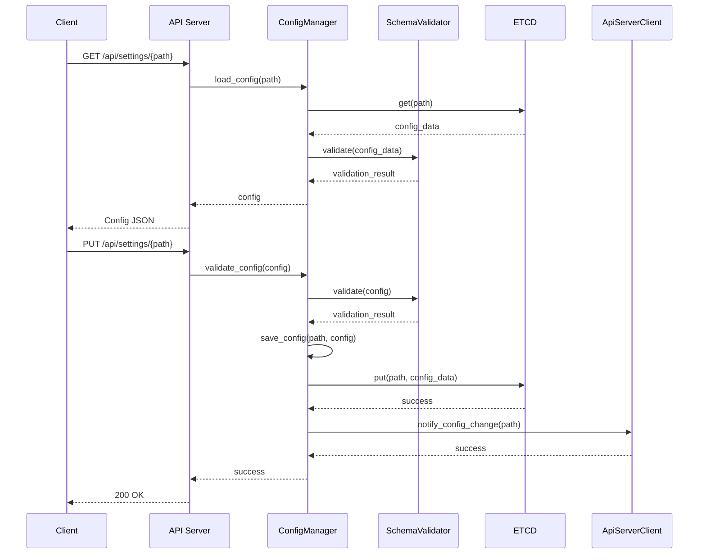
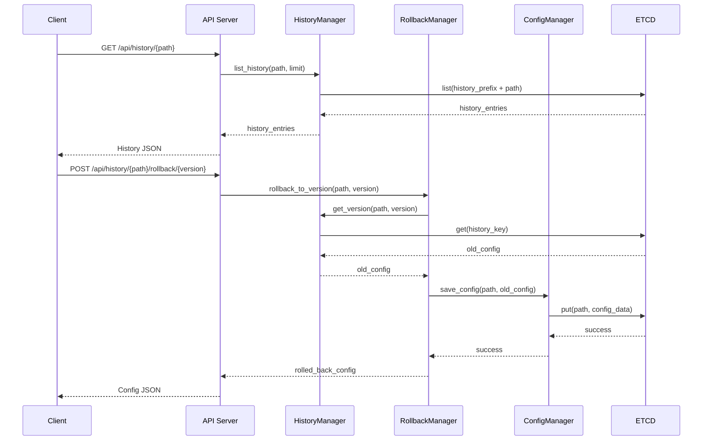

# Settings Service 상세 설계 문서 (LLD)

**문서 번호**: PICCOLO-SETTINGS-LLD-2025-001  
**버전**: 1.0  
**날짜**: 2025-08-11  
**작성자**: PICCOLO 팀  
**분류**: LLD (Low-Level Design)

## 1. 개요

Settings Service는 PICCOLO 프레임워크에서 시스템 설정 관리와 메트릭 정보 제공을 담당하는 핵심 컴포넌트입니다. 본 문서는 HLD에서 정의된 기능을 구현하기 위한 상세 설계 명세를 제공합니다.

### 1.1 목적 및 범위

본 문서는 다음 내용을 포함합니다:
- Settings Service의 모듈별 상세 구현 방법
- 클래스 및 함수 정의
- 데이터 구조 및 알고리즘
- 인터페이스 세부 명세
- 오류 처리 메커니즘
- 주요 시퀀스 상세 흐름

### 1.2 주요 기능 요약

1. **설정 관리** - YAML 기반 구성 파일의 생성, 수정, 삭제, 검증 및 적용
2. **메트릭 정보 제공** - ETCD에 저장된 메트릭 데이터 필터링 및 REST API 제공
3. **다중 인터페이스** - 웹 UI 및 CLI 인터페이스 제공
4. **변경 이력 관리** - 설정 변경 이력 추적 및 롤백 기능

## 2. 시스템 아키텍처

### 2.1 컴포넌트 구조

Settings Service는 다음과 같은 주요 모듈로 구성됩니다:

```
settingsservice/
├── src/
│   ├── main.rs                 # 진입점 및 서비스 초기화
│   ├── config/                 # 설정 관리 모듈
│   │   └── mod.rs              # 설정 관리, 유효성 검증, 스키마 정의 등 모든 기능 구현
│   ├── history/                # 이력 관리 모듈
│   │   └── mod.rs              # 이력 저장/조회, 차이 계산, 롤백 등 모든 기능 구현
│   ├── metrics/                # 메트릭 관리 모듈
│   │   └── mod.rs              # 메트릭 데이터 조회/필터링, 캐싱 등 모든 기능 구현
│   ├── storage/                # 저장소 관리 모듈
│   │   └── mod.rs              # ETCD 클라이언트 및 데이터 모델 구현
│   ├── api/                    # API 서버 모듈
│   │   ├── mod.rs              # API 기본 정의 및 공통 기능
│   │   ├── rest/               # REST API 구현
│   │   │   └── mod.rs          # 모든 API 엔드포인트 및 서버 구현
│   │   └── client/             # 클라이언트 구현
│   │       └── mod.rs          # API 서버 클라이언트 구현
│   ├── web/                    # 웹 인터페이스 모듈
│   │   ├── mod.rs              # 웹 서버 및 라우팅 설정
│   │   └── ui/                 # UI 컴포넌트
│   │       └── mod.rs          # 모든 UI 컴포넌트 구현
│   ├── cli/                    # CLI 모듈
│   │   └── mod.rs              # CLI 명령, 쉘, 포맷팅 등 모든 기능 구현
│   └── utils/                  # 유틸리티 모듈
│       └── mod.rs              # 오류 처리, 로깅, YAML 처리 등 모든 유틸리티 구현
└── Cargo.toml                  # 의존성 및 메타데이터
│   │   ├── server.rs           # 웹 서버 구현
│   │   ├── routes.rs           # 라우팅 설정
│   │   └── ui/                 # UI 컴포넌트
│   │       ├── mod.rs
│   │       ├── dashboard.rs    # 대시보드 컴포넌트
│   │       ├── editor.rs       # 설정 편집기 컴포넌트
│   │       ├── history.rs      # 이력 브라우저 컴포넌트
│   │       └── metrics.rs      # 메트릭 뷰어 컴포넌트
│   ├── cli/                    # CLI 모듈
│   │   ├── mod.rs
│   │   ├── commands.rs         # CLI 명령 구현
│   │   ├── shell.rs            # 대화형 쉘 구현
│   │   └── formatter.rs        # 출력 포맷 지정
│   └── utils/                  # 유틸리티 모듈
│       ├── mod.rs
│       ├── error.rs            # 오류 처리
│       ├── logging.rs          # 로깅 유틸리티
│       └── yaml.rs             # YAML 처리 유틸리티
└── Cargo.toml                  # 의존성 및 메타데이터
```

### 2.2 모듈 설명

각 모듈의 주요 기능과 책임 영역은 다음과 같습니다:

1. **config**: 시스템 설정 파일 관리를 담당합니다. YAML 파일의 로드, 파싱, 검증, 저장을 처리합니다.
2. **history**: 설정 변경 이력을 관리하고 버전 간 차이를 계산하며 롤백 기능을 제공합니다.
3. **metrics**: ETCD에 저장된 메트릭 데이터를 조회하고 필터링하는 기능을 제공합니다.
4. **storage**: ETCD와의 통신을 담당하며, 설정과 메트릭 데이터의 영구 저장소 역할을 합니다.
5. **api**: REST API 서버를 구현하고 외부 시스템과의 통신을 관리합니다.
6. **web**: 웹 기반 UI를 제공하여 사용자가 설정을 관리하고 메트릭을 조회할 수 있습니다.
7. **cli**: 명령줄 인터페이스를 제공하여 스크립트 및 자동화를 지원합니다.
8. **utils**: 오류 처리, 로깅, YAML 처리 등 공통 유틸리티 기능을 제공합니다.

### 2.3 서비스 의존성

Settings Service는 다음과 같은 외부 시스템과 상호작용합니다:

1. **ETCD**: 설정 및 메트릭 데이터 영구 저장소
2. **API Server**: 설정 변경 사항 전파
3. **Monitoring Server**: 메트릭 데이터 출처

### 2.4 외부 시스템 통합

Settings Service는 다음과 같은 방식으로 외부 시스템과 통합됩니다:

1. **API Server 연동**
   - REST API를 통한 설정 변경 사항 전파
   - 상태 확인 및 헬스 체크 API 제공
   - gRPC 호출을 통한 실시간 알림

2. **ETCD 저장소 연동**
   - 클러스터 모드 ETCD 지원
   - 트랜잭션 기반 데이터 무결성 보장
   - 키 접두사 기반 데이터 구성

3. **Monitoring Server 연동**
   - 메트릭 데이터 조회 인터페이스
   - 필터 기반 데이터 조회 최적화
   - 캐싱을 통한 성능 향상

### 2.5 확장성 및 성능 고려사항

1. **수평적 확장성**
   - 무상태(Stateless) 설계로 다중 인스턴스 운영 가능
   - 로드 밸런서를 통한 트래픽 분산
   - 인스턴스 간 캐시 동기화 메커니즘

2. **성능 최적화**
   - ETCD 쿼리 최적화
   - 응답 캐싱
   - 비동기 처리를 통한 응답성 향상

3. **대용량 처리**
   - 대규모 설정 파일 처리를 위한 스트리밍 API
   - 페이지네이션을 통한 대량 데이터 조회
   - 부분 업데이트를 통한 효율적인 데이터 처리

## 3. 모듈별 상세 설계

### 3.1 Config 모듈

#### 3.1.1 클래스 및 함수 정의

```rust
// mod.rs - 설정 관리 모듈의 모든 기능 구현
pub struct ConfigManager {
    etcd_client: Arc<EtcdClient>,
}

impl ConfigManager {
    pub fn new(etcd_client: Arc<EtcdClient>) -> Self;
    pub async fn load_config(&self, config_path: &str) -> Result<Config, ConfigError>;
    pub async fn save_config(&self, config_path: &str, config: &Config) -> Result<(), ConfigError>;
    pub async fn validate_config(&self, config: &Config) -> Result<ValidationResult, ConfigError>;
    pub async fn apply_config(&self, config: &Config) -> Result<ApplyResult, ConfigError>;
    pub async fn list_configs(&self, prefix: &str) -> Result<Vec<ConfigSummary>, ConfigError>;
    pub async fn delete_config(&self, config_path: &str) -> Result<(), ConfigError>;
}

// SchemaValidator - 동일 파일 내에서 구현
pub struct SchemaValidator {
    schemas: HashMap<String, JsonSchema>,
}

impl SchemaValidator {
    pub fn new() -> Self;
    pub fn load_schema(&mut self, schema_type: &str, schema: &str) -> Result<(), SchemaError>;
    pub fn validate(&self, schema_type: &str, data: &Value) -> ValidationResult;
}

// JsonSchema - 동일 파일 내에서 구현
pub struct JsonSchema {
    schema: Value,
}

impl JsonSchema {
    pub fn new(schema: Value) -> Self;
    pub fn validate(&self, data: &Value) -> ValidationResult;
}
```

#### 3.1.2 데이터 구조

```rust
// 설정 데이터 구조
pub struct Config {
    pub path: String,
    pub content: Value,
    pub metadata: ConfigMetadata,
}

pub struct ConfigMetadata {
    pub version: u64,
    pub created_at: DateTime<Utc>,
    pub modified_at: DateTime<Utc>,
    pub schema_type: String,
}

pub struct ConfigSummary {
    pub path: String,
    pub schema_type: String,
    pub version: u64,
    pub modified_at: DateTime<Utc>,
}

pub struct ValidationResult {
    pub is_valid: bool,
    pub errors: Vec<ValidationError>,
}

pub struct ValidationError {
    pub path: String,
    pub message: String,
    pub severity: ValidationSeverity,
}

pub enum ValidationSeverity {
    Error,
    Warning,
    Info,
}

pub struct ApplyResult {
    pub success: bool,
    pub message: String,
    pub affected_components: Vec<String>,
}
```

### 3.2 History 모듈

#### 3.2.1 클래스 및 함수 정의

```rust
// mod.rs - 이력 관리 모듈의 모든 기능 구현
pub struct HistoryManager {
    etcd_client: Arc<EtcdClient>,
}

impl HistoryManager {
    pub fn new(etcd_client: Arc<EtcdClient>) -> Self;
    pub async fn record_change(&self, config_path: &str, old_config: Option<&Config>, new_config: &Config) -> Result<u64, HistoryError>;
    pub async fn list_history(&self, config_path: &str, limit: usize) -> Result<Vec<HistoryEntry>, HistoryError>;
    pub async fn get_version(&self, config_path: &str, version: u64) -> Result<Config, HistoryError>;
    pub fn calculate_diff(old_config: &Value, new_config: &Value) -> Vec<DiffEntry>;
    pub fn format_diff(diff: &[DiffEntry]) -> String;
    pub async fn rollback_to_version(&self, config_path: &str, version: u64, config_manager: &ConfigManager) -> Result<Config, RollbackError>;
}
```

#### 3.2.2 데이터 구조

```rust
pub struct HistoryEntry {
    pub config_path: String,
    pub version: u64,
    pub timestamp: DateTime<Utc>,
    pub author: String,
    pub comment: Option<String>,
}

pub enum DiffOperation {
    Add,
    Remove,
    Change,
}

pub struct DiffEntry {
    pub path: String,
    pub operation: DiffOperation,
    pub old_value: Option<Value>,
    pub new_value: Option<Value>,
}
```

### 3.3 Metrics 모듈

#### 3.3.1 클래스 및 함수 정의

```rust
// mod.rs - 메트릭 관리 모듈의 모든 기능 구현
pub struct MetricsManager {
    etcd_client: Arc<EtcdClient>,
    cache: RwLock<HashMap<String, CacheEntry<Metric>>>,
    ttl: Duration,
}

impl MetricsManager {
    pub fn new(etcd_client: Arc<EtcdClient>, ttl: Duration) -> Self;
    pub async fn get_metrics(&self, filter: Option<&MetricsFilter>) -> Result<Vec<Metric>, MetricsError>;
    pub async fn get_metric_by_id(&self, id: &str) -> Result<Metric, MetricsError>;
    pub async fn get_metrics_by_component(&self, component: &str) -> Result<Vec<Metric>, MetricsError>;
    pub async fn get_metrics_by_type(&self, metric_type: &str) -> Result<Vec<Metric>, MetricsError>;
    
    // 필터 관리 기능
    pub async fn create_filter(&self, filter: &MetricsFilter) -> Result<String, FilterError>;
    pub async fn get_filter(&self, id: &str) -> Result<MetricsFilter, FilterError>;
    pub async fn update_filter(&self, id: &str, filter: &MetricsFilter) -> Result<(), FilterError>;
    pub async fn delete_filter(&self, id: &str) -> Result<(), FilterError>;
    pub async fn list_filters(&self) -> Result<Vec<FilterSummary>, FilterError>;
    
    // 캐시 관리 기능
    pub async fn get_cached(&self, key: &str) -> Option<Metric>;
    pub async fn set_cached(&self, key: &str, metric: Metric);
    pub async fn invalidate_cache(&self, key: &str);
    pub async fn clear_cache(&self);
    
    // 시각화 및 데이터 내보내기 기능
    pub async fn generate_time_series_data(&self, metric_ids: &[String], time_range: &TimeRange) -> Result<TimeSeriesData, MetricsError>;
    pub async fn generate_histogram(&self, metric_id: &str, buckets: usize) -> Result<HistogramData, MetricsError>;
    pub async fn export_metrics(&self, format: ExportFormat, metrics: &[Metric]) -> Result<Vec<u8>, ExportError>;
    pub async fn generate_dashboard_data(&self, dashboard_id: &str) -> Result<DashboardData, DashboardError>;
    pub async fn save_dashboard(&self, dashboard: &Dashboard) -> Result<String, DashboardError>;
    pub async fn get_dashboard(&self, id: &str) -> Result<Dashboard, DashboardError>;
    pub async fn list_dashboards(&self) -> Result<Vec<DashboardSummary>, DashboardError>;
    pub async fn delete_dashboard(&self, id: &str) -> Result<(), DashboardError>;
}

// 시각화를 위한 데이터 구조체
pub struct TimeSeriesData {
    pub labels: Vec<String>,
    pub series: Vec<TimeSeries>,
}

pub struct TimeSeries {
    pub name: String,
    pub data: Vec<(Timestamp, f64)>,
}

pub struct HistogramData {
    pub metric_id: String,
    pub bucket_labels: Vec<String>,
    pub bucket_values: Vec<u64>,
}

pub struct Dashboard {
    pub id: Option<String>,
    pub name: String,
    pub description: String,
    pub panels: Vec<DashboardPanel>,
    pub created_at: Option<Timestamp>,
    pub updated_at: Option<Timestamp>,
}

pub struct DashboardPanel {
    pub id: String,
    pub title: String,
    pub panel_type: PanelType,
    pub metrics: Vec<String>,
    pub options: Value,
    pub position: PanelPosition,
}

pub enum PanelType {
    TimeSeries,
    Gauge,
    Histogram,
    Table,
    Stat,
}

pub struct PanelPosition {
    pub x: u32,
    pub y: u32,
    pub width: u32,
    pub height: u32,
}

pub struct DashboardData {
    pub dashboard: Dashboard,
    pub panels_data: HashMap<String, Value>,
}

pub enum ExportFormat {
    CSV,
    JSON,
    Prometheus,
}

pub struct DashboardSummary {
    pub id: String,
    pub name: String,
    pub description: String,
    pub panel_count: usize,
    pub created_at: Timestamp,
    pub updated_at: Timestamp,
}
```

#### 3.3.2 데이터 구조

```rust
pub struct Metric {
    pub id: String,
    pub component: String,
    pub metric_type: String,
    pub labels: HashMap<String, String>,
    pub value: MetricValue,
    pub timestamp: DateTime<Utc>,
}

pub enum MetricValue {
    Counter(u64),
    Gauge(f64),
    Histogram(Vec<HistogramBucket>),
    Summary(Vec<SummaryQuantile>),
}

pub struct HistogramBucket {
    pub upper_bound: f64,
    pub count: u64,
}

pub struct SummaryQuantile {
    pub quantile: f64,
    pub value: f64,
}

pub struct MetricsFilter {
    pub id: String,
    pub name: String,
    pub components: Option<Vec<String>>,
    pub metric_types: Option<Vec<String>>,
    pub label_selectors: Option<HashMap<String, String>>,
    pub time_range: Option<TimeRange>,
}

pub struct TimeRange {
    pub start: DateTime<Utc>,
    pub end: Option<DateTime<Utc>>,
}

pub struct FilterSummary {
    pub id: String,
    pub name: String,
    pub component_count: usize,
    pub metric_type_count: usize,
}

pub struct CacheEntry<T> {
    pub data: T,
    pub expiry: Instant,
}
```

### 3.4 Storage 모듈

#### 3.4.1 클래스 및 함수 정의

```rust
// mod.rs - 저장소 관리 모듈의 모든 기능 구현
pub struct EtcdClient {
    client: Client,
    endpoints: Vec<String>,
}

impl EtcdClient {
    pub fn new(endpoints: Vec<String>) -> Result<Self, EtcdError>;
    pub async fn get(&self, key: &str) -> Result<Option<KeyValue>, EtcdError>;
    pub async fn put(&self, key: &str, value: &str) -> Result<(), EtcdError>;
    pub async fn delete(&self, key: &str) -> Result<bool, EtcdError>;
    pub async fn list(&self, prefix: &str) -> Result<Vec<KeyValue>, EtcdError>;
    pub async fn watch(&self, prefix: &str) -> EtcdWatcher;
    pub async fn transaction(&self, txn: &Transaction) -> Result<TxnResponse, EtcdError>;
}

pub struct EtcdWatcher {
    inner: Pin<Box<dyn Stream<Item = Result<WatchEvent, EtcdError>> + Send>>,
}

impl EtcdWatcher {
    pub async fn next(&mut self) -> Option<Result<WatchEvent, EtcdError>>;
    pub fn close(self);
}

// 데이터 모델 구조체 (동일 파일 내에서 구현)
pub struct KeyValue {
    pub key: Vec<u8>,
    pub value: Vec<u8>,
    pub create_revision: i64,
    pub mod_revision: i64,
    pub version: i64,
}

pub struct Transaction {
    pub compare: Vec<Compare>,
    pub success: Vec<TxnOp>,
    pub failure: Vec<TxnOp>,
}

pub enum Compare {
    Value(String, CompareOp, Vec<u8>),
    Version(String, CompareOp, i64),
    CreateRevision(String, CompareOp, i64),
    ModRevision(String, CompareOp, i64),
}

pub enum CompareOp {
    Equal,
    Greater,
    Less,
}

pub enum TxnOp {
    Put(String, Vec<u8>),
    Get(String),
    Delete(String),
}

pub enum WatchEvent {
    Put(KeyValue),
    Delete(KeyValue),
}
```

### 3.5 API 모듈

#### 3.5.1 클래스 및 함수 정의

```rust
// api/mod.rs - API 모듈 기본 정의
pub struct ApiServer {
    config: ApiServerConfig,
    router: Router,
}

impl ApiServer {
    pub fn new(config: ApiServerConfig) -> Self;
    pub fn configure_routes(&mut self);
    pub async fn start(&self) -> Result<(), ApiError>;
    pub async fn stop(&self) -> Result<(), ApiError>;
}

// api/rest/mod.rs - REST API 구현
pub struct RestApiHandler {
    metrics_manager: Arc<MetricsManager>,
    config_manager: Arc<ConfigManager>,
    history_manager: Arc<HistoryManager>,
}

impl RestApiHandler {
    pub fn new(
        metrics_manager: Arc<MetricsManager>,
        config_manager: Arc<ConfigManager>,
        history_manager: Arc<HistoryManager>
    ) -> Self;
    
    // 메트릭 API 핸들러
    pub async fn get_metrics(&self, query: Query<MetricsQuery>) -> Result<Json<Vec<Metric>>, ApiError>;
    pub async fn get_metric_by_id(&self, id: String) -> Result<Json<Metric>, ApiError>;
    pub async fn get_filters(&self) -> Result<Json<Vec<FilterSummary>>, ApiError>;
    pub async fn get_filter(&self, id: String) -> Result<Json<MetricsFilter>, ApiError>;
    pub async fn create_filter(&self, filter: Json<MetricsFilter>) -> Result<Json<FilterResponse>, ApiError>;
    pub async fn update_filter(&self, id: String, filter: Json<MetricsFilter>) -> Result<StatusCode, ApiError>;
    pub async fn delete_filter(&self, id: String) -> Result<StatusCode, ApiError>;
    
    // 설정 API 핸들러
    pub async fn get_config(&self, path: String) -> Result<Json<Config>, ApiError>;
    pub async fn list_configs(&self, prefix: Option<String>) -> Result<Json<Vec<ConfigSummary>>, ApiError>;
    pub async fn create_config(&self, config: Json<Config>) -> Result<StatusCode, ApiError>;
    pub async fn update_config(&self, path: String, config: Json<Config>) -> Result<StatusCode, ApiError>;
    pub async fn delete_config(&self, path: String) -> Result<StatusCode, ApiError>;
    pub async fn validate_config(&self, config: Json<Config>) -> Result<Json<ValidationResult>, ApiError>;
    
    // 이력 API 핸들러
    pub async fn get_history(&self, path: String, limit: Option<usize>) -> Result<Json<Vec<HistoryEntry>>, ApiError>;
    pub async fn get_version(&self, path: String, version: u64) -> Result<Json<Config>, ApiError>;
    pub async fn rollback(&self, path: String, version: u64) -> Result<Json<Config>, ApiError>;
    pub async fn diff_versions(&self, path: String, version1: u64, version2: u64) -> Result<Json<Vec<DiffEntry>>, ApiError>;
}

// api/client/mod.rs - API 클라이언트 구현
pub struct ApiClient {
    base_url: String,
    client: reqwest::Client,
}

impl ApiClient {
    pub fn new(base_url: String) -> Self;
    pub async fn notify_config_change(&self, config_path: &str) -> Result<(), ClientError>;
    pub async fn get_status(&self) -> Result<ApiServerStatus, ClientError>;
    pub async fn get_metrics(&self, query: &MetricsQuery) -> Result<Vec<Metric>, ClientError>;
    pub async fn get_config(&self, path: &str) -> Result<Config, ClientError>;
    pub async fn save_config(&self, config: &Config) -> Result<(), ClientError>;
    pub async fn get_history(&self, path: &str, limit: Option<usize>) -> Result<Vec<HistoryEntry>, ClientError>;
    pub async fn rollback(&self, path: &str, version: u64) -> Result<Config, ClientError>;
}
```

#### 3.5.2 데이터 구조

```rust
pub struct ApiServerConfig {
    pub bind_address: String,
    pub bind_port: u16,
    pub tls_enabled: bool,
    pub tls_cert_path: Option<String>,
    pub tls_key_path: Option<String>,
}

pub struct MetricsQuery {
    pub component: Option<String>,
    pub metric_type: Option<String>,
    pub filter_id: Option<String>,
    pub labels: Option<HashMap<String, String>>,
    pub start_time: Option<DateTime<Utc>>,
    pub end_time: Option<DateTime<Utc>>,
}

pub struct FilterResponse {
    pub id: String,
    pub name: String,
}

pub struct ApiServerStatus {
    pub version: String,
    pub uptime: Duration,
    pub connected_clients: u32,
    pub request_count: u64,
}
```

### 3.6 Web 모듈

#### 3.6.1 클래스 및 함수 정의

```rust
// web/mod.rs - 웹 서버 및 라우팅 구현
pub struct WebServer {
    config: WebServerConfig,
    router: Router,
    api_client: Arc<ApiClient>,
}

impl WebServer {
    pub fn new(config: WebServerConfig, api_client: Arc<ApiClient>) -> Self;
    pub fn configure_routes(&mut self);
    pub async fn start(&self) -> Result<(), WebError>;
    pub async fn stop(&self) -> Result<(), WebError>;
}

// web/ui/mod.rs - UI 컴포넌트 구현
pub struct UiComponents {
    api_client: Arc<ApiClient>,
}

impl UiComponents {
    pub fn new(api_client: Arc<ApiClient>) -> Self;
    
    // 대시보드 컴포넌트
    pub async fn render_dashboard(&self) -> Html;
    pub async fn handle_dashboard_refresh(&self) -> Result<Vec<Metric>, ComponentError>;
    
    // 설정 편집기 컴포넌트
    pub async fn render_config_editor(&self, config_path: Option<&str>) -> Html;
    pub async fn handle_config_save(&self, config: &Config) -> Result<(), ComponentError>;
    pub async fn handle_config_validate(&self, config: &Config) -> Result<ValidationResult, ComponentError>;
    
    // 이력 브라우저 컴포넌트
    pub async fn render_history_browser(&self, config_path: &str) -> Html;
    pub async fn handle_history_rollback(&self, config_path: &str, version: u64) -> Result<(), ComponentError>;
    pub async fn handle_history_view_diff(&self, config_path: &str, version1: u64, version2: u64) -> Result<Vec<DiffEntry>, ComponentError>;
    
    // 메트릭 뷰어 컴포넌트
    pub async fn render_metrics_viewer(&self, filter: Option<&MetricsFilter>) -> Html;
    pub async fn handle_metrics_apply_filter(&self, filter: &MetricsFilter) -> Result<Vec<Metric>, ComponentError>;
    pub async fn handle_metrics_save_filter(&self, filter: &MetricsFilter) -> Result<String, ComponentError>;
}
```

#### 3.6.2 데이터 구조

```rust
pub struct WebServerConfig {
    pub bind_address: String,
    pub bind_port: u16,
    pub static_dir: String,
    pub template_dir: String,
    pub api_url: String,
    pub session_secret: String,
}

pub struct Html {
    pub content: String,
}

pub struct ApiClient {
    base_url: String,
    client: reqwest::Client,
}

impl ApiClient {
    pub fn new(base_url: String) -> Self;
    pub async fn get_metrics(&self, query: &MetricsQuery) -> Result<Vec<Metric>, ClientError>;
    pub async fn get_config(&self, path: &str) -> Result<Config, ClientError>;
    pub async fn save_config(&self, config: &Config) -> Result<(), ClientError>;
    pub async fn get_history(&self, path: &str, limit: Option<usize>) -> Result<Vec<HistoryEntry>, ClientError>;
    pub async fn rollback(&self, path: &str, version: u64) -> Result<Config, ClientError>;
}
```

### 3.7 CLI 모듈

#### 3.7.1 클래스 및 함수 정의

```rust
// cli/mod.rs - CLI 모듈의 모든 기능 구현
pub struct CommandRegistry {
    commands: HashMap<String, Box<dyn Command>>,
    api_client: Arc<ApiClient>,
}

impl CommandRegistry {
    pub fn new(api_client: Arc<ApiClient>) -> Self;
    pub fn register_default_commands(&mut self);
    pub fn execute(&self, args: &[String]) -> Result<(), CommandError>;
    pub fn get_help(&self) -> String;
}

pub trait Command {
    fn name(&self) -> &'static str;
    fn description(&self) -> &'static str;
    fn execute(&self, args: &[String]) -> Result<(), CommandError>;
    fn help(&self) -> String;
}

// 내장 명령어 구현 (동일 파일 내에서 구현)
pub struct GetConfigCommand;
pub struct SetConfigCommand;
pub struct ListConfigsCommand;
pub struct GetMetricsCommand;
pub struct FilterMetricsCommand;
pub struct HistoryCommand;
pub struct RollbackCommand;
pub struct HelpCommand;

// 대화형 쉘 (동일 파일 내에서 구현)
pub struct InteractiveShell {
    registry: Arc<CommandRegistry>,
    history: Vec<String>,
}

impl InteractiveShell {
    pub fn new(registry: Arc<CommandRegistry>) -> Self;
    pub async fn run(&mut self) -> Result<(), ShellError>;
    pub fn handle_line(&mut self, line: &str) -> Result<(), ShellError>;
    pub fn complete(&self, line: &str) -> Vec<String>;
    pub fn load_history(&mut self, path: &Path) -> Result<(), ShellError>;
    pub fn save_history(&self, path: &Path) -> Result<(), ShellError>;
}

// 출력 포맷터 (동일 파일 내에서 구현)
pub struct OutputFormatter;

impl OutputFormatter {
    pub fn format_json(value: &Value, pretty: bool) -> String;
    pub fn format_yaml(value: &Value) -> String;
    pub fn format_table<T: Serialize>(items: &[T], headers: &[&str]) -> String;
    pub fn format_metrics(metrics: &[Metric], format: OutputFormat) -> String;
}

pub enum OutputFormat {
    Json,
    Yaml,
    Table,
    Text,
}
```

### 3.8 Utils 모듈

#### 3.8.1 클래스 및 함수 정의

```rust
// utils/mod.rs - 유틸리티 모듈의 모든 기능 구현
// 오류 처리
pub enum ErrorKind {
    ConfigError,
    ValidationError,
    HistoryError,
    MetricsError,
    StorageError,
    ApiError,
    WebError,
    CommandError,
    SystemError,
}

pub struct Error {
    pub kind: ErrorKind,
    pub message: String,
    pub source: Option<Box<dyn std::error::Error + Send + Sync>>,
}

impl Error {
    pub fn new(kind: ErrorKind, message: &str) -> Self;
    pub fn with_source<E>(kind: ErrorKind, message: &str, source: E) -> Self
    where
        E: std::error::Error + Send + Sync + 'static;
}

// 로깅 (동일 파일 내에서 구현)
pub struct Logger;

impl Logger {
    pub fn init(config: &LogConfig) -> Result<(), LogError>;
    pub fn debug(target: &str, message: &str);
    pub fn info(target: &str, message: &str);
    pub fn warn(target: &str, message: &str);
    pub fn error(target: &str, message: &str);
}

// YAML 처리 (동일 파일 내에서 구현)
pub struct YamlParser;

impl YamlParser {
    pub fn parse(content: &str) -> Result<Value, YamlError>;
    pub fn serialize(value: &Value) -> Result<String, YamlError>;
    pub fn merge(base: &mut Value, overlay: &Value) -> Result<(), YamlError>;
    pub fn path_get(value: &Value, path: &str) -> Option<&Value>;
    pub fn path_set(value: &mut Value, path: &str, new_value: Value) -> Result<(), YamlError>;
}
```

#### 3.8.2 데이터 구조

```rust
pub struct LogConfig {
    pub level: LogLevel,
    pub file: Option<String>,
    pub stdout: bool,
    pub format: LogFormat,
}

pub enum LogLevel {
    Debug,
    Info,
    Warn,
    Error,
}

pub enum LogFormat {
    Text,
    Json,
}

pub struct YamlError {
    pub message: String,
    pub line: Option<usize>,
    pub column: Option<usize>,
}
```

## 4. 주요 시퀀스 흐름

### 4.1 설정 파일 로드 및 적용



### 4.2 메트릭 데이터 조회


### 4.3 설정 변경 이력 및 롤백



## 5. 오류 처리 전략

### 5.1 오류 유형 분류

Settings Service는 다음과 같은 오류 유형을 정의하고 처리합니다:

1. **구성 오류** - 설정 파일 형식 오류, 누락된 필수 필드 등
2. **검증 오류** - 스키마 검증 실패, 비즈니스 규칙 위반 등
3. **저장소 오류** - ETCD 연결 실패, 데이터 손상 등
4. **API 오류** - 잘못된 요청 형식, 존재하지 않는 리소스 등
5. **시스템 오류** - 메모리 부족, 파일 시스템 오류 등

### 5.2 오류 처리 메커니즘

1. **통합 오류 타입** - 모든 모듈에서 공통 오류 타입을 사용하여 일관된 오류 정보 제공
2. **컨텍스트 유지** - 오류 발생 시 원인과 컨텍스트 정보를 함께 전파
3. **단계적 복구** - 가능한 경우 오류에서 복구하는 전략 구현
4. **사용자 친화적 메시지** - API 응답으로 전달되는 오류 메시지는 사용자가 이해하기 쉽게 변환
5. **로깅** - 모든 오류는 적절한 로그 레벨로 기록

### 5.3 오류 응답 형식

```json
{
  "error": {
    "code": "CONFIG_VALIDATION_ERROR",
    "message": "Configuration validation failed",
    "details": [
      {
        "path": "resources.cpu",
        "message": "Value must be a positive integer",
        "severity": "ERROR"
      }
    ],
    "requestId": "req-123456"
  }
}
```

## 6. 구성 요소 간 통신

### 6.1 내부 통신

Settings Service의 내부 모듈 간 통신은 다음과 같은 방식으로 이루어집니다:

1. **의존성 주입** - 모듈 간 의존성은 Arc(Atomic Reference Counted) 포인터를 통해 공유
2. **비동기 패턴** - Rust의 async/await 패턴을 사용하여 비동기 작업 처리
3. **이벤트 기반 통신** - 일부 모듈은 이벤트 채널을 통해 비동기적으로 상태 변경 알림

### 6.2 외부 시스템 통신

Settings Service는 다음과 같은 외부 시스템과 통신합니다:

1. **ETCD** - gRPC 기반 클라이언트를 사용하여 설정 및 메트릭 데이터 저장/조회
2. **API Server** - REST API를 통해 설정 변경 알림
3. **웹 클라이언트** - HTTP/WebSocket을 통한 UI 통신

## 7. 성능 및 확장성 고려사항

### 7.1 성능 최적화

1. **캐싱 전략** - 자주 조회되는 메트릭 데이터와 설정을 메모리에 캐싱
2. **비동기 처리** - I/O 바운드 작업은 비동기 처리로 스레드 차단 방지
3. **배치 처리** - 대량의 메트릭 데이터 처리 시 배치 작업으로 효율성 향상
4. **인덱싱** - ETCD 키 설계 시 효율적인 검색을 위한 인덱싱 고려

### 7.2 확장성 설계

1. **모듈식 아키텍처** - 기능별 모듈화로 독립적인 확장 가능
2. **플러그인 시스템** - 향후 추가 기능을 위한 플러그인 아키텍처 고려
3. **수평적 확장** - 부하 분산을 위한 다중 인스턴스 실행 지원
4. **설정 기반 제한** - 리소스 사용량(메모리, 연결 등)을 설정으로 제어

## 8. 배포 및 패키징

### 8.1 배포 전략

#### 8.1.1 컨테이너 기반 배포

```yaml
# docker-compose.yml 예시
version: '3.8'

services:
  settings-service:
    image: piccolo/settings-service:${VERSION}
    ports:
      - "8080:8080"
    environment:
      - RUST_LOG=info
      - ETCD_ENDPOINTS=http://etcd:2379
      - API_SERVER_URL=http://api-server:8000
    volumes:
      - ./config:/app/config
    depends_on:
      - etcd
    restart: unless-stopped

  etcd:
    image: bitnami/etcd:3.5
    environment:
      - ALLOW_NONE_AUTHENTICATION=yes
    ports:
      - "2379:2379"
    volumes:
      - etcd_data:/bitnami/etcd

volumes:
  etcd_data:
```

#### 8.1.2 쿠버네티스 배포

```yaml
# settings-service-deployment.yaml 예시
apiVersion: apps/v1
kind: Deployment
metadata:
  name: settings-service
  namespace: piccolo
spec:
  replicas: 2
  selector:
    matchLabels:
      app: settings-service
  template:
    metadata:
      labels:
        app: settings-service
    spec:
      containers:
      - name: settings-service
        image: piccolo/settings-service:latest
        ports:
        - containerPort: 8080
        env:
        - name: RUST_LOG
          value: "info"
        - name: ETCD_ENDPOINTS
          value: "http://etcd-service:2379"
        - name: API_SERVER_URL
          value: "http://api-server-service:8000"
        volumeMounts:
        - name: config-volume
          mountPath: /app/config
        resources:
          limits:
            cpu: "1"
            memory: "512Mi"
          requests:
            cpu: "200m"
            memory: "256Mi"
        livenessProbe:
          httpGet:
            path: /health
            port: 8080
          initialDelaySeconds: 30
          periodSeconds: 10
        readinessProbe:
          httpGet:
            path: /ready
            port: 8080
          initialDelaySeconds: 5
          periodSeconds: 5
      volumes:
      - name: config-volume
        configMap:
          name: settings-service-config
---
apiVersion: v1
kind: Service
metadata:
  name: settings-service
  namespace: piccolo
spec:
  selector:
    app: settings-service
  ports:
  - port: 8080
    targetPort: 8080
  type: ClusterIP
```

### 8.2 패키징 세부사항

#### 8.2.1 Docker 이미지 구성

- 기본 이미지: Alpine Linux
- 런타임 의존성: OpenSSL, CA certificates
- 포함 바이너리: settings-service, cli 도구
- 구성 파일: 기본 설정, 스키마, 템플릿
- 상태 및 진단 API 포함

#### 8.2.2 설치 옵션

1. **바이너리 배포**
   - x86_64 Linux용 정적 링크 바이너리
   - ARM64 Linux용 정적 링크 바이너리
   - systemd 서비스 파일
   - 설정 디렉토리 구조

2. **소스 코드 컴파일**
   - 빌드 의존성 및 요구사항
   - Cargo.toml 구성
   - 최적화 빌드 옵션
   - 최소 Rust 버전 요구사항

3. **개발 환경 설정**
   - 로컬 개발 Docker Compose 파일
   - Mock ETCD 및 Mock API Server
   - 개발자 도구 및 디버깅 지원

### 8.3 업그레이드 및 마이그레이션

1. **설정 스키마 마이그레이션**
   - 이전 버전 스키마 자동 업그레이드
   - 스키마 변경 감지 및 경고
   - 하위 호환성 유지 전략

2. **무중단 업그레이드**
   - 블루-그린 배포 지원
   - 롤링 업데이트 지원
   - 상태 저장소 백업 및 복구

3. **버전 호환성**
   - API 버전 관리
   - 클라이언트 라이브러리 호환성
   - ETCD 버전 요구사항

## 9. 보안 설계

### 9.1 인증 및 권한 부여

#### 9.1.1 API 접근 제어

```rust
// security/mod.rs 예시
pub struct SecurityManager {
    token_validator: TokenValidator,
    permission_checker: PermissionChecker,
}

impl SecurityManager {
    // API 요청 인증
    pub async fn authenticate_request(&self, request: &HttpRequest) -> Result<UserInfo, AuthError> {
        let token = self.extract_token(request)?;
        self.token_validator.validate_token(&token).await
    }
    
    // 권한 확인
    pub async fn check_permission(&self, user: &UserInfo, resource: &str, action: Action) -> bool {
        self.permission_checker.has_permission(user, resource, action)
    }
}
```

#### 9.1.2 세션 관리

Settings Service는 상태를 유지하지 않는(stateless) 설계를 사용하며, API Server에서 제공하는 JWT 토큰 기반 인증을 활용합니다:

- 모든 API 요청은 Authorization 헤더를 통해 JWT 토큰을 전달
- 토큰에는 사용자 ID, 역할, 권한 등의 정보가 포함됨
- 토큰 유효성 검사 및 만료 처리

### 9.2 데이터 보안

#### 9.2.1 데이터 암호화

```rust
// crypto/mod.rs 예시
pub struct CryptoManager {
    key_provider: KeyProvider,
}

impl CryptoManager {
    // 중요 설정 값 암호화
    pub fn encrypt_sensitive_data(&self, data: &str) -> Result<String, CryptoError> {
        let key = self.key_provider.get_encryption_key()?;
        // AES-GCM 알고리즘을 사용한 암호화 구현
        // ...
    }
    
    // 암호화된 데이터 복호화
    pub fn decrypt_sensitive_data(&self, encrypted: &str) -> Result<String, CryptoError> {
        let key = self.key_provider.get_encryption_key()?;
        // 복호화 구현
        // ...
    }
}
```

#### 9.2.2 전송 데이터 보안

- HTTPS(TLS 1.3) 사용 강제
- 보안 헤더 적용 (Content-Security-Policy, X-XSS-Protection 등)
- CORS 정책 구성

### 9.3 취약점 방어

#### 9.3.1 입력 검증

```rust
// validation/mod.rs 예시
pub struct InputValidator {
    // 구현...
}

impl InputValidator {
    // YAML 파일 검증
    pub fn validate_yaml(&self, content: &str) -> Result<(), ValidationError> {
        // YAML 구문 검증
        // 악의적 코드 패턴 검사
        // 최대 크기 제한 확인
        // ...
    }
    
    // API 입력 검증
    pub fn validate_api_input(&self, input: &Value, schema: &JsonSchema) -> Result<(), ValidationError> {
        // JSON 스키마 검증
        // 데이터 타입 및 범위 검증
        // 입력 필드 검증
        // ...
    }
}
```

#### 9.3.2 보안 로깅 및 모니터링

```rust
// security_logging/mod.rs 예시
pub struct SecurityLogger {
    log_backend: Arc<dyn LogBackend>,
}

impl SecurityLogger {
    // 보안 이벤트 로깅
    pub fn log_security_event(&self, event: SecurityEvent) {
        // 중요 정보 마스킹
        let sanitized_event = self.sanitize_sensitive_data(&event);
        // 구조화된 로그 생성
        self.log_backend.log(LogLevel::Warning, sanitized_event);
    }
    
    // 침입 탐지 시도 로깅
    pub fn log_intrusion_attempt(&self, request: &HttpRequest, reason: &str) {
        // IP, 요청 헤더, 요청 경로 등 로깅
        // 시스템 관리자에게 알림 발송(선택적)
    }
}
```

### 9.4 보안 테스트 계획

1. **정적 코드 분석**
   - Cargo Audit을 통한 의존성 취약점 검사
   - Clippy와 같은 린터를 통한 안전하지 않은 코드 패턴 검사
   - 코드 리뷰 프로세스

2. **동적 보안 테스트**
   - OWASP Top 10 취약점 테스트
   - 자동화된 침투 테스트
   - 퍼징 테스트

3. **정기적인 보안 점검**
   - 의존성 및 라이브러리 업데이트 모니터링
   - 보안 패치 적용 프로세스
   - 취약점 보고 및 해결 절차

## 8. 보안 고려사항

### 8.1 데이터 보안

1. **전송 중 암호화** - TLS를 통한 모든 API 통신 암호화
2. **저장 데이터 보호** - 민감한 설정 데이터의 암호화 저장
3. **액세스 제어** - 경로 기반 설정 접근 제어 구현

### 8.2 보안 로깅

1. **감사 로그** - 모든 설정 변경 사항에 대한 상세 감사 로그 기록
2. **로그 보존** - 보안 감사를 위한 로그 데이터 보존 정책 구현
3. **로그 무결성** - 로그 변조 방지를 위한 무결성 검증 메커니즘

## 9. 테스트 전략

### 9.1 테스트 수준

1. **단위 테스트** - 개별 함수 및 클래스의 동작 검증
2. **통합 테스트** - 모듈 간 상호작용 검증
3. **시스템 테스트** - 전체 시스템 동작 검증
4. **성능 테스트** - 부하 조건에서의 성능 측정

### 9.2 테스트 자동화

1. **CI/CD 통합** - 자동화된 빌드 및 테스트 파이프라인 구축
2. **테스트 커버리지** - 코드 커버리지 측정 및 모니터링
3. **모의 객체(Mock)** - 외부 의존성에 대한 모의 객체 구현

## 10. 배포 및 운영 고려사항

### 10.1 패키징 및 배포

1. **컨테이너화** - Docker 컨테이너로 패키징
2. **설정 관리** - 환경별 설정 관리 전략
3. **버전 관리** - 명확한 버전 관리 및 변경 기록

### 10.2 모니터링 및 로깅

1. **헬스 체크** - 서비스 상태 모니터링 엔드포인트 제공
2. **메트릭 노출** - 내부 성능 메트릭 노출
3. **분산 로깅** - 중앙 집중식 로그 수집 지원

### 10.3 장애 복구

1. **자동 재시작** - 프로세스 장애 시 자동 재시작 메커니즘
2. **상태 백업** - 중요 상태 데이터의 정기적인 백업
3. **롤백 계획** - 배포 실패 시 이전 버전으로 롤백 전략

## 11. 결론

Settings Service는 PICCOLO 프레임워크의 핵심 컴포넌트로서, 시스템 설정 관리와 메트릭 정보 제공을 담당합니다. 본 문서에서는 이를 구현하기 위한 상세 설계를 제시했습니다. 모듈식 아키텍처, 확장 가능한 설계, 강력한 오류 처리 메커니즘을 통해 견고하고 유지보수가 용이한 서비스를 구현할 수 있을 것입니다.
```
```
- **etcd/client.rs** - 공통 ETCD 라이브러리 사용
- **grpc/mod.rs** - gRPC 통신 관리
- **grpc/client/mod.rs** - gRPC 클라이언트 관리
- **grpc/client/api_server.rs** - API Server와의 gRPC 통신
- **grpc/client/monitoring_server.rs** - Monitoring Server와의 gRPC 통신
- **history/mod.rs** - 변경 이력 관리
- **history/manager.rs** - 이력 저장 및 조회
- **history/rollback.rs** - 롤백 기능 구현
- **monitoring/mod.rs** - 모니터링 설정 관리
- **monitoring/manager.rs** - 모니터링 항목 관리
- **monitoring/metrics.rs** - 메트릭 정의 및 처리
- **resources/mod.rs** - Piccolo 리소스 관리
- **resources/manager.rs** - 리소스 관리 공통 기능
- **resources/models.rs** - 모델 리소스 관리
- **resources/packages.rs** - 패키지 리소스 관리
- **resources/scenarios.rs** - 시나리오 리소스 관리
- **resources/validator.rs** - 리소스 유효성 검증
- **web/mod.rs** - 웹 인터페이스 관리
- **web/api.rs** - REST API 구현
- **web/routes.rs** - 웹 라우트 정의
- **web/server.rs** - 웹 서버 구현
- **web/ui/mod.rs** - UI 컴포넌트 관리
- **web/ui/components.rs** - 재사용 가능한 UI 컴포넌트
- **web/ui/pages.rs** - 페이지 레이아웃 및 구성
- **web/ui/resource_editor.rs** - Piccolo 리소스 편집기 UI
- **web/ui/monitoring_dashboard.rs** - 모니터링 대시보드 UI
- **web/server.rs** - 웹 서버 구현
- **web/ui/mod.rs** - UI 컴포넌트 관리
- **web/ui/components.rs** - 재사용 가능한 UI 컴포넌트
- **web/ui/pages.rs** - 페이지 레이아웃 및 구성

## 3. Function information

본 문단의 function 정보는 rustdoc 에서 사용하는 주석 형태로 작성되었다.
이에 대해서는 [링크](https://doc.rust-lang.org/stable/rustdoc/index.html) 를 참조하라.

### `main.rs`

```rust
/// Main function of Piccolo Settings Service
#[tokio::main]
async fn main() {}
```

### `settings_config/mod.rs`

```rust
/// Initialize and manage configuration
pub struct SettingsConfigManager {
    storage_client: Arc<EtcdClient>,
    validator: SchemaValidator,
}

impl SettingsConfigManager {
    /// Create a new ConfigManager instance
    ///
    /// ### Parameters
    /// * `storage_client: Arc<EtcdClient>` - Storage client for persistence
    /// * `validator: SchemaValidator` - Schema validator for configurations
    /// ### Returns
    /// * `Self` - New ConfigManager instance
    pub fn new(storage_client: Arc<EtcdClient>, validator: SchemaValidator) -> Self {}

    /// Load a configuration from storage
    ///
    /// ### Parameters
    /// * `path: &str` - Configuration path
    /// ### Returns
    /// * `Result<Config, ConfigError>` - Configuration or error
    pub async fn load_config(&self, path: &str) -> Result<Config, ConfigError> {}

    /// Save a configuration to storage
    ///
    /// ### Parameters
    /// * `config: &Config` - Configuration to save
    /// ### Returns
    /// * `Result<(), ConfigError>` - Success or error
    pub async fn save_config(&self, config: &Config) -> Result<(), ConfigError> {}

    /// Validate a configuration against schema
    ///
    /// ### Parameters
    /// * `config: &Config` - Configuration to validate
    /// ### Returns
    /// * `Result<ValidationResult, ConfigError>` - Validation result or error
    pub fn validate_config(&self, config: &Config) -> Result<ValidationResult, ConfigError> {}

    /// List available configurations
    ///
    /// ### Parameters
    /// * `prefix: Option<&str>` - Optional prefix filter
    /// ### Returns
    /// * `Result<Vec<ConfigSummary>, ConfigError>` - List of configurations or error
    pub async fn list_configs(&self, prefix: Option<&str>) -> Result<Vec<ConfigSummary>, ConfigError> {}
}

/// Schema validator for configurations
pub struct SchemaValidator {
    schemas: HashMap<String, Value>,
}

impl SchemaValidator {
    /// Create a new SchemaValidator instance
    ///
    /// ### Parameters
    /// * `schema_dir: &Path` - Directory containing JSON schemas
    /// ### Returns
    /// * `Result<Self, ConfigError>` - New validator or error
    pub fn new(schema_dir: &Path) -> Result<Self, ConfigError> {}

    /// Validate configuration against schema
    ///
    /// ### Parameters
    /// * `config: &Config` - Configuration to validate
    /// ### Returns
    /// * `Result<ValidationResult, ConfigError>` - Validation result or error
    pub fn validate(&self, config: &Config) -> Result<ValidationResult, ConfigError> {}
}
```

### `settings_history/mod.rs`

```rust
/// * `changes: ConfigChanges` - Configuration changes to apply
/// ### Returns
/// * `Result<(), Error>` - Application result
pub async fn apply_changes(changes: ConfigChanges) -> Result<(), Error> {}
```

### `settings_metrics/mod.rs`

```rust
/// Manage metrics collection and querying
pub struct SettingsMetricsManager {
    storage_client: Arc<EtcdClient>,
}

impl SettingsMetricsManager {
    /// Create a new MetricsManager instance
    ///
    /// ### Parameters
    /// * `storage_client: Arc<EtcdClient>` - Storage client for persistence
    /// ### Returns
    /// * `Self` - New MetricsManager instance
    pub fn new(storage_client: Arc<EtcdClient>) -> Self {}

    /// Get metrics based on query
    ///
    /// ### Parameters
    /// * `query: &MetricsQuery` - Query parameters
    /// ### Returns
    /// * `Result<Vec<Metric>, MetricsError>` - Metrics or error
    pub async fn get_metrics(&self, query: &MetricsQuery) -> Result<Vec<Metric>, MetricsError> {}

    /// Get a specific metric by ID
    ///
    /// ### Parameters
    /// * `id: &str` - Metric ID
    /// ### Returns
    /// * `Result<Metric, MetricsError>` - Metric or error
    pub async fn get_metric(&self, id: &str) -> Result<Metric, MetricsError> {}

    /// Create a new metrics filter
    ///
    /// ### Parameters
    /// * `filter: &MetricsFilter` - Filter to create
    /// ### Returns
    /// * `Result<String, MetricsError>` - Filter ID or error
    pub async fn create_filter(&self, filter: &MetricsFilter) -> Result<String, MetricsError> {}

    /// Get metrics filter by ID
    ///
    /// ### Parameters
    /// * `id: &str` - Filter ID
    /// ### Returns
    /// * `Result<MetricsFilter, MetricsError>` - Filter or error
    pub async fn get_filter(&self, id: &str) -> Result<MetricsFilter, MetricsError> {}

    /// List all saved filters
    ///
    /// ### Returns
    /// * `Result<Vec<FilterSummary>, MetricsError>` - Filters or error
    pub async fn list_filters(&self) -> Result<Vec<FilterSummary>, MetricsError> {}
}
```

### `settings_storage/mod.rs`

```rust
/// ETCD client for storage operations
pub struct EtcdClient {
    client: Client,
    endpoints: Vec<String>,
}

impl EtcdClient {
    /// Create a new EtcdClient instance
    ///
    /// ### Parameters
    /// * `endpoints: Vec<String>` - ETCD endpoints
    /// ### Returns
    /// * `Result<Self, EtcdError>` - New client or error
    pub fn new(endpoints: Vec<String>) -> Result<Self, EtcdError> {}

    /// Get a value from storage
    ///
    /// ### Parameters
    /// * `key: &str` - Key to retrieve
    /// ### Returns
    /// * `Result<Option<KeyValue>, EtcdError>` - Value or error
    pub async fn get(&self, key: &str) -> Result<Option<KeyValue>, EtcdError> {}

    /// Put a value in storage
    ///
    /// ### Parameters
    /// * `key: &str` - Key to store
    /// * `value: &str` - Value to store
    /// ### Returns
    /// * `Result<(), EtcdError>` - Success or error
    pub async fn put(&self, key: &str, value: &str) -> Result<(), EtcdError> {}

    /// Delete a value from storage
    ///
    /// ### Parameters
    /// * `key: &str` - Key to delete
    /// ### Returns
    /// * `Result<bool, EtcdError>` - True if deleted, false if not found
    pub async fn delete(&self, key: &str) -> Result<bool, EtcdError> {}

    /// List values with a prefix
    ///
    /// ### Parameters
    /// * `prefix: &str` - Key prefix
    /// ### Returns
    /// * `Result<Vec<KeyValue>, EtcdError>` - Values or error
    pub async fn list(&self, prefix: &str) -> Result<Vec<KeyValue>, EtcdError> {}

    /// Watch for changes to keys with a prefix
    ///
    /// ### Parameters
    /// * `prefix: &str` - Key prefix to watch
    /// ### Returns
    /// * `EtcdWatcher` - Watcher for changes
    pub async fn watch(&self, prefix: &str) -> EtcdWatcher {}

    /// Execute a transaction
    ///
    /// ### Parameters
    /// * `txn: &Transaction` - Transaction to execute
    /// ### Returns
    /// * `Result<TxnResponse, EtcdError>` - Transaction response or error
    pub async fn transaction(&self, txn: &Transaction) -> Result<TxnResponse, EtcdError> {}
}

/// Watcher for ETCD changes
pub struct EtcdWatcher {
    inner: Pin<Box<dyn Stream<Item = Result<WatchEvent, EtcdError>> + Send>>,
}

impl EtcdWatcher {
    /// Get the next watch event
    ///
    /// ### Returns
    /// * `Option<Result<WatchEvent, EtcdError>>` - Next event or None if closed
    pub async fn next(&mut self) -> Option<Result<WatchEvent, EtcdError>> {}

    /// Close the watcher
    pub fn close(self) {}
}
```

### `settings_api/mod.rs`

```rust

/// Refresh authentication token
///
/// ### Parameters
/// * `token: &AuthToken` - Token to refresh
/// ### Returns
/// * `Result<AuthToken, AuthError>` - New token or error
pub async fn refresh_token(&self, token: &AuthToken) -> Result<AuthToken, AuthError> {}
```

### `auth/permissions.rs`

```rust
/// Check if user has permission
///
/// ### Parameters
/// * `user: &UserInfo` - User information
/// * `permission: Permission` - Permission to check
/// ### Returns
/// * `bool` - True if user has permission
pub fn has_permission(user: &UserInfo, permission: Permission) -> bool {}

/// Get user permissions
///
/// ### Parameters
/// * `user: &UserInfo` - User information
/// ### Returns
/// * `Vec<Permission>` - List of user permissions
pub fn get_user_permissions(user: &UserInfo) -> Vec<Permission> {}

/// Add permission to role
///
/// ### Parameters
/// * `role: &str` - Role name
/// * `permission: Permission` - Permission to add
/// ### Returns
/// * `Result<(), Error>` - Result of adding permission
pub async fn add_permission_to_role(role: &str, permission: Permission) -> Result<(), Error> {}

/// Remove permission from role
///
/// ### Parameters
/// * `role: &str` - Role name
/// * `permission: Permission` - Permission to remove
/// ### Returns
/// * `Result<(), Error>` - Result of removing permission
pub async fn remove_permission_from_role(role: &str, permission: Permission) -> Result<(), Error> {}
```

### `auth/user.rs`

```rust
/// Create new user
///
/// ### Parameters
/// * `user_info: UserInfo` - User information
/// * `password: &str` - User password
/// ### Returns
/// * `Result<UserId, UserError>` - User ID or error
pub async fn create_user(user_info: UserInfo, password: &str) -> Result<UserId, UserError> {}

/// Update user information
///
/// ### Parameters
/// * `user_id: UserId` - ID of the user to update
/// * `user_info: UserInfo` - Updated user information
/// ### Returns
/// * `Result<(), UserError>` - Update result
pub async fn update_user(user_id: UserId, user_info: UserInfo) -> Result<(), UserError> {}

/// Delete user
///
/// ### Parameters
/// * `user_id: UserId` - ID of the user to delete
/// ### Returns
/// * `Result<(), UserError>` - Deletion result
pub async fn delete_user(user_id: UserId) -> Result<(), UserError> {}

/// Get user information
///
/// ### Parameters
/// * `user_id: UserId` - ID of the user
/// ### Returns
/// * `Result<UserInfo, UserError>` - User information or error
pub async fn get_user(user_id: UserId) -> Result<UserInfo, UserError> {}

/// List all users
///
/// ### Returns
/// * `Result<Vec<UserInfo>, UserError>` - List of users
pub async fn list_users() -> Result<Vec<UserInfo>, UserError> {}

/// Change user password
///
/// ### Parameters
/// * `user_id: UserId` - ID of the user
/// * `old_password: &str` - Current password
/// * `new_password: &str` - New password
/// ### Returns
/// * `Result<(), UserError>` - Password change result
pub async fn change_password(user_id: UserId, old_password: &str, new_password: &str) -> Result<(), UserError> {}

/// Add user to role
///
/// ### Parameters
/// * `user_id: UserId` - ID of the user
/// * `role: &str` - Role to add
/// ### Returns
/// * `Result<(), UserError>` - Role addition result
pub async fn add_user_to_role(user_id: UserId, role: &str) -> Result<(), UserError> {}

/// Remove user from role
///
/// ### Parameters
/// * `user_id: UserId` - ID of the user
/// * `role: &str` - Role to remove
/// ### Returns
/// * `Result<(), UserError>` - Role removal result
pub async fn remove_user_from_role(user_id: UserId, role: &str) -> Result<(), UserError> {}
```

### `cli/commands.rs`

```rust
/// Register CLI commands
///
/// ### Parameters
/// * `app: &mut App` - Command line application
pub fn register_commands(app: &mut App) {}

/// Execute CLI command
///
/// ### Parameters
/// * `matches: &ArgMatches` - Command line arguments
/// ### Returns
/// * `Result<CommandOutput, CommandError>` - Command execution result
pub async fn execute_command(matches: &ArgMatches) -> Result<CommandOutput, CommandError> {}

/// Handle get configuration command
///
/// ### Parameters
/// * `args: &GetConfigArgs` - Command arguments
/// ### Returns
/// * `Result<CommandOutput, CommandError>` - Command execution result
async fn handle_get_config(args: &GetConfigArgs) -> Result<CommandOutput, CommandError> {}

/// Handle set configuration command
///
/// ### Parameters
/// * `args: &SetConfigArgs` - Command arguments
/// ### Returns
/// * `Result<CommandOutput, CommandError>` - Command execution result
async fn handle_set_config(args: &SetConfigArgs) -> Result<CommandOutput, CommandError> {}

/// Handle apply configuration command
///
/// ### Parameters
/// * `args: &ApplyConfigArgs` - Command arguments
/// ### Returns
/// * `Result<CommandOutput, CommandError>` - Command execution result
async fn handle_apply_config(args: &ApplyConfigArgs) -> Result<CommandOutput, CommandError> {}

/// Handle rollback command
///
/// ### Parameters
/// * `args: &RollbackArgs` - Command arguments
/// ### Returns
/// * `Result<CommandOutput, CommandError>` - Command execution result
async fn handle_rollback(args: &RollbackArgs) -> Result<CommandOutput, CommandError> {}

/// Handle history command
///
/// ### Parameters
/// * `args: &HistoryArgs` - Command arguments
/// ### Returns
/// * `Result<CommandOutput, CommandError>` - Command execution result
async fn handle_history(args: &HistoryArgs) -> Result<CommandOutput, CommandError> {}

/// Handle validate command
///
/// ### Parameters
/// * `args: &ValidateArgs` - Command arguments
/// ### Returns
/// * `Result<CommandOutput, CommandError>` - Command execution result
async fn handle_validate(args: &ValidateArgs) -> Result<CommandOutput, CommandError> {}

/// Handle resource list command
///
/// ### Parameters
/// * `args: &ResourceListArgs` - Command arguments
/// ### Returns
/// * `Result<CommandOutput, CommandError>` - Command execution result
async fn handle_resource_list(args: &ResourceListArgs) -> Result<CommandOutput, CommandError> {}

/// Handle resource get command
///
/// ### Parameters
/// * `args: &ResourceGetArgs` - Command arguments
/// ### Returns
/// * `Result<CommandOutput, CommandError>` - Command execution result
async fn handle_resource_get(args: &ResourceGetArgs) -> Result<CommandOutput, CommandError> {}

/// Handle resource create command
///
/// ### Parameters
/// * `args: &ResourceCreateArgs` - Command arguments
/// ### Returns
/// * `Result<CommandOutput, CommandError>` - Command execution result
async fn handle_resource_create(args: &ResourceCreateArgs) -> Result<CommandOutput, CommandError> {}

/// Handle resource update command
///
/// ### Parameters
/// * `args: &ResourceUpdateArgs` - Command arguments
/// ### Returns
/// * `Result<CommandOutput, CommandError>` - Command execution result
async fn handle_resource_update(args: &ResourceUpdateArgs) -> Result<CommandOutput, CommandError> {}

/// Handle resource delete command
///
/// ### Parameters
/// * `args: &ResourceDeleteArgs` - Command arguments
/// ### Returns
/// * `Result<CommandOutput, CommandError>` - Command execution result
async fn handle_resource_delete(args: &ResourceDeleteArgs) -> Result<CommandOutput, CommandError> {}

/// Handle resource validate command
///
/// ### Parameters
/// * `args: &ResourceValidateArgs` - Command arguments
/// ### Returns
/// * `Result<CommandOutput, CommandError>` - Command execution result
async fn handle_resource_validate(args: &ResourceValidateArgs) -> Result<CommandOutput, CommandError> {}

/// Handle resource export command
///
/// ### Parameters
/// * `args: &ResourceExportArgs` - Command arguments
/// ### Returns
/// * `Result<CommandOutput, CommandError>` - Command execution result
async fn handle_resource_export(args: &ResourceExportArgs) -> Result<CommandOutput, CommandError> {}

/// Handle resource import command
///
/// ### Parameters
/// * `args: &ResourceImportArgs` - Command arguments
/// ### Returns
/// * `Result<CommandOutput, CommandError>` - Command execution result
async fn handle_resource_import(args: &ResourceImportArgs) -> Result<CommandOutput, CommandError> {}

/// Handle resource dependencies command
///
/// ### Parameters
/// * `args: &ResourceDependenciesArgs` - Command arguments
/// ### Returns
/// * `Result<CommandOutput, CommandError>` - Command execution result
async fn handle_resource_dependencies(args: &ResourceDependenciesArgs) -> Result<CommandOutput, CommandError> {}

/// Handle monitoring list command
///
/// ### Parameters
/// * `args: &MonitoringListArgs` - Command arguments
/// ### Returns
/// * `Result<CommandOutput, CommandError>` - Command execution result
async fn handle_monitoring_list(args: &MonitoringListArgs) -> Result<CommandOutput, CommandError> {}

/// Handle monitoring get command
///
/// ### Parameters
/// * `args: &MonitoringGetArgs` - Command arguments
/// ### Returns
/// * `Result<CommandOutput, CommandError>` - Command execution result
async fn handle_monitoring_get(args: &MonitoringGetArgs) -> Result<CommandOutput, CommandError> {}

/// Handle monitoring create command
///
/// ### Parameters
/// * `args: &MonitoringCreateArgs` - Command arguments
/// ### Returns
/// * `Result<CommandOutput, CommandError>` - Command execution result
async fn handle_monitoring_create(args: &MonitoringCreateArgs) -> Result<CommandOutput, CommandError> {}

/// Handle monitoring update command
///
/// ### Parameters
/// * `args: &MonitoringUpdateArgs` - Command arguments
/// ### Returns
/// * `Result<CommandOutput, CommandError>` - Command execution result
async fn handle_monitoring_update(args: &MonitoringUpdateArgs) -> Result<CommandOutput, CommandError> {}

/// Handle monitoring delete command
///
/// ### Parameters
/// * `args: &MonitoringDeleteArgs` - Command arguments
/// ### Returns
/// * `Result<CommandOutput, CommandError>` - Command execution result
async fn handle_monitoring_delete(args: &MonitoringDeleteArgs) -> Result<CommandOutput, CommandError> {}

/// Handle monitoring enable command
///
/// ### Parameters
/// * `args: &MonitoringEnableArgs` - Command arguments
/// ### Returns
/// * `Result<CommandOutput, CommandError>` - Command execution result
async fn handle_monitoring_enable(args: &MonitoringEnableArgs) -> Result<CommandOutput, CommandError> {}

/// Handle monitoring disable command
///
/// ### Parameters
/// * `args: &MonitoringDisableArgs` - Command arguments
/// ### Returns
/// * `Result<CommandOutput, CommandError>` - Command execution result
async fn handle_monitoring_disable(args: &MonitoringDisableArgs) -> Result<CommandOutput, CommandError> {}

/// Handle dashboard list command
///
/// ### Parameters
/// * `args: &DashboardListArgs` - Command arguments
/// ### Returns
/// * `Result<CommandOutput, CommandError>` - Command execution result
async fn handle_dashboard_list(args: &DashboardListArgs) -> Result<CommandOutput, CommandError> {}

/// Handle dashboard get command
///
/// ### Parameters
/// * `args: &DashboardGetArgs` - Command arguments
/// ### Returns
/// * `Result<CommandOutput, CommandError>` - Command execution result
async fn handle_dashboard_get(args: &DashboardGetArgs) -> Result<CommandOutput, CommandError> {}

/// Handle dashboard create command
///
/// ### Parameters
/// * `args: &DashboardCreateArgs` - Command arguments
/// ### Returns
/// * `Result<CommandOutput, CommandError>` - Command execution result
async fn handle_dashboard_create(args: &DashboardCreateArgs) -> Result<CommandOutput, CommandError> {}

/// Handle dashboard update command
///
/// ### Parameters
/// * `args: &DashboardUpdateArgs` - Command arguments
/// ### Returns
/// * `Result<CommandOutput, CommandError>` - Command execution result
async fn handle_dashboard_update(args: &DashboardUpdateArgs) -> Result<CommandOutput, CommandError> {}

/// Handle dashboard delete command
///
/// ### Parameters
/// * `args: &DashboardDeleteArgs` - Command arguments
/// ### Returns
/// * `Result<CommandOutput, CommandError>` - Command execution result
async fn handle_dashboard_delete(args: &DashboardDeleteArgs) -> Result<CommandOutput, CommandError> {}

/// Handle metrics list command
///
/// ### Parameters
/// * `args: &MetricsListArgs` - Command arguments
/// ### Returns
/// * `Result<CommandOutput, CommandError>` - Command execution result
async fn handle_metrics_list(args: &MetricsListArgs) -> Result<CommandOutput, CommandError> {}

/// Handle monitoring apply command
///
/// ### Parameters
/// * `args: &MonitoringApplyArgs` - Command arguments
/// ### Returns
/// * `Result<CommandOutput, CommandError>` - Command execution result
async fn handle_monitoring_apply(args: &MonitoringApplyArgs) -> Result<CommandOutput, CommandError> {}
```

### `cli/shell.rs`

```rust
/// Start interactive shell
///
/// ### Returns
/// * `Result<(), Error>` - Shell execution result
pub async fn start_shell() -> Result<(), Error> {}

/// Process shell command
///
/// ### Parameters
/// * `line: &str` - Command line input
/// ### Returns
/// * `Result<(), Error>` - Command processing result
async fn process_command(line: &str) -> Result<(), Error> {}

/// Complete shell command
///
/// ### Parameters
/// * `line: &str` - Partial command line input
/// ### Returns
/// * `Vec<String>` - List of completion suggestions
fn complete_command(line: &str) -> Vec<String> {}

/// Print shell help
fn print_help() {}

/// Initialize shell history
///
/// ### Returns
/// * `Result<(), Error>` - Initialization result
fn init_history() -> Result<(), Error> {}
```

### `config/manager.rs`

```rust
/// Initialize configuration manager
///
/// ### Parameters
/// * `config: ManagerConfig` - Configuration manager settings
/// ### Returns
/// * `ConfigManager` - Initialized configuration manager
pub fn new(config: ManagerConfig) -> ConfigManager {}

/// Load configuration
///
/// ### Parameters
/// * `key: &str` - Configuration key
/// ### Returns
/// * `Result<Config, ConfigError>` - Loaded configuration or error
pub async fn load_config(&self, key: &str) -> Result<Config, ConfigError> {}

/// Save configuration
///
/// ### Parameters
/// * `key: &str` - Configuration key
/// * `config: &Config` - Configuration to save
/// ### Returns
/// * `Result<(), ConfigError>` - Save result
pub async fn save_config(&self, key: &str, config: &Config) -> Result<(), ConfigError> {}

/// Delete configuration
///
/// ### Parameters
/// * `key: &str` - Configuration key
/// ### Returns
/// * `Result<(), ConfigError>` - Deletion result
pub async fn delete_config(&self, key: &str) -> Result<(), ConfigError> {}

/// List configurations
///
/// ### Parameters
/// * `prefix: &str` - Key prefix to filter by
/// ### Returns
/// * `Result<Vec<String>, ConfigError>` - List of configuration keys
pub async fn list_configs(&self, prefix: &str) -> Result<Vec<String>, ConfigError> {}

/// Watch for configuration changes
///
/// ### Parameters
/// * `prefix: &str` - Key prefix to watch
/// * `handler: WatchHandler` - Change handler function
/// ### Returns
/// * `WatchId` - Identifier for the watch operation
pub async fn watch_configs(&self, prefix: &str, handler: WatchHandler) -> WatchId {}

/// Cancel configuration watch
///
/// ### Parameters
/// * `watch_id: WatchId` - Watch identifier
pub async fn cancel_watch(&self, watch_id: WatchId) {}
```

### `config/validator.rs`

```rust
/// Validate configuration
///
/// ### Parameters
/// * `config: &Config` - Configuration to validate
/// ### Returns
/// * `Result<ValidationReport, ValidationError>` - Validation result
pub fn validate_config(config: &Config) -> Result<ValidationReport, ValidationError> {}

/// Validate against schema
///
/// ### Parameters
/// * `config: &Config` - Configuration to validate
/// * `schema: &Schema` - Schema to validate against
/// ### Returns
/// * `Result<(), ValidationError>` - Validation result
pub fn validate_against_schema(config: &Config, schema: &Schema) -> Result<(), ValidationError> {}

/// Check configuration semantics
///
/// ### Parameters
/// * `config: &Config` - Configuration to check
/// ### Returns
/// * `Vec<SemanticIssue>` - List of semantic issues found
pub fn check_semantics(config: &Config) -> Vec<SemanticIssue> {}

/// Analyze configuration impact
///
/// ### Parameters
/// * `old_config: &Config` - Previous configuration
/// * `new_config: &Config` - New configuration
/// ### Returns
/// * `ImpactAnalysis` - Impact analysis report
pub fn analyze_impact(old_config: &Config, new_config: &Config) -> ImpactAnalysis {}

/// Load validation schema
///
/// ### Parameters
/// * `schema_path: &Path` - Path to schema file
/// ### Returns
/// * `Result<Schema, SchemaError>` - Loaded schema or error
pub fn load_schema(schema_path: &Path) -> Result<Schema, SchemaError> {}
```

### `etcd/client.rs`

```rust
/// Using common ETCD library for client operations
///
/// ### Parameters
/// * `config: EtcdConfig` - Configuration for ETCD client
/// ### Returns
/// * `Result<EtcdClient, EtcdError>` - Initialized ETCD client from common library or error
pub async fn new_client(config: EtcdConfig) -> Result<EtcdClient, EtcdError> {}

/// Get value from ETCD using common library
///
/// ### Parameters
/// * `key: &str` - Key to retrieve
/// ### Returns
/// * `Result<Option<String>, EtcdError>` - Value if found, or error
pub async fn get(&self, key: &str) -> Result<Option<String>, EtcdError> {}

/// Put value in ETCD using common library
///
/// ### Parameters
/// * `key: &str` - Key to store
/// * `value: &str` - Value to store
/// ### Returns
/// * `Result<(), EtcdError>` - Put result or error
pub async fn put(&self, key: &str, value: &str) -> Result<(), EtcdError> {}

/// Delete value from ETCD using common library
///
/// ### Parameters
/// * `key: &str` - Key to delete
/// ### Returns
/// * `Result<(), EtcdError>` - Delete result or error
pub async fn delete(&self, key: &str) -> Result<(), EtcdError> {}

/// Get values with prefix from ETCD using common library
///
/// ### Parameters
/// * `prefix: &str` - Key prefix
/// ### Returns
/// * `Result<HashMap<String, String>, EtcdError>` - Map of keys to values, or error
pub async fn get_prefix(&self, prefix: &str) -> Result<HashMap<String, String>, EtcdError> {}

/// Watch for key changes in ETCD using common library
///
/// ### Parameters
/// * `key: &str` - Key to watch
/// * `handler: WatchHandler` - Handler function for changes
/// ### Returns
/// * `Result<WatcherId, EtcdError>` - Watcher ID or error
pub async fn watch(&self, key: &str, handler: WatchHandler) -> Result<WatcherId, EtcdError> {}

/// Cancel ETCD watch using common library
///
/// ### Parameters
/// * `watcher_id: WatcherId` - ID of the watcher to cancel
/// ### Returns
/// * `Result<(), EtcdError>` - Cancel result or error
pub async fn cancel_watch(&self, watcher_id: WatcherId) -> Result<(), EtcdError> {}
```

### `grpc/client/api_server.rs`

```rust
/// Connect to APIServer gRPC service
///
/// ### Parameters
/// * `address: &str` - APIServer service address
/// ### Returns
/// * `Result<ApiServerClient, Error>` - Connected client or error
pub async fn connect(address: &str) -> Result<ApiServerClient, Error> {}

/// Apply configuration update
///
/// ### Parameters
/// * `config_data: &ConfigData` - Configuration data to apply
/// ### Returns
/// * `Result<ApplyResponse, Error>` - Apply result or error
pub async fn apply_config(&self, config_data: &ConfigData) -> Result<ApplyResponse, Error> {}

/// Get configuration status
///
/// ### Parameters
/// * `config_id: &str` - ID of the configuration
/// ### Returns
/// * `Result<ConfigStatus, Error>` - Configuration status or error
pub async fn get_config_status(&self, config_id: &str) -> Result<ConfigStatus, Error> {}

/// Rollback configuration
///
/// ### Parameters
/// * `version: &str` - Version to rollback to
/// ### Returns
/// * `Result<RollbackResponse, Error>` - Rollback result or error
pub async fn rollback_config(&self, version: &str) -> Result<RollbackResponse, Error> {}

/// Validate configuration
///
/// ### Parameters
/// * `config_data: &ConfigData` - Configuration data to validate
/// ### Returns
/// * `Result<ValidationResponse, Error>` - Validation result or error
pub async fn validate_config(&self, config_data: &ConfigData) -> Result<ValidationResponse, Error> {}
```

### `history/manager.rs`

```rust
/// Initialize history manager
///
/// ### Parameters
/// * `config: HistoryConfig` - History manager configuration
/// ### Returns
/// * `HistoryManager` - Initialized history manager
pub fn new(config: HistoryConfig) -> HistoryManager {}

/// Add history entry
///
/// ### Parameters
/// * `entry: HistoryEntry` - History entry to add
/// ### Returns
/// * `Result<HistoryId, Error>` - ID of the added entry or error
pub async fn add_entry(&self, entry: HistoryEntry) -> Result<HistoryId, Error> {}

/// Get history entry
///
/// ### Parameters
/// * `id: HistoryId` - ID of the entry to retrieve
/// ### Returns
/// * `Result<HistoryEntry, Error>` - History entry or error
pub async fn get_entry(&self, id: HistoryId) -> Result<HistoryEntry, Error> {}

/// List history entries
///
/// ### Parameters
/// * `filter: Option<HistoryFilter>` - Optional filter for entries
/// * `limit: Option<usize>` - Optional limit on number of entries
/// ### Returns
/// * `Result<Vec<HistoryEntry>, Error>` - List of history entries
pub async fn list_entries(&self, filter: Option<HistoryFilter>, limit: Option<usize>) -> Result<Vec<HistoryEntry>, Error> {}

/// Get configuration at point in history
///
/// ### Parameters
/// * `key: &str` - Configuration key
/// * `version: &str` - Configuration version
/// ### Returns
/// * `Result<Config, Error>` - Historical configuration or error
pub async fn get_config_at(&self, key: &str, version: &str) -> Result<Config, Error> {}

/// Compare configurations between versions
///
/// ### Parameters
/// * `key: &str` - Configuration key
/// * `version1: &str` - First configuration version
/// * `version2: &str` - Second configuration version
/// ### Returns
/// * `Result<ConfigDiff, Error>` - Configuration differences
pub async fn compare_versions(&self, key: &str, version1: &str, version2: &str) -> Result<ConfigDiff, Error> {}
```

### `history/rollback.rs`

```rust
/// Rollback configuration to previous version
///
/// ### Parameters
/// * `key: &str` - Configuration key
/// * `version: &str` - Version to rollback to
/// ### Returns
/// * `Result<RollbackResult, Error>` - Rollback result or error
pub async fn rollback_to_version(key: &str, version: &str) -> Result<RollbackResult, Error> {}

/// Create rollback plan
///
/// ### Parameters
/// * `key: &str` - Configuration key
/// * `version: &str` - Target version for rollback
/// ### Returns
/// * `Result<RollbackPlan, Error>` - Rollback plan or error
pub async fn create_rollback_plan(key: &str, version: &str) -> Result<RollbackPlan, Error> {}

/// Execute rollback plan
///
/// ### Parameters
/// * `plan: &RollbackPlan` - Rollback plan to execute
/// ### Returns
/// * `Result<RollbackResult, Error>` - Rollback execution result
pub async fn execute_rollback_plan(plan: &RollbackPlan) -> Result<RollbackResult, Error> {}

/// Verify rollback success
///
/// ### Parameters
/// * `key: &str` - Configuration key
/// * `target_version: &str` - Target version
/// ### Returns
/// * `Result<bool, Error>` - Verification result
pub async fn verify_rollback(key: &str, target_version: &str) -> Result<bool, Error> {}
```

### `templates/library.rs`

```rust
/// Initialize template library
///
/// ### Parameters
/// * `config: LibraryConfig` - Library configuration
/// ### Returns
/// * `TemplateLibrary` - Initialized template library
pub fn new(config: LibraryConfig) -> TemplateLibrary {}

/// Get template
///
/// ### Parameters
/// * `name: &str` - Template name
/// ### Returns
/// * `Result<Template, Error>` - Template or error
pub async fn get_template(&self, name: &str) -> Result<Template, Error> {}

/// List templates
///
/// ### Parameters
/// * `category: Option<&str>` - Optional category filter
/// ### Returns
/// * `Result<Vec<TemplateInfo>, Error>` - List of template information
pub async fn list_templates(&self, category: Option<&str>) -> Result<Vec<TemplateInfo>, Error> {}

/// Add template
///
/// ### Parameters
/// * `template: Template` - Template to add
/// ### Returns
/// * `Result<(), Error>` - Addition result
pub async fn add_template(&self, template: Template) -> Result<(), Error> {}

/// Remove template
///
/// ### Parameters
/// * `name: &str` - Name of template to remove
/// ### Returns
/// * `Result<(), Error>` - Removal result
pub async fn remove_template(&self, name: &str) -> Result<(), Error> {}

/// Create configuration from template
///
/// ### Parameters
/// * `template_name: &str` - Name of template to use
/// * `params: &TemplateParams` - Template parameters
/// ### Returns
/// * `Result<Config, Error>` - Generated configuration
pub async fn create_from_template(&self, template_name: &str, params: &TemplateParams) -> Result<Config, Error> {}
```

### `web/api.rs`

```rust
/// Initialize API routes
///
/// ### Parameters
/// * `app: &mut web::ServiceConfig` - Web application configuration
pub fn init_routes(app: &mut web::ServiceConfig) {}

/// Handle configuration get request
///
/// ### Parameters
/// * `req: HttpRequest` - HTTP request
/// * `path: web::Path<String>` - Configuration key path
/// ### Returns
/// * `Result<HttpResponse, Error>` - HTTP response or error
async fn handle_get_config(req: HttpRequest, path: web::Path<String>) -> Result<HttpResponse, Error> {}

/// Handle configuration set request
///
/// ### Parameters
/// * `req: HttpRequest` - HTTP request
/// * `path: web::Path<String>` - Configuration key path
/// * `data: web::Json<Config>` - Configuration data
/// ### Returns
/// * `Result<HttpResponse, Error>` - HTTP response or error
async fn handle_set_config(req: HttpRequest, path: web::Path<String>, data: web::Json<Config>) -> Result<HttpResponse, Error> {}

/// Handle configuration delete request
///
/// ### Parameters
/// * `req: HttpRequest` - HTTP request
/// * `path: web::Path<String>` - Configuration key path
/// ### Returns
/// * `Result<HttpResponse, Error>` - HTTP response or error
async fn handle_delete_config(req: HttpRequest, path: web::Path<String>) -> Result<HttpResponse, Error> {}

/// Handle configuration apply request
///
/// ### Parameters
/// * `req: HttpRequest` - HTTP request
/// * `data: web::Json<ApplyRequest>` - Apply request data
/// ### Returns
/// * `Result<HttpResponse, Error>` - HTTP response or error
async fn handle_apply_config(req: HttpRequest, data: web::Json<ApplyRequest>) -> Result<HttpResponse, Error> {}

/// Handle configuration validate request
///
/// ### Parameters
/// * `req: HttpRequest` - HTTP request
/// * `data: web::Json<ValidateRequest>` - Validate request data
/// ### Returns
/// * `Result<HttpResponse, Error>` - HTTP response or error
async fn handle_validate_config(req: HttpRequest, data: web::Json<ValidateRequest>) -> Result<HttpResponse, Error> {}

/// Handle history list request
///
/// ### Parameters
/// * `req: HttpRequest` - HTTP request
/// * `query: web::Query<HistoryQuery>` - Query parameters
/// ### Returns
/// * `Result<HttpResponse, Error>` - HTTP response or error
async fn handle_list_history(req: HttpRequest, query: web::Query<HistoryQuery>) -> Result<HttpResponse, Error> {}

/// Handle resource list request
///
/// ### Parameters
/// * `req: HttpRequest` - HTTP request
/// * `path: web::Path<String>` - Resource type path
/// * `query: web::Query<ResourceQuery>` - Query parameters
/// ### Returns
/// * `Result<HttpResponse, Error>` - HTTP response or error
async fn handle_list_resources(req: HttpRequest, path: web::Path<String>, query: web::Query<ResourceQuery>) -> Result<HttpResponse, Error> {}

/// Handle resource get request
///
/// ### Parameters
/// * `req: HttpRequest` - HTTP request
/// * `path: web::Path<ResourcePath>` - Resource type and name path
/// ### Returns
/// * `Result<HttpResponse, Error>` - HTTP response or error
async fn handle_get_resource(req: HttpRequest, path: web::Path<ResourcePath>) -> Result<HttpResponse, Error> {}

/// Handle resource create request
///
/// ### Parameters
/// * `req: HttpRequest` - HTTP request
/// * `path: web::Path<String>` - Resource type path
/// * `data: web::Json<Resource>` - Resource data
/// ### Returns
/// * `Result<HttpResponse, Error>` - HTTP response or error
async fn handle_create_resource(req: HttpRequest, path: web::Path<String>, data: web::Json<Resource>) -> Result<HttpResponse, Error> {}

/// Handle resource update request
///
/// ### Parameters
/// * `req: HttpRequest` - HTTP request
/// * `path: web::Path<ResourcePath>` - Resource type and name path
/// * `data: web::Json<Resource>` - Resource data
/// ### Returns
/// * `Result<HttpResponse, Error>` - HTTP response or error
async fn handle_update_resource(req: HttpRequest, path: web::Path<ResourcePath>, data: web::Json<Resource>) -> Result<HttpResponse, Error> {}

/// Handle resource delete request
///
/// ### Parameters
/// * `req: HttpRequest` - HTTP request
/// * `path: web::Path<ResourcePath>` - Resource type and name path
/// ### Returns
/// * `Result<HttpResponse, Error>` - HTTP response or error
async fn handle_delete_resource(req: HttpRequest, path: web::Path<ResourcePath>) -> Result<HttpResponse, Error> {}

/// Handle resource validate request
///
/// ### Parameters
/// * `req: HttpRequest` - HTTP request
/// * `data: web::Json<Resource>` - Resource data
/// ### Returns
/// * `Result<HttpResponse, Error>` - HTTP response or error
async fn handle_validate_resource(req: HttpRequest, data: web::Json<Resource>) -> Result<HttpResponse, Error> {}

/// Handle resource yaml export request
///
/// ### Parameters
/// * `req: HttpRequest` - HTTP request
/// * `path: web::Path<ResourcePath>` - Resource type and name path
/// ### Returns
/// * `Result<HttpResponse, Error>` - HTTP response or error
async fn handle_export_resource_yaml(req: HttpRequest, path: web::Path<ResourcePath>) -> Result<HttpResponse, Error> {}

/// Handle resource yaml import request
///
/// ### Parameters
/// * `req: HttpRequest` - HTTP request
/// * `data: web::Json<YamlImportRequest>` - YAML import request data
/// ### Returns
/// * `Result<HttpResponse, Error>` - HTTP response or error
async fn handle_import_resource_yaml(req: HttpRequest, data: web::Json<YamlImportRequest>) -> Result<HttpResponse, Error> {}

/// Handle resource dependencies request
///
/// ### Parameters
/// * `req: HttpRequest` - HTTP request
/// * `path: web::Path<ResourcePath>` - Resource type and name path
/// ### Returns
/// * `Result<HttpResponse, Error>` - HTTP response or error
async fn handle_get_resource_dependencies(req: HttpRequest, path: web::Path<ResourcePath>) -> Result<HttpResponse, Error> {}

/// Handle monitoring items list request
///
/// ### Parameters
/// * `req: HttpRequest` - HTTP request
/// * `query: web::Query<MonitoringQuery>` - Query parameters
/// ### Returns
/// * `Result<HttpResponse, Error>` - HTTP response or error
async fn handle_list_monitoring_items(req: HttpRequest, query: web::Query<MonitoringQuery>) -> Result<HttpResponse, Error> {}

/// Handle monitoring item get request
///
/// ### Parameters
/// * `req: HttpRequest` - HTTP request
/// * `path: web::Path<String>` - Monitoring item ID path
/// ### Returns
/// * `Result<HttpResponse, Error>` - HTTP response or error
async fn handle_get_monitoring_item(req: HttpRequest, path: web::Path<String>) -> Result<HttpResponse, Error> {}

/// Handle monitoring item create request
///
/// ### Parameters
/// * `req: HttpRequest` - HTTP request
/// * `data: web::Json<MonitoringItem>` - Monitoring item data
/// ### Returns
/// * `Result<HttpResponse, Error>` - HTTP response or error
async fn handle_create_monitoring_item(req: HttpRequest, data: web::Json<MonitoringItem>) -> Result<HttpResponse, Error> {}

/// Handle monitoring item update request
///
/// ### Parameters
/// * `req: HttpRequest` - HTTP request
/// * `path: web::Path<String>` - Monitoring item ID path
/// * `data: web::Json<MonitoringItem>` - Monitoring item data
/// ### Returns
/// * `Result<HttpResponse, Error>` - HTTP response or error
async fn handle_update_monitoring_item(req: HttpRequest, path: web::Path<String>, data: web::Json<MonitoringItem>) -> Result<HttpResponse, Error> {}

/// Handle monitoring item delete request
///
/// ### Parameters
/// * `req: HttpRequest` - HTTP request
/// * `path: web::Path<String>` - Monitoring item ID path
/// ### Returns
/// * `Result<HttpResponse, Error>` - HTTP response or error
async fn handle_delete_monitoring_item(req: HttpRequest, path: web::Path<String>) -> Result<HttpResponse, Error> {}

/// Handle monitoring item enable request
///
/// ### Parameters
/// * `req: HttpRequest` - HTTP request
/// * `path: web::Path<String>` - Monitoring item ID path
/// ### Returns
/// * `Result<HttpResponse, Error>` - HTTP response or error
async fn handle_enable_monitoring_item(req: HttpRequest, path: web::Path<String>) -> Result<HttpResponse, Error> {}

/// Handle monitoring item disable request
///
/// ### Parameters
/// * `req: HttpRequest` - HTTP request
/// * `path: web::Path<String>` - Monitoring item ID path
/// ### Returns
/// * `Result<HttpResponse, Error>` - HTTP response or error
async fn handle_disable_monitoring_item(req: HttpRequest, path: web::Path<String>) -> Result<HttpResponse, Error> {}

/// Handle dashboards list request
///
/// ### Parameters
/// * `req: HttpRequest` - HTTP request
/// ### Returns
/// * `Result<HttpResponse, Error>` - HTTP response or error
async fn handle_list_dashboards(req: HttpRequest) -> Result<HttpResponse, Error> {}

/// Handle dashboard get request
///
/// ### Parameters
/// * `req: HttpRequest` - HTTP request
/// * `path: web::Path<String>` - Dashboard ID path
/// ### Returns
/// * `Result<HttpResponse, Error>` - HTTP response or error
async fn handle_get_dashboard(req: HttpRequest, path: web::Path<String>) -> Result<HttpResponse, Error> {}

/// Handle dashboard create request
///
/// ### Parameters
/// * `req: HttpRequest` - HTTP request
/// * `data: web::Json<MonitoringDashboard>` - Dashboard data
/// ### Returns
/// * `Result<HttpResponse, Error>` - HTTP response or error
async fn handle_create_dashboard(req: HttpRequest, data: web::Json<MonitoringDashboard>) -> Result<HttpResponse, Error> {}

/// Handle dashboard update request
///
/// ### Parameters
/// * `req: HttpRequest` - HTTP request
/// * `path: web::Path<String>` - Dashboard ID path
/// * `data: web::Json<MonitoringDashboard>` - Dashboard data
/// ### Returns
/// * `Result<HttpResponse, Error>` - HTTP response or error
async fn handle_update_dashboard(req: HttpRequest, path: web::Path<String>, data: web::Json<MonitoringDashboard>) -> Result<HttpResponse, Error> {}

/// Handle dashboard delete request
///
/// ### Parameters
/// * `req: HttpRequest` - HTTP request
/// * `path: web::Path<String>` - Dashboard ID path
/// ### Returns
/// * `Result<HttpResponse, Error>` - HTTP response or error
async fn handle_delete_dashboard(req: HttpRequest, path: web::Path<String>) -> Result<HttpResponse, Error> {}

/// Handle monitoring data request
///
/// ### Parameters
/// * `req: HttpRequest` - HTTP request
/// * `path: web::Path<String>` - Monitoring item ID path
/// * `query: web::Query<TimeRangeQuery>` - Time range query parameters
/// ### Returns
/// * `Result<HttpResponse, Error>` - HTTP response or error
async fn handle_get_monitoring_data(req: HttpRequest, path: web::Path<String>, query: web::Query<TimeRangeQuery>) -> Result<HttpResponse, Error> {}

/// Handle monitoring metrics list request
///
/// ### Parameters
/// * `req: HttpRequest` - HTTP request
/// * `query: web::Query<MetricsQuery>` - Query parameters
/// ### Returns
/// * `Result<HttpResponse, Error>` - HTTP response or error
async fn handle_list_metrics(req: HttpRequest, query: web::Query<MetricsQuery>) -> Result<HttpResponse, Error> {}

/// Handle monitoring config apply request
///
/// ### Parameters
/// * `req: HttpRequest` - HTTP request
/// ### Returns
/// * `Result<HttpResponse, Error>` - HTTP response or error
async fn handle_apply_monitoring_config(req: HttpRequest) -> Result<HttpResponse, Error> {}
```

### `settings_web/mod.rs`

```rust
/// Web server for Settings Service
pub struct SettingsWebServer {
    config: WebServerConfig,
    router: Router,
    api_client: Arc<SettingsApiClient>,
}

impl SettingsWebServer {
    /// Create a new WebServer instance
    ///
    /// ### Parameters
    /// * `config: WebServerConfig` - Web server configuration
    /// * `api_client: Arc<SettingsApiClient>` - API client
    /// ### Returns
    /// * `Self` - New WebServer instance
    pub fn new(config: WebServerConfig, api_client: Arc<SettingsApiClient>) -> Self {}
    
    /// Configure routes for the web server
    pub fn configure_routes(&mut self) {}
    
    /// Start the web server
    ///
    /// ### Returns
    /// * `Result<(), WebError>` - Start result
    pub async fn start(&self) -> Result<(), WebError> {}
    
    /// Stop the web server
    ///
    /// ### Returns
    /// * `Result<(), WebError>` - Stop result
    pub async fn stop(&self) -> Result<(), WebError> {}
}

/// UI components for web interface
pub struct SettingsUiComponents {
    api_client: Arc<SettingsApiClient>,
}

impl SettingsUiComponents {
    /// Create a new UiComponents instance
    ///
    /// ### Parameters
    /// * `api_client: Arc<SettingsApiClient>` - API client
    /// ### Returns
    /// * `Self` - New UiComponents instance
    pub fn new(api_client: Arc<SettingsApiClient>) -> Self {}
    
    /// Render dashboard component
    ///
    /// ### Returns
    /// * `Html` - Rendered HTML
    pub async fn render_dashboard(&self) -> Html {}
    
    /// Handle dashboard refresh
    ///
    /// ### Returns
    /// * `Result<Vec<Metric>, ComponentError>` - Metrics or error
    pub async fn handle_dashboard_refresh(&self) -> Result<Vec<Metric>, ComponentError> {}
    
    /// Render config editor component
    ///
    /// ### Parameters
    /// * `config_path: Option<&str>` - Optional configuration path
    /// ### Returns
    /// * `Html` - Rendered HTML
    pub async fn render_config_editor(&self, config_path: Option<&str>) -> Html {}
    
    /// Handle config save
    ///
    /// ### Parameters
    /// * `config: &Config` - Configuration to save
    /// ### Returns
    /// * `Result<(), ComponentError>` - Save result
    pub async fn handle_config_save(&self, config: &Config) -> Result<(), ComponentError> {}
    
    /// Handle config validation
    ///
    /// ### Parameters
    /// * `config: &Config` - Configuration to validate
    /// ### Returns
    /// * `Result<ValidationResult, ComponentError>` - Validation result or error
    pub async fn handle_config_validate(&self, config: &Config) -> Result<ValidationResult, ComponentError> {}
    
    /// Render history browser component
    ///
    /// ### Parameters
    /// * `config_path: &str` - Configuration path
    /// ### Returns
    /// * `Html` - Rendered HTML
    pub async fn render_history_browser(&self, config_path: &str) -> Html {}
    
    /// Handle history rollback
    ///
    /// ### Parameters
    /// * `config_path: &str` - Configuration path
    /// * `version: u64` - Version to rollback to
    /// ### Returns
    /// * `Result<(), ComponentError>` - Rollback result
    pub async fn handle_history_rollback(&self, config_path: &str, version: u64) -> Result<(), ComponentError> {}
    
    /// Handle history view diff
    ///
    /// ### Parameters
    /// * `config_path: &str` - Configuration path
    /// * `version1: u64` - First version
    /// * `version2: u64` - Second version
    /// ### Returns
    /// * `Result<Vec<DiffEntry>, ComponentError>` - Differences or error
    pub async fn handle_history_view_diff(&self, config_path: &str, version1: u64, version2: u64) -> Result<Vec<DiffEntry>, ComponentError> {}
    
    /// Render metrics viewer component
    ///
    /// ### Parameters
    /// * `filter: Option<&MetricsFilter>` - Optional filter
    /// ### Returns
    /// * `Html` - Rendered HTML
    pub async fn render_metrics_viewer(&self, filter: Option<&MetricsFilter>) -> Html {}
    
    /// Handle metrics apply filter
    ///
    /// ### Parameters
    /// * `filter: &MetricsFilter` - Filter to apply
    /// ### Returns
    /// * `Result<Vec<Metric>, ComponentError>` - Filtered metrics or error
    pub async fn handle_metrics_apply_filter(&self, filter: &MetricsFilter) -> Result<Vec<Metric>, ComponentError> {}
    
    /// Handle metrics save filter
    ///
    /// ### Parameters
    /// * `filter: &MetricsFilter` - Filter to save
    /// ### Returns
    /// * `Result<String, ComponentError>` - Filter ID or error
    pub async fn handle_metrics_save_filter(&self, filter: &MetricsFilter) -> Result<String, ComponentError> {}
}
```

### `settings_cli/mod.rs`

```rust
/// Command registry for CLI commands
pub struct SettingsCommandRegistry {
    commands: HashMap<String, Box<dyn Command>>,
    api_client: Arc<SettingsApiClient>,
}

impl SettingsCommandRegistry {
    /// Create a new CommandRegistry instance
    ///
    /// ### Parameters
    /// * `api_client: Arc<SettingsApiClient>` - API client
    /// ### Returns
    /// * `Self` - New CommandRegistry instance
    pub fn new(api_client: Arc<SettingsApiClient>) -> Self {}
    
    /// Register default commands
    pub fn register_default_commands(&mut self) {}
    
    /// Execute a command
    ///
    /// ### Parameters
    /// * `args: &[String]` - Command arguments
    /// ### Returns
    /// * `Result<(), CommandError>` - Command result
    pub fn execute(&self, args: &[String]) -> Result<(), CommandError> {}
    
    /// Get help information
    ///
    /// ### Returns
    /// * `String` - Help text
    pub fn get_help(&self) -> String {}
}

/// Command trait for CLI commands
pub trait Command {
    /// Get command name
    ///
    /// ### Returns
    /// * `&'static str` - Command name
    fn name(&self) -> &'static str;
    
    /// Get command description
    ///
    /// ### Returns
    /// * `&'static str` - Command description
    fn description(&self) -> &'static str;
    
    /// Execute the command
    ///
    /// ### Parameters
    /// * `args: &[String]` - Command arguments
    /// ### Returns
    /// * `Result<(), CommandError>` - Command result
    fn execute(&self, args: &[String]) -> Result<(), CommandError>;
    
    /// Get command help
    ///
    /// ### Returns
    /// * `String` - Help text
    fn help(&self) -> String;
}

/// Interactive shell for CLI
pub struct SettingsInteractiveShell {
    registry: Arc<SettingsCommandRegistry>,
    history: Vec<String>,
}

impl SettingsInteractiveShell {
    /// Create a new InteractiveShell instance
    ///
    /// ### Parameters
    /// * `registry: Arc<SettingsCommandRegistry>` - Command registry
    /// ### Returns
    /// * `Self` - New InteractiveShell instance
    pub fn new(registry: Arc<SettingsCommandRegistry>) -> Self {}
    
    /// Run the interactive shell
    ///
    /// ### Returns
    /// * `Result<(), ShellError>` - Shell result
    pub async fn run(&mut self) -> Result<(), ShellError> {}
    
    /// Handle a line of input
    ///
    /// ### Parameters
    /// * `line: &str` - Input line
    /// ### Returns
    /// * `Result<(), ShellError>` - Line handling result
    pub fn handle_line(&mut self, line: &str) -> Result<(), ShellError> {}
    
    /// Complete a partial line
    ///
    /// ### Parameters
    /// * `line: &str` - Partial line
    /// ### Returns
    /// * `Vec<String>` - Completion suggestions
    pub fn complete(&self, line: &str) -> Vec<String> {}
    
    /// Load command history from a file
    ///
    /// ### Parameters
    /// * `path: &Path` - History file path
    /// ### Returns
    /// * `Result<(), ShellError>` - Load result
    pub fn load_history(&mut self, path: &Path) -> Result<(), ShellError> {}
    
    /// Save command history to a file
    ///
    /// ### Parameters
    /// * `path: &Path` - History file path
    /// ### Returns
    /// * `Result<(), ShellError>` - Save result
    pub fn save_history(&self, path: &Path) -> Result<(), ShellError> {}
}

/// Output formatter for CLI
pub struct SettingsOutputFormatter;

impl SettingsOutputFormatter {
    /// Format value as JSON
    ///
    /// ### Parameters
    /// * `value: &Value` - Value to format
    /// * `pretty: bool` - Whether to pretty-print
    /// ### Returns
    /// * `String` - Formatted JSON
    pub fn format_json(value: &Value, pretty: bool) -> String {}
    
    /// Format value as YAML
    ///
    /// ### Parameters
    /// * `value: &Value` - Value to format
    /// ### Returns
    /// * `String` - Formatted YAML
    pub fn format_yaml(value: &Value) -> String {}
    
    /// Format items as a table
    ///
    /// ### Parameters
    /// * `items: &[T]` - Items to format
    /// * `headers: &[&str]` - Table headers
    /// ### Returns
    /// * `String` - Formatted table
    pub fn format_table<T: Serialize>(items: &[T], headers: &[&str]) -> String {}
    
    /// Format metrics with specified format
    ///
    /// ### Parameters
    /// * `metrics: &[Metric]` - Metrics to format
    /// * `format: OutputFormat` - Output format
    /// ### Returns
    /// * `String` - Formatted metrics
    pub fn format_metrics(metrics: &[Metric], format: OutputFormat) -> String {}
}
```

### `settings_utils/mod.rs`

```rust
/// Error types for Settings Service
pub enum SettingsErrorKind {
    ConfigError,
    ValidationError,
    HistoryError,
    MetricsError,
    StorageError,
    ApiError,
    WebError,
    CommandError,
    SystemError,
}

/// Error struct for Settings Service
pub struct SettingsError {
    pub kind: SettingsErrorKind,
    pub message: String,
    pub source: Option<Box<dyn std::error::Error + Send + Sync>>,
}

impl SettingsError {
    /// Create a new Error instance
    ///
    /// ### Parameters
    /// * `kind: SettingsErrorKind` - Error kind
    /// * `message: &str` - Error message
    /// ### Returns
    /// * `Self` - New Error instance
    pub fn new(kind: SettingsErrorKind, message: &str) -> Self {}
    
    /// Create a new Error instance with source
    ///
    /// ### Parameters
    /// * `kind: SettingsErrorKind` - Error kind
    /// * `message: &str` - Error message
    /// * `source: E` - Error source
    /// ### Returns
    /// * `Self` - New Error instance
    pub fn with_source<E>(kind: SettingsErrorKind, message: &str, source: E) -> Self
    where
        E: std::error::Error + Send + Sync + 'static {}
}

/// Logger for Settings Service
pub struct SettingsLogger;

impl SettingsLogger {
    /// Initialize the logger
    ///
    /// ### Parameters
    /// * `config: &LogConfig` - Logger configuration
    /// ### Returns
    /// * `Result<(), LogError>` - Initialization result
    pub fn init(config: &LogConfig) -> Result<(), LogError> {}
    
    /// Log a debug message
    ///
    /// ### Parameters
    /// * `target: &str` - Log target
    /// * `message: &str` - Log message
    pub fn debug(target: &str, message: &str) {}
    
    /// Log an info message
    ///
    /// ### Parameters
    /// * `target: &str` - Log target
    /// * `message: &str` - Log message
    pub fn info(target: &str, message: &str) {}
    
    /// Log a warning message
    ///
    /// ### Parameters
    /// * `target: &str` - Log target
    /// * `message: &str` - Log message
    pub fn warn(target: &str, message: &str) {}
    
    /// Log an error message
    ///
    /// ### Parameters
    /// * `target: &str` - Log target
    /// * `message: &str` - Log message
    pub fn error(target: &str, message: &str) {}
}

/// YAML parser for Settings Service
pub struct SettingsYamlParser;

impl SettingsYamlParser {
    /// Parse YAML content
    ///
    /// ### Parameters
    /// * `content: &str` - YAML content
    /// ### Returns
    /// * `Result<Value, YamlError>` - Parsed value or error
    pub fn parse(content: &str) -> Result<Value, YamlError> {}
    
    /// Serialize value to YAML
    ///
    /// ### Parameters
    /// * `value: &Value` - Value to serialize
    /// ### Returns
    /// * `Result<String, YamlError>` - Serialized YAML or error
    pub fn serialize(value: &Value) -> Result<String, YamlError> {}
    
    /// Merge two YAML values
    ///
    /// ### Parameters
    /// * `base: &mut Value` - Base value
    /// * `overlay: &Value` - Overlay value
    /// ### Returns
    /// * `Result<(), YamlError>` - Merge result
    pub fn merge(base: &mut Value, overlay: &Value) -> Result<(), YamlError> {}
    
    /// Get a value by path
    ///
    /// ### Parameters
    /// * `value: &Value` - Value to search
    /// * `path: &str` - Path to get
    /// ### Returns
    /// * `Option<&Value>` - Value at path or None
    pub fn path_get(value: &Value, path: &str) -> Option<&Value> {}
    
    /// Set a value by path
    ///
    /// ### Parameters
    /// * `value: &mut Value` - Value to modify
    /// * `path: &str` - Path to set
    /// * `new_value: Value` - New value
    /// ### Returns
    /// * `Result<(), YamlError>` - Set result
    pub fn path_set(value: &mut Value, path: &str, new_value: Value) -> Result<(), YamlError> {}
}
```

## 10. 참고 정보

### 10.1 관련 컴포넌트
- **APIServer**: 변경된 설정을 시스템 전체에 적용하기 위한 통신
- **StateManager**: 설정 변경 후 시스템 상태 확인을 위한 상태 정보 제공
- **ETCD**: 설정 데이터 및 이력 저장을 위한 분산 키-값 저장소
- **MonitoringServer**: 모니터링 항목 관리 및 데이터 수집을 위한 서버

### 10.2 프로토콜 및 API
- **REST API**: 웹 기반 설정 관리를 위한 HTTP 인터페이스
- **gRPC API**: API Server와의 통신을 위한 gRPC 서비스
- **ETCD API**: 설정 데이터 저장 및 조회를 위한 공통 ETCD 라이브러리 인터페이스
- **CLI API**: 명령줄 기반 설정 관리를 위한 인터페이스
- **Monitoring API**: 모니터링 서버와의 통신을 위한 gRPC 서비스

### 10.3 데이터 구조
- **Config**: 시스템 설정 정보 구조체
- **HistoryEntry**: 설정 변경 이력 항목 구조체
- **UserInfo**: 사용자 정보 구조체
- **Template**: 설정 템플릿 구조체
- **ValidationReport**: 설정 검증 결과 구조체
- **ConfigDiff**: 설정 변경 차이점 구조체
- **Resource**: Piccolo 리소스 정보 구조체
- **ResourceMetadata**: 리소스 메타데이터 구조체
- **ResourceSpec**: 리소스 명세 구조체
- **ResourceStatus**: 리소스 상태 구조체
- **ResourceRef**: 리소스 참조 정보 구조체
- **MonitoringItem**: 모니터링 항목 구조체
- **MonitoringThresholds**: 모니터링 임계값 구조체
- **MonitoringDashboard**: 모니터링 대시보드 구조체
- **DashboardPanel**: 대시보드 패널 구조체
- **MonitoringDataPoint**: 모니터링 데이터 포인트 구조체
- **MetricInfo**: 메트릭 정보 구조체

### 10.4 리소스 유형
- **Model**: AI 모델 리소스
- **Package**: 모델 패키지 리소스
- **Scenario**: 시나리오 리소스

### 10.5 모니터링 구성 요소
- **메트릭**: 측정 대상 항목 (CPU 사용률, 메모리 사용량 등)
- **임계값**: 경고 및 심각 수준의 경계값
- **알림 채널**: 알림 전달 방식 (이메일, Slack 등)
- **대시보드**: 모니터링 시각화 화면
- **패널**: 대시보드 내 시각화 요소 (차트, 게이지 등)

### 10.6 참고 자료
- [ETCD API 문서](https://etcd.io/docs/v3.5/learning/api/)
- [YAML 사양](https://yaml.org/spec/1.2/spec.html)
- [JSON Schema](https://json-schema.org/)
- [Rust 라이브러리 문서](https://docs.rs/)
- [Actix Web 프레임워크](https://actix.rs/)
- [Tokio 비동기 런타임](https://tokio.rs/)
- [Serde JSON/YAML 처리](https://serde.rs/)
- [PICCOLO 프레임워크 API 문서](https://piccolo-docs.example.com/api)
- [Kubernetes 배포 가이드](https://kubernetes.io/docs/concepts/workloads/controllers/deployment/)
- [REST API 설계 가이드](https://restfulapi.net/)
- [Actix Web 문서](https://actix.rs/docs/)
- [Prometheus 메트릭 모델](https://prometheus.io/docs/concepts/data_model/)
- [Grafana 대시보드 API](https://grafana.com/docs/grafana/latest/http_api/dashboard/)
- [Piccolo 리소스 사양](https://piccolo.io/docs/resources/)
