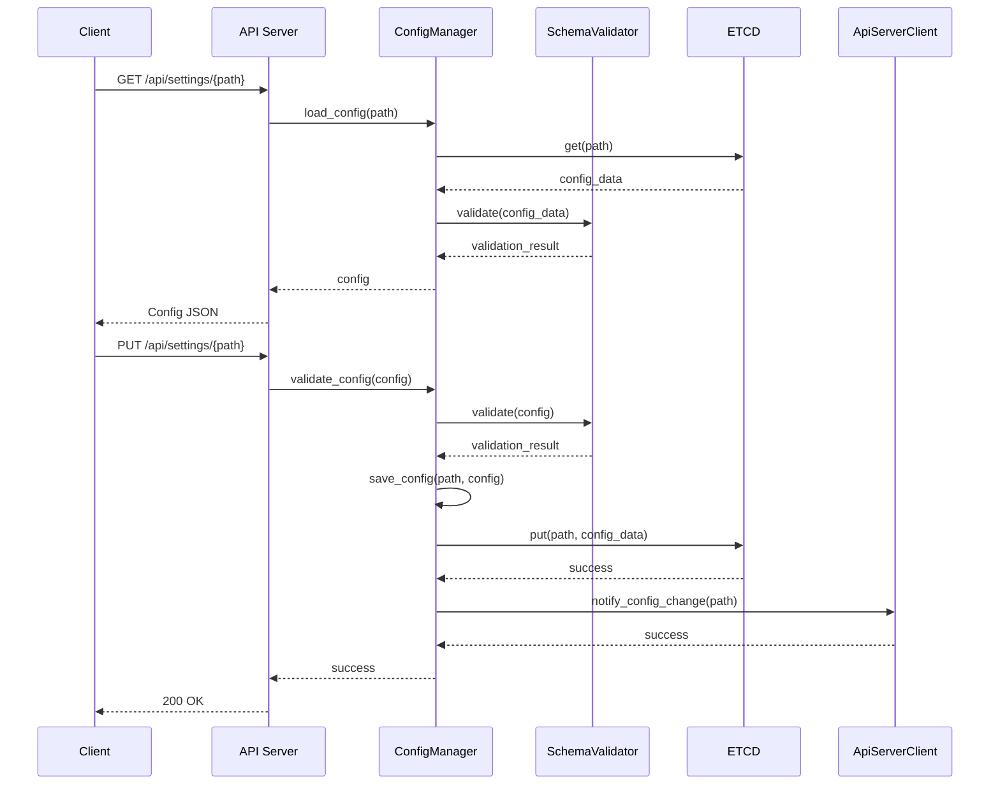
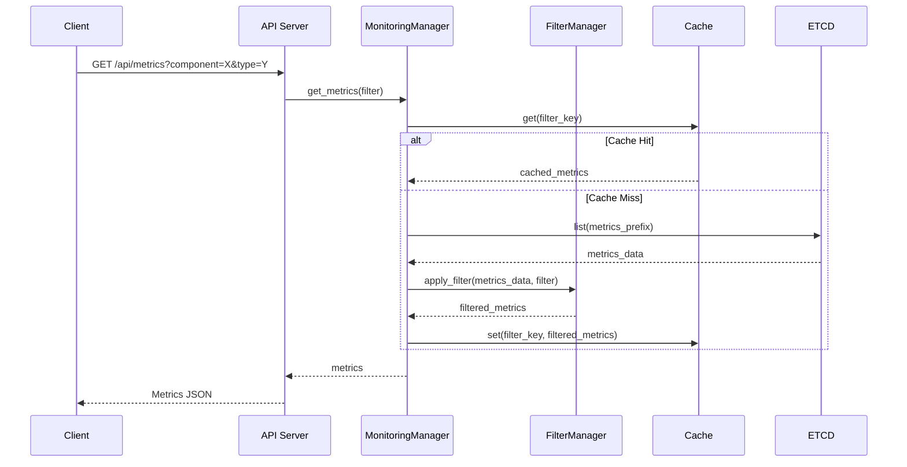
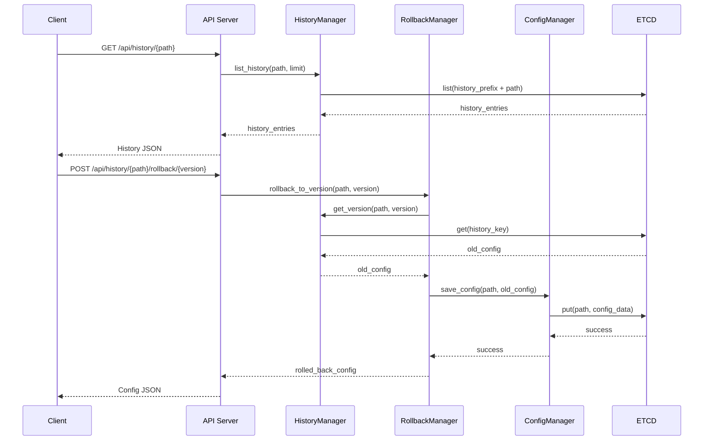

# Settings Service 상세 설계 문서 (LLD)

**문서 번호**: PICCOLO-SETTINGS-LLD-2025-001  
**버전**: 1.0  
**날짜**: 2025-08-11  
**작성자**: PICCOLO 팀  
**분류**: LLD (Low-Level Design)

## 1. 개요

Settings Service는 PICCOLO 프레임워크에서 시스템 설정 관리와 메트릭 정보 제공을 담당하는 핵심 컴포넌트입니다. 본 문서는 HLD에서 정의된 기능을 구현하기 위한 상세 설계 명세를 제공합니다.

### 1.1 목적 및 범위

본 문서는 다음 내용을 포함합니다:
- Settings Service의 모듈별 상세 구현 방법
- 클래스 및 함수 정의
- 데이터 구조 및 알고리즘
- 인터페이스 세부 명세
- 오류 처리 메커니즘
- 주요 시퀀스 상세 흐름

### 1.2 주요 기능 요약

1. **설정 관리** - YAML 기반 구성 파일의 생성, 수정, 삭제, 검증 및 적용
2. **메트릭 정보 제공** - ETCD에 저장된 메트릭 데이터 필터링 및 REST API 제공
3. **다중 인터페이스** - REST API 및 CLI 인터페이스 제공
4. **변경 이력 관리** - 설정 변경 이력 추적 및 롤백 기능

## 2. 시스템 아키텍처

### 2.1 컴포넌트 구조

Settings Service는 다음과 같은 주요 모듈로 구성됩니다:

```
settingsservice/
├── src/
│   ├── main.rs                 # 진입점 및 서비스 초기화
│   ├── settings_core/          # 코어 관리 모듈
│   │   └── mod.rs              # 서비스 초기화 및 컴포넌트 조정
│   ├── settings_config/        # 설정 관리 모듈
│   │   └── mod.rs              # 설정 관리, 유효성 검증, 스키마 정의
│   ├── settings_history/       # 이력 관리 모듈
│   │   └── mod.rs              # 이력 저장/조회, 차이 계산, 롤백
│   ├── settings_monitoring/    # 메트릭 관리 모듈
│   │   └── mod.rs              # 메트릭 데이터 조회/필터링, 캐싱
│   ├── settings_storage/       # 저장소 관리 모듈
│   │   └── mod.rs              # ETCD 클라이언트 및 데이터 모델
│   ├── settings_api/           # API 서버 모듈
│   │   ├── mod.rs              # API 기본 정의 및 공통 기능
│   │   ├── rest/               # REST API 구현
│   │   │   └── mod.rs          # API 엔드포인트 및 서버 구현
│   │   └── client/             # 클라이언트 구현
│   │       └── mod.rs          # API 서버 클라이언트 구현
│   ├── settings_cli/           # CLI 모듈
│   │   ├── mod.rs              # CLI 기본 정의
│   │   ├── commands.rs         # CLI 명령 구현
│   │   ├── shell.rs            # 대화형 쉘 구현
│   │   └── formatter.rs        # 출력 포맷 지정
│   └── settings_utils/         # 유틸리티 모듈
│       ├── mod.rs              # 유틸리티 기본 정의
│       ├── error.rs            # 오류 처리
│       ├── logging.rs          # 로깅 유틸리티
│       └── yaml.rs             # YAML 처리 유틸리티
└── Cargo.toml                  # 의존성 및 메타데이터
```

### 2.2 모듈 설명

각 모듈의 주요 기능과 책임 영역은 다음과 같습니다:

1. **settings_core**: 서비스 초기화 및 컴포넌트 조정을 담당하며, 설정 변경 요청 처리 및 흐름 제어를 관리합니다.
2. **settings_config**: 시스템 설정 파일 관리를 담당합니다. YAML 파일의 로드, 파싱, 검증, 저장을 처리합니다.
3. **settings_history**: 설정 변경 이력을 관리하고 버전 간 차이를 계산하며 롤백 기능을 제공합니다.
4. **settings_monitoring**: ETCD에 저장된 메트릭 데이터를 조회하고 필터링하는 기능을 제공합니다.
5. **settings_storage**: ETCD와의 통신을 담당하며, 설정과 메트릭 데이터의 영구 저장소 역할을 합니다.
6. **settings_api**: REST API 서버를 구현하고 외부 시스템과의 통신을 관리합니다.
7. **settings_cli**: 명령줄 인터페이스를 제공하여 스크립트 및 자동화를 지원합니다.
8. **settings_utils**: 오류 처리, 로깅, YAML 처리 등 공통 유틸리티 기능을 제공합니다.

### 2.3 서비스 의존성

Settings Service는 다음과 같은 외부 시스템과 상호작용합니다:

1. **ETCD**: 설정 및 메트릭 데이터 영구 저장소
2. **API Server**: 설정 변경 사항 전파
3. **Monitoring Server**: 메트릭 데이터 출처

### 2.4 외부 시스템 통합

Settings Service는 다음과 같은 방식으로 외부 시스템과 통합됩니다:

1. **API Server 연동**
   - REST API를 통한 설정 변경 사항 전파
   - 상태 확인 및 헬스 체크 API 제공
   - gRPC 호출을 통한 실시간 알림

2. **ETCD 저장소 연동**
   - 클러스터 모드 ETCD 지원
   - 트랜잭션 기반 데이터 무결성 보장
   - 키 접두사 기반 데이터 구성

3. **Monitoring Server 연동**
   - 메트릭 데이터 조회 인터페이스
   - 필터 기반 데이터 조회 최적화
   - 캐싱을 통한 성능 향상

### 2.5 확장성 및 성능 고려사항

1. **수평적 확장성**
   - 무상태(Stateless) 설계로 다중 인스턴스 운영 가능
   - 로드 밸런서를 통한 트래픽 분산
   - 인스턴스 간 캐시 동기화 메커니즘

2. **성능 최적화**
   - ETCD 쿼리 최적화
   - 응답 캐싱
   - 비동기 처리를 통한 응답성 향상

3. **대용량 처리**
   - 대규모 설정 파일 처리를 위한 스트리밍 API
   - 페이지네이션을 통한 대량 데이터 조회
   - 부분 업데이트를 통한 효율적인 데이터 처리

## 3. 모듈별 상세 설계

### 3.1 Settings Core 모듈

#### 3.1.1 클래스 및 함수 정의

```rust
// mod.rs - 코어 관리 모듈
pub struct CoreManager {
    config_manager: Arc<ConfigManager>,
    history_manager: Arc<HistoryManager>,
    monitoring_manager: Arc<MonitoringManager>,
    api_server: Option<Arc<ApiServer>>,
}

impl CoreManager {
    pub fn new(
        config_manager: Arc<ConfigManager>,
        history_manager: Arc<HistoryManager>,
        monitoring_manager: Arc<MonitoringManager>
    ) -> Self;
    
    pub async fn initialize(&mut self) -> Result<(), CoreError>;
    pub async fn start_services(&mut self) -> Result<(), CoreError>;
    pub async fn shutdown(&self) -> Result<(), CoreError>;
    
    pub async fn handle_config_change(&self, change_request: ConfigChangeRequest) -> Result<ConfigChangeResponse, CoreError>;
    pub async fn handle_rollback_request(&self, rollback_request: RollbackRequest) -> Result<RollbackResponse, CoreError>;
    pub async fn get_system_status(&self) -> Result<SystemStatus, CoreError>;
}
```

#### 3.1.2 데이터 구조

```rust
pub struct ConfigChangeRequest {
    pub config_path: String,
    pub new_config: Value,
    pub author: String,
    pub comment: Option<String>,
    pub validate_only: bool,
}

pub struct ConfigChangeResponse {
    pub success: bool,
    pub validation_result: Option<ValidationResult>,
    pub applied_config: Option<Config>,
    pub version: Option<u64>,
    pub error_message: Option<String>,
}

pub struct RollbackRequest {
    pub config_path: String,
    pub target_version: u64,
    pub author: String,
    pub comment: Option<String>,
}

pub struct RollbackResponse {
    pub success: bool,
    pub config: Option<Config>,
    pub version: Option<u64>,
    pub error_message: Option<String>,
}

pub struct SystemStatus {
    pub version: String,
    pub uptime: Duration,
    pub component_statuses: HashMap<String, ComponentStatus>,
    pub storage_status: StorageStatus,
}

pub enum ComponentStatus {
    Healthy,
    Degraded(String),
    Failed(String),
}

pub struct StorageStatus {
    pub connected: bool,
    pub cluster_size: usize,
    pub leader_id: Option<String>,
    pub error_message: Option<String>,
}
```

### 3.2 Settings Config 모듈

#### 3.2.1 클래스 및 함수 정의

```rust
// mod.rs - 설정 관리 모듈
pub struct ConfigManager {
    etcd_client: Arc<EtcdClient>,
    schema_validator: SchemaValidator,
}

impl ConfigManager {
    pub fn new(etcd_client: Arc<EtcdClient>) -> Self;
    pub async fn load_config(&self, config_path: &str) -> Result<Config, ConfigError>;
    pub async fn save_config(&self, config_path: &str, config: &Config) -> Result<(), ConfigError>;
    pub async fn validate_config(&self, config: &Config) -> Result<ValidationResult, ConfigError>;
    pub async fn apply_config(&self, config: &Config) -> Result<ApplyResult, ConfigError>;
    pub async fn list_configs(&self, prefix: &str) -> Result<Vec<ConfigSummary>, ConfigError>;
    pub async fn delete_config(&self, config_path: &str) -> Result<(), ConfigError>;
}

// SchemaValidator - 설정 스키마 검증
pub struct SchemaValidator {
    schemas: HashMap<String, JsonSchema>,
}

impl SchemaValidator {
    pub fn new() -> Self;
    pub fn load_schema(&mut self, schema_type: &str, schema: &str) -> Result<(), SchemaError>;
    pub fn validate(&self, schema_type: &str, data: &Value) -> ValidationResult;
}
```

#### 3.2.2 데이터 구조

```rust
// 설정 데이터 구조
pub struct Config {
    pub path: String,
    pub content: Value,
    pub metadata: ConfigMetadata,
}

pub struct ConfigMetadata {
    pub version: u64,
    pub created_at: DateTime<Utc>,
    pub modified_at: DateTime<Utc>,
    pub schema_type: String,
}

pub struct ConfigSummary {
    pub path: String,
    pub schema_type: String,
    pub version: u64,
    pub modified_at: DateTime<Utc>,
}

pub struct ValidationResult {
    pub is_valid: bool,
    pub errors: Vec<ValidationError>,
}

pub struct ValidationError {
    pub path: String,
    pub message: String,
    pub severity: ValidationSeverity,
}

pub enum ValidationSeverity {
    Error,
    Warning,
    Info,
}

pub struct ApplyResult {
    pub success: bool,
    pub message: String,
    pub affected_components: Vec<String>,
}
```

### 3.3 Settings History 모듈

#### 3.3.1 클래스 및 함수 정의

```rust
// mod.rs - 이력 관리 모듈
pub struct HistoryManager {
    etcd_client: Arc<EtcdClient>,
}

impl HistoryManager {
    pub fn new(etcd_client: Arc<EtcdClient>) -> Self;
    pub async fn record_change(&self, config_path: &str, old_config: Option<&Config>, new_config: &Config) -> Result<u64, HistoryError>;
    pub async fn list_history(&self, config_path: &str, limit: usize) -> Result<Vec<HistoryEntry>, HistoryError>;
    pub async fn get_version(&self, config_path: &str, version: u64) -> Result<Config, HistoryError>;
    pub fn calculate_diff(old_config: &Value, new_config: &Value) -> Vec<DiffEntry>;
    pub fn format_diff(diff: &[DiffEntry]) -> String;
    pub async fn rollback_to_version(&self, config_path: &str, version: u64, config_manager: &ConfigManager) -> Result<Config, RollbackError>;
}
```

#### 3.3.2 데이터 구조

```rust
pub struct HistoryEntry {
    pub config_path: String,
    pub version: u64,
    pub timestamp: DateTime<Utc>,
    pub author: String,
    pub comment: Option<String>,
}

pub enum DiffOperation {
    Add,
    Remove,
    Change,
}

pub struct DiffEntry {
    pub path: String,
    pub operation: DiffOperation,
    pub old_value: Option<Value>,
    pub new_value: Option<Value>,
}
```

### 3.4 Settings Monitoring 모듈

#### 3.4.1 클래스 및 함수 정의

```rust
// mod.rs - 메트릭 관리 모듈
pub struct MonitoringManager {
    etcd_client: Arc<EtcdClient>,
    cache: RwLock<HashMap<String, CacheEntry<Metric>>>,
    ttl: Duration,
}

impl MonitoringManager {
    pub fn new(etcd_client: Arc<EtcdClient>, ttl: Duration) -> Self;
    pub async fn get_metrics(&self, filter: Option<&MetricsFilter>) -> Result<Vec<Metric>, MetricsError>;
    pub async fn get_metric_by_id(&self, id: &str) -> Result<Metric, MetricsError>;
    pub async fn get_metrics_by_component(&self, component: &str) -> Result<Vec<Metric>, MetricsError>;
    pub async fn get_metrics_by_type(&self, metric_type: &str) -> Result<Vec<Metric>, MetricsError>;
    
    // 필터 관리 기능
    pub async fn create_filter(&self, filter: &MetricsFilter) -> Result<String, FilterError>;
    pub async fn get_filter(&self, id: &str) -> Result<MetricsFilter, FilterError>;
    pub async fn update_filter(&self, id: &str, filter: &MetricsFilter) -> Result<(), FilterError>;
    pub async fn delete_filter(&self, id: &str) -> Result<(), FilterError>;
    pub async fn list_filters(&self) -> Result<Vec<FilterSummary>, FilterError>;
    
    // 캐시 관리 기능
    pub fn get_cached(&self, key: &str) -> Option<Metric>;
    pub fn set_cached(&self, key: &str, metric: Metric);
    pub fn invalidate_cache(&self, key: &str);
    pub fn clear_cache(&self);
    
    // 데이터 내보내기 기능
    pub async fn export_metrics(&self, format: ExportFormat, metrics: &[Metric]) -> Result<Vec<u8>, ExportError>;
}
```

#### 3.4.2 데이터 구조

```rust
pub struct Metric {
    pub id: String,
    pub component: String,
    pub metric_type: String,
    pub labels: HashMap<String, String>,
    pub value: MetricValue,
    pub timestamp: DateTime<Utc>,
}

pub enum MetricValue {
    Counter(u64),
    Gauge(f64),
    Histogram(Vec<HistogramBucket>),
    Summary(Vec<SummaryQuantile>),
}

pub struct HistogramBucket {
    pub upper_bound: f64,
    pub count: u64,
}

pub struct SummaryQuantile {
    pub quantile: f64,
    pub value: f64,
}

pub struct MetricsFilter {
    pub id: String,
    pub name: String,
    pub components: Option<Vec<String>>,
    pub metric_types: Option<Vec<String>>,
    pub label_selectors: Option<HashMap<String, String>>,
    pub time_range: Option<TimeRange>,
}

pub struct TimeRange {
    pub start: DateTime<Utc>,
    pub end: Option<DateTime<Utc>>,
}

pub struct FilterSummary {
    pub id: String,
    pub name: String,
    pub component_count: usize,
    pub metric_type_count: usize,
}

pub struct CacheEntry<T> {
    pub data: T,
    pub expiry: Instant,
}

pub enum ExportFormat {
    CSV,
    JSON,
    Prometheus,
}
```

### 3.5 Settings Storage 모듈

#### 3.5.1 클래스 및 함수 정의

```rust
// mod.rs - 저장소 관리 모듈
pub struct EtcdClient {
    client: Client,
    endpoints: Vec<String>,
}

impl EtcdClient {
    pub fn new(endpoints: Vec<String>) -> Result<Self, EtcdError>;
    pub async fn get(&self, key: &str) -> Result<Option<KeyValue>, EtcdError>;
    pub async fn put(&self, key: &str, value: &str) -> Result<(), EtcdError>;
    pub async fn delete(&self, key: &str) -> Result<bool, EtcdError>;
    pub async fn list(&self, prefix: &str) -> Result<Vec<KeyValue>, EtcdError>;
    pub async fn watch(&self, prefix: &str) -> EtcdWatcher;
    pub async fn transaction(&self, txn: &Transaction) -> Result<TxnResponse, EtcdError>;
}

pub struct EtcdWatcher {
    inner: Pin<Box<dyn Stream<Item = Result<WatchEvent, EtcdError>> + Send>>,
}

impl EtcdWatcher {
    pub async fn next(&mut self) -> Option<Result<WatchEvent, EtcdError>>;
    pub fn close(self);
}
```

#### 3.5.2 데이터 구조

```rust
pub struct KeyValue {
    pub key: Vec<u8>,
    pub value: Vec<u8>,
    pub create_revision: i64,
    pub mod_revision: i64,
    pub version: i64,
}

pub struct Transaction {
    pub compare: Vec<Compare>,
    pub success: Vec<TxnOp>,
    pub failure: Vec<TxnOp>,
}

pub enum Compare {
    Value(String, CompareOp, Vec<u8>),
    Version(String, CompareOp, i64),
    CreateRevision(String, CompareOp, i64),
    ModRevision(String, CompareOp, i64),
}

pub enum CompareOp {
    Equal,
    Greater,
    Less,
}

pub enum TxnOp {
    Put(String, Vec<u8>),
    Get(String),
    Delete(String),
}

pub enum WatchEvent {
    Put(KeyValue),
    Delete(KeyValue),
}
```

### 3.6 Settings API 모듈

#### 3.6.1 클래스 및 함수 정의

```rust
// api/mod.rs - API 모듈 기본 정의
pub struct ApiServer {
    config: ApiServerConfig,
    router: Router,
}

impl ApiServer {
    pub fn new(config: ApiServerConfig) -> Self;
    pub fn configure_routes(&mut self);
    pub async fn start(&self) -> Result<(), ApiError>;
    pub async fn stop(&self) -> Result<(), ApiError>;
    pub fn register_middleware(&mut self, middleware: Box<dyn Middleware>);
    pub fn register_error_handler(&mut self, handler: Box<dyn ErrorHandler>);
}

// api/rest/mod.rs - REST API 구현
pub struct RestApiHandler {
    monitoring_manager: Arc<MonitoringManager>,
    config_manager: Arc<ConfigManager>,
    history_manager: Arc<HistoryManager>,
    core_manager: Arc<CoreManager>,
}

impl RestApiHandler {
    pub fn new(
        monitoring_manager: Arc<MonitoringManager>,
        config_manager: Arc<ConfigManager>,
        history_manager: Arc<HistoryManager>,
        core_manager: Arc<CoreManager>
    ) -> Self;
    
    // 메트릭 API 핸들러
    pub async fn get_metrics(&self, query: Query<MetricsQuery>) -> Result<Json<Vec<Metric>>, ApiError>;
    pub async fn get_metric_by_id(&self, id: String) -> Result<Json<Metric>, ApiError>;
    pub async fn get_metrics_by_component(&self, component: String) -> Result<Json<Vec<Metric>>, ApiError>;
    pub async fn get_metrics_by_type(&self, metric_type: String) -> Result<Json<Vec<Metric>>, ApiError>;
    pub async fn get_metrics_by_label(&self, label: String, value: String) -> Result<Json<Vec<Metric>>, ApiError>;
    pub async fn get_filters(&self) -> Result<Json<Vec<FilterSummary>>, ApiError>;
    pub async fn get_filter(&self, id: String) -> Result<Json<MetricsFilter>, ApiError>;
    pub async fn create_filter(&self, filter: Json<MetricsFilter>) -> Result<Json<FilterResponse>, ApiError>;
    pub async fn update_filter(&self, id: String, filter: Json<MetricsFilter>) -> Result<StatusCode, ApiError>;
    pub async fn delete_filter(&self, id: String) -> Result<StatusCode, ApiError>;
    pub async fn export_metrics(&self, format: String, query: Query<MetricsQuery>) -> Result<Response, ApiError>;
    
    // 설정 API 핸들러
    pub async fn get_config(&self, path: String) -> Result<Json<Config>, ApiError>;
    pub async fn list_configs(&self, prefix: Option<String>) -> Result<Json<Vec<ConfigSummary>>, ApiError>;
    pub async fn create_config(&self, config: Json<Config>) -> Result<StatusCode, ApiError>;
    pub async fn update_config(&self, path: String, config: Json<Config>) -> Result<StatusCode, ApiError>;
    pub async fn delete_config(&self, path: String) -> Result<StatusCode, ApiError>;
    pub async fn validate_config(&self, config: Json<Config>) -> Result<Json<ValidationResult>, ApiError>;
    pub async fn apply_config(&self, path: String) -> Result<Json<ApplyResult>, ApiError>;
    pub async fn get_config_schema(&self, schema_type: String) -> Result<Json<Value>, ApiError>;
    
    // 이력 API 핸들러
    pub async fn get_history(&self, path: String, limit: Option<usize>) -> Result<Json<Vec<HistoryEntry>>, ApiError>;
    pub async fn get_version(&self, path: String, version: u64) -> Result<Json<Config>, ApiError>;
    pub async fn rollback(&self, path: String, version: u64) -> Result<Json<Config>, ApiError>;
    pub async fn diff_versions(&self, path: String, version1: u64, version2: u64) -> Result<Json<Vec<DiffEntry>>, ApiError>;
    pub async fn get_history_summary(&self, limit: Option<usize>) -> Result<Json<HistorySummary>, ApiError>;
    
    // 시스템 상태 API 핸들러
    pub async fn get_system_status(&self) -> Result<Json<SystemStatus>, ApiError>;
    pub async fn get_health(&self) -> Result<StatusCode, ApiError>;
    pub async fn get_component_status(&self, component: String) -> Result<Json<ComponentStatus>, ApiError>;
}
```

#### 3.6.2 데이터 구조

```rust
pub struct ApiServerConfig {
    pub bind_address: String,
    pub bind_port: u16,
    pub tls_enabled: bool,
    pub tls_cert_path: Option<String>,
    pub tls_key_path: Option<String>,
    pub cors_allowed_origins: Vec<String>,
    pub request_timeout: Duration,
    pub max_request_size: usize,
    pub rate_limit: Option<RateLimit>,
}

pub struct RateLimit {
    pub requests_per_minute: u32,
    pub burst_size: u32,
}

pub struct MetricsQuery {
    pub component: Option<String>,
    pub metric_type: Option<String>,
    pub filter_id: Option<String>,
    pub labels: Option<HashMap<String, String>>,
    pub start_time: Option<DateTime<Utc>>,
    pub end_time: Option<DateTime<Utc>>,
    pub page: Option<u32>,
    pub page_size: Option<u32>,
    pub sort_by: Option<String>,
    pub sort_order: Option<SortOrder>,
}

pub enum SortOrder {
    Ascending,
    Descending,
}

pub struct FilterResponse {
    pub id: String,
    pub name: String,
    pub created_at: DateTime<Utc>,
}

pub struct ApiServerStatus {
    pub version: String,
    pub uptime: Duration,
    pub connected_clients: u32,
    pub request_count: u64,
    pub success_rate: f64,
    pub average_response_time: Duration,
    pub active_requests: u32,
}

pub struct HistorySummary {
    pub total_changes: u64,
    pub recent_changes: Vec<HistoryEntry>,
    pub changes_by_path: HashMap<String, u64>,
    pub changes_by_author: HashMap<String, u64>,
}

pub struct PaginatedResponse<T> {
    pub items: Vec<T>,
    pub total: u64,
    pub page: u32,
    pub page_size: u32,
    pub total_pages: u32,
}
```

#### 3.6.3 REST API 엔드포인트 상세

Settings Service는 다음과 같은 REST API 엔드포인트를 제공합니다:

#### 메트릭 관련 API

| 엔드포인트 | 메소드 | 설명 | 요청 파라미터 | 응답 |
|------------|--------|------|---------------|------|
| `/api/v1/metrics` | GET | 모든 메트릭 조회 | component, metric_type, filter_id, labels, start_time, end_time, page, page_size | 메트릭 목록 |
| `/api/v1/metrics/{id}` | GET | 특정 ID의 메트릭 조회 | - | 단일 메트릭 |
| `/api/v1/metrics/component/{component}` | GET | 특정 컴포넌트의 메트릭 조회 | page, page_size | 메트릭 목록 |
| `/api/v1/metrics/type/{type}` | GET | 특정 타입의 메트릭 조회 | page, page_size | 메트릭 목록 |
| `/api/v1/metrics/label/{key}/{value}` | GET | 특정 레이블의 메트릭 조회 | page, page_size | 메트릭 목록 |
| `/api/v1/metrics/export` | GET | 메트릭 데이터 내보내기 | format(csv,json,prometheus), query 파라미터 | 다운로드 가능한 데이터 |
| `/api/v1/metrics/filters` | GET | 메트릭 필터 목록 조회 | - | 필터 요약 목록 |
| `/api/v1/metrics/filters/{id}` | GET | 특정 필터 조회 | - | 필터 상세 정보 |
| `/api/v1/metrics/filters` | POST | 새 필터 생성 | 필터 JSON | 생성된 필터 ID |
| `/api/v1/metrics/filters/{id}` | PUT | 필터 업데이트 | 필터 JSON | 성공/실패 상태 |
| `/api/v1/metrics/filters/{id}` | DELETE | 필터 삭제 | - | 성공/실패 상태 |

#### 설정 관련 API

| 엔드포인트 | 메소드 | 설명 | 요청 파라미터 | 응답 |
|------------|--------|------|---------------|------|
| `/api/v1/settings` | GET | 모든 설정 조회 | prefix | 설정 요약 목록 |
| `/api/v1/settings/{path}` | GET | 특정 경로의 설정 조회 | - | 설정 상세 정보 |
| `/api/v1/settings` | POST | 새 설정 생성 | 설정 JSON | 성공/실패 상태 |
| `/api/v1/settings/{path}` | PUT | 설정 업데이트 | 설정 JSON | 성공/실패 상태 |
| `/api/v1/settings/{path}` | DELETE | 설정 삭제 | - | 성공/실패 상태 |
| `/api/v1/settings/validate` | POST | 설정 유효성 검증 | 설정 JSON | 검증 결과 |
| `/api/v1/settings/{path}/apply` | POST | 설정 적용 | - | 적용 결과 |
| `/api/v1/settings/schemas/{type}` | GET | 설정 스키마 조회 | - | JSON 스키마 |

#### 이력 관련 API

| 엔드포인트 | 메소드 | 설명 | 요청 파라미터 | 응답 |
|------------|--------|------|---------------|------|
| `/api/v1/history` | GET | 전체 변경 이력 요약 | limit | 이력 요약 정보 |
| `/api/v1/history/{path}` | GET | 특정 경로의 변경 이력 | limit | 이력 항목 목록 |
| `/api/v1/history/{path}/version/{version}` | GET | 특정 버전의 설정 조회 | - | 이전 버전 설정 |
| `/api/v1/history/{path}/rollback/{version}` | POST | 특정 버전으로 롤백 | - | 롤백된 설정 |
| `/api/v1/history/{path}/diff` | GET | 버전 간 차이 조회 | version1, version2 | 차이점 목록 |

#### 시스템 상태 API

| 엔드포인트 | 메소드 | 설명 | 요청 파라미터 | 응답 |
|------------|--------|------|---------------|------|
| `/api/v1/system/status` | GET | 시스템 상태 조회 | - | 상태 정보 |
| `/api/v1/system/health` | GET | 헬스 체크 | - | 상태 코드(200/503) |
| `/api/v1/system/components/{component}` | GET | 특정 컴포넌트 상태 조회 | - | 컴포넌트 상태 |

### 3.6.4 API 요청 및 응답 상세

#### 1. 메트릭 조회 API

**요청**: `GET /api/v1/metrics?component=node-agent&metric_type=gauge&page=1&page_size=20`

**응답**:
```json
{
  "items": [
    {
      "id": "cpu_usage",
      "component": "node-agent",
      "metric_type": "gauge",
      "labels": {
        "node": "worker-1",
        "instance": "192.168.1.10"
      },
      "value": {
        "type": "gauge",
        "value": 45.2
      },
      "timestamp": "2025-08-11T10:23:45Z"
    },
    {
      "id": "memory_usage",
      "component": "node-agent",
      "metric_type": "gauge",
      "labels": {
        "node": "worker-1",
        "instance": "192.168.1.10"
      },
      "value": {
        "type": "gauge",
        "value": 1256.8
      },
      "timestamp": "2025-08-11T10:23:45Z"
    }
  ],
  "total": 245,
  "page": 1,
  "page_size": 20,
  "total_pages": 13
}
```

#### 2. 필터 생성 API

**요청**: `POST /api/v1/metrics/filters`
```json
{
  "name": "NodeAgentMemoryUsage",
  "components": ["node-agent"],
  "metric_types": ["gauge"],
  "label_selectors": {
    "metric": "memory_usage"
  },
  "time_range": {
    "start": "2025-08-10T00:00:00Z",
    "end": "2025-08-11T23:59:59Z"
  }
}
```

**응답**:
```json
{
  "id": "filter-123456",
  "name": "NodeAgentMemoryUsage",
  "created_at": "2025-08-11T15:30:22Z"
}
```

#### 3. 설정 조회 API

**요청**: `GET /api/v1/settings/system/logging`

**응답**:
```json
{
  "path": "system/logging",
  "content": {
    "level": "info",
    "output": ["file", "console"],
    "file_path": "/var/log/piccolo/system.log",
    "max_size_mb": 100,
    "max_files": 10,
    "rotation": "daily"
  },
  "metadata": {
    "version": 3,
    "created_at": "2025-07-15T08:45:12Z",
    "modified_at": "2025-08-10T14:23:05Z",
    "schema_type": "logging-config"
  }
}
```

#### 4. 설정 업데이트 API

**요청**: `PUT /api/v1/settings/system/logging`
```json
{
  "path": "system/logging",
  "content": {
    "level": "debug",
    "output": ["file", "console"],
    "file_path": "/var/log/piccolo/system.log",
    "max_size_mb": 200,
    "max_files": 20,
    "rotation": "daily"
  },
  "metadata": {
    "schema_type": "logging-config"
  }
}
```

**응답**: `HTTP 200 OK`

#### 5. 유효성 검증 API

**요청**: `POST /api/v1/settings/validate`
```json
{
  "path": "system/logging",
  "content": {
    "level": "invalid-level",
    "output": ["file", "console"],
    "file_path": "/var/log/piccolo/system.log",
    "max_size_mb": -10,
    "max_files": 20,
    "rotation": "daily"
  },
  "metadata": {
    "schema_type": "logging-config"
  }
}
```

**응답**:
```json
{
  "valid": false,
  "errors": [
    {
      "path": "content.level",
      "message": "Invalid log level. Allowed values are: debug, info, warn, error",
      "schema_path": "#/properties/level/enum",
      "severity": "Error"
    },
    {
      "path": "content.max_size_mb",
      "message": "Value must be a positive integer",
      "schema_path": "#/properties/max_size_mb/minimum",
      "severity": "Error"
    }
  ]
}
```

#### 6. 이력 조회 API

**요청**: `GET /api/v1/history/system/logging?limit=3`

**응답**:
```json
[
  {
    "path": "system/logging",
    "version": 3,
    "timestamp": "2025-08-10T14:23:05Z",
    "change_type": "Update",
    "change_summary": "Changed log level from debug to info"
  },
  {
    "path": "system/logging",
    "version": 2,
    "timestamp": "2025-08-01T09:15:32Z",
    "change_type": "Update",
    "change_summary": "Increased max_files from 5 to 10"
  },
  {
    "path": "system/logging",
    "version": 1,
    "timestamp": "2025-07-15T08:45:12Z",
    "change_type": "Create",
    "change_summary": "Initial creation"
  }
]
```

#### 7. 시스템 상태 API

**요청**: `GET /api/v1/system/status`

**응답**:
```json
{
  "version": "1.0.0",
  "uptime": "10d 4h 23m 15s",
  "config_count": 52,
  "metrics_count": 1458,
  "last_reload": "2025-08-10T22:30:15Z",
  "components": {
    "core": {
      "name": "core",
      "status": "Running",
      "last_update": "2025-08-11T15:40:22Z",
      "error_count": 0
    },
    "config": {
      "name": "config",
      "status": "Running",
      "last_update": "2025-08-11T15:40:22Z", 
      "error_count": 0
    },
    "api": {
      "name": "api",
      "status": "Running",
      "last_update": "2025-08-11T15:40:22Z",
      "error_count": 0
    },
    "monitoring": {
      "name": "monitoring",
      "status": "Running",
      "last_update": "2025-08-11T15:40:22Z",
      "error_count": 0
    },
    "storage": {
      "name": "storage",
      "status": "Running",
      "last_update": "2025-08-11T15:40:22Z",
      "error_count": 0
    }
  }
}
```

#### 3.6.4 API 보안 및 인증

```rust
// api/auth/mod.rs - API 인증 모듈
pub struct AuthMiddleware {
    auth_provider: Arc<dyn AuthProvider>,
}

impl AuthMiddleware {
    pub fn new(auth_provider: Arc<dyn AuthProvider>) -> Self;
    pub async fn handle(&self, request: Request, next: Next) -> Result<Response, ApiError>;
}

pub trait AuthProvider: Send + Sync {
    async fn authenticate(&self, token: &str) -> Result<AuthUser, AuthError>;
    async fn authorize(&self, user: &AuthUser, resource: &str, action: &str) -> bool;
}

pub struct JwtAuthProvider {
    secret_key: String,
    issuer: String,
    expiration: Duration,
}

impl JwtAuthProvider {
    pub fn new(secret_key: String, issuer: String, expiration: Duration) -> Self;
    pub fn generate_token(&self, user_id: &str, roles: &[String]) -> Result<String, AuthError>;
    pub fn verify_token(&self, token: &str) -> Result<AuthUser, AuthError>;
}

pub struct AuthUser {
    pub id: String,
    pub roles: Vec<String>,
    pub permissions: HashMap<String, Vec<String>>,
}
```

#### 3.6.5 API 클라이언트 구현

```rust
// api/client/mod.rs - API 클라이언트 구현
pub struct ApiClient {
    base_url: String,
    client: reqwest::Client,
    auth_token: Option<String>,
    timeout: Duration,
}

impl ApiClient {
    pub fn new(base_url: String) -> Self;
    pub fn with_token(base_url: String, token: String) -> Self;
    pub fn with_timeout(base_url: String, timeout: Duration) -> Self;
    
    // 메트릭 관련 메소드
    pub async fn get_metrics(&self, query: &MetricsQuery) -> Result<PaginatedResponse<Metric>, ClientError>;
    pub async fn get_metric_by_id(&self, id: &str) -> Result<Metric, ClientError>;
    pub async fn get_metrics_by_component(&self, component: &str) -> Result<Vec<Metric>, ClientError>;
    pub async fn get_metrics_by_type(&self, metric_type: &str) -> Result<Vec<Metric>, ClientError>;
    pub async fn export_metrics(&self, format: ExportFormat, query: &MetricsQuery) -> Result<Vec<u8>, ClientError>;
    pub async fn get_filters(&self) -> Result<Vec<FilterSummary>, ClientError>;
    pub async fn get_filter(&self, id: &str) -> Result<MetricsFilter, ClientError>;
    pub async fn create_filter(&self, filter: &MetricsFilter) -> Result<FilterResponse, ClientError>;
    pub async fn update_filter(&self, id: &str, filter: &MetricsFilter) -> Result<(), ClientError>;
    pub async fn delete_filter(&self, id: &str) -> Result<(), ClientError>;
    
    // 설정 관련 메소드
    pub async fn get_config(&self, path: &str) -> Result<Config, ClientError>;
    pub async fn list_configs(&self, prefix: Option<&str>) -> Result<Vec<ConfigSummary>, ClientError>;
    pub async fn create_config(&self, config: &Config) -> Result<(), ClientError>;
    pub async fn update_config(&self, path: &str, config: &Config) -> Result<(), ClientError>;
    pub async fn delete_config(&self, path: &str) -> Result<(), ClientError>;
    pub async fn validate_config(&self, config: &Config) -> Result<ValidationResult, ClientError>;
    pub async fn apply_config(&self, path: &str) -> Result<ApplyResult, ClientError>;
    pub async fn get_config_schema(&self, schema_type: &str) -> Result<Value, ClientError>;
    
    // 이력 관련 메소드
    pub async fn get_history_summary(&self, limit: Option<usize>) -> Result<HistorySummary, ClientError>;
    pub async fn get_history(&self, path: &str, limit: Option<usize>) -> Result<Vec<HistoryEntry>, ClientError>;
    pub async fn get_version(&self, path: &str, version: u64) -> Result<Config, ClientError>;
    pub async fn rollback(&self, path: &str, version: u64) -> Result<Config, ClientError>;
    pub async fn diff_versions(&self, path: &str, version1: u64, version2: u64) -> Result<Vec<DiffEntry>, ClientError>;
    
    // 시스템 상태 관련 메소드
    pub async fn get_system_status(&self) -> Result<SystemStatus, ClientError>;
    pub async fn get_health(&self) -> Result<bool, ClientError>;
    pub async fn get_component_status(&self, component: &str) -> Result<ComponentStatus, ClientError>;
    
    // 요청 도우미 메소드
    async fn get<T: DeserializeOwned>(&self, path: &str) -> Result<T, ClientError>;
    async fn post<T: DeserializeOwned, B: Serialize>(&self, path: &str, body: &B) -> Result<T, ClientError>;
    async fn put<B: Serialize>(&self, path: &str, body: &B) -> Result<(), ClientError>;
    async fn delete(&self, path: &str) -> Result<(), ClientError>;
    fn build_url(&self, path: &str) -> String;
    fn handle_error(&self, response: reqwest::Response) -> ClientError;
}

pub struct ClientError {
    pub status_code: Option<u16>,
    pub message: String,
    pub request_id: Option<String>,
    pub cause: Option<Box<dyn Error + Send + Sync>>,
}

impl ClientError {
    pub fn new(message: &str) -> Self;
    pub fn with_status(status_code: u16, message: &str) -> Self;
    pub fn with_cause<E>(message: &str, cause: E) -> Self
    where
        E: Error + Send + Sync + 'static;
    pub fn is_not_found(&self) -> bool;
    pub fn is_unauthorized(&self) -> bool;
    pub fn is_validation_error(&self) -> bool;
    pub fn is_network_error(&self) -> bool;
}
```

#### 3.6.6 API 오류 처리

```rust
// api/error.rs - API 오류 처리
pub struct ApiError {
    pub kind: ApiErrorKind,
    pub message: String,
    pub status_code: StatusCode,
    pub source: Option<Box<dyn std::error::Error + Send + Sync>>,
    pub request_id: String,
}

pub enum ApiErrorKind {
    NotFound,
    ValidationFailed,
    Unauthorized,
    Forbidden,
    BadRequest,
    Conflict,
    InternalError,
    ServiceUnavailable,
    RateLimitExceeded,
}

impl ApiError {
    pub fn not_found(message: &str) -> Self;
    pub fn validation_failed(message: &str, errors: Vec<ValidationError>) -> Self;
    pub fn unauthorized(message: &str) -> Self;
    pub fn forbidden(message: &str) -> Self;
    pub fn bad_request(message: &str) -> Self;
    pub fn conflict(message: &str) -> Self;
    pub fn internal_error(message: &str) -> Self;
    pub fn service_unavailable(message: &str) -> Self;
    pub fn rate_limit_exceeded(message: &str) -> Self;
    
    pub fn with_source<E>(mut self, source: E) -> Self
    where
        E: std::error::Error + Send + Sync + 'static;
    
    pub fn with_request_id(mut self, request_id: String) -> Self;
    pub fn status_code(&self) -> StatusCode;
    pub fn to_response(&self) -> HttpResponse;
}

impl ResponseError for ApiError {
    fn error_response(&self) -> HttpResponse;
    fn status_code(&self) -> StatusCode;
}

// 오류 응답 포맷
pub struct ErrorResponse {
    pub error: ErrorDetail,
}

pub struct ErrorDetail {
    pub code: String,
    pub message: String,
    pub details: Option<Vec<ErrorDetailItem>>,
    pub request_id: String,
}

pub struct ErrorDetailItem {
    pub path: String,
    pub message: String,
    pub severity: String,
}
```

### 3.7 Settings CLI 모듈

#### 3.7.1 클래스 및 함수 정의

```rust
// cli/mod.rs - CLI 모듈의 모든 기능 구현
pub struct CommandRegistry {
    commands: HashMap<String, Box<dyn Command>>,
    api_client: Arc<ApiClient>,
}

impl CommandRegistry {
    pub fn new(api_client: Arc<ApiClient>) -> Self;
    pub fn register_default_commands(&mut self);
    pub fn execute(&self, args: &[String]) -> Result<(), CommandError>;
    pub fn get_help(&self) -> String;
}

pub trait Command {
    fn name(&self) -> &'static str;
    fn description(&self) -> &'static str;
    fn execute(&self, args: &[String]) -> Result<(), CommandError>;
    fn help(&self) -> String;
}

// 내장 명령어 구현 (cli/commands.rs)
pub struct GetConfigCommand;
pub struct SetConfigCommand;
pub struct ListConfigsCommand;
pub struct GetMetricsCommand;
pub struct FilterMetricsCommand;
pub struct HistoryCommand;
pub struct RollbackCommand;
pub struct HelpCommand;

// 대화형 쉘 (cli/shell.rs)
pub struct InteractiveShell {
    registry: Arc<CommandRegistry>,
    history: Vec<String>,
}

impl InteractiveShell {
    pub fn new(registry: Arc<CommandRegistry>) -> Self;
    pub async fn run(&mut self) -> Result<(), ShellError>;
    pub fn handle_line(&mut self, line: &str) -> Result<(), ShellError>;
    pub fn complete(&self, line: &str) -> Vec<String>;
    pub fn load_history(&mut self, path: &Path) -> Result<(), ShellError>;
    pub fn save_history(&self, path: &Path) -> Result<(), ShellError>;
}

// 출력 포맷터 (cli/formatter.rs)
pub struct OutputFormatter;

impl OutputFormatter {
    pub fn format_json(value: &Value, pretty: bool) -> String;
    pub fn format_yaml(value: &Value) -> String;
    pub fn format_table<T: Serialize>(items: &[T], headers: &[&str]) -> String;
    pub fn format_metrics(metrics: &[Metric], format: OutputFormat) -> String;
}

pub enum OutputFormat {
    Json,
    Yaml,
    Table,
    Text,
}
```

### 3.8 Settings Utils 모듈

#### 3.8.1 클래스 및 함수 정의

```rust
// utils/error.rs - 오류 처리
pub enum ErrorKind {
    ConfigError,
    ValidationError,
    HistoryError,
    MetricsError,
    StorageError,
    ApiError,
    WebError,
    CommandError,
    SystemError,
}

pub struct Error {
    pub kind: ErrorKind,
    pub message: String,
    pub source: Option<Box<dyn std::error::Error + Send + Sync>>,
}

impl Error {
    pub fn new(kind: ErrorKind, message: &str) -> Self;
    pub fn with_source<E>(kind: ErrorKind, message: &str, source: E) -> Self
    where
        E: std::error::Error + Send + Sync + 'static;
}

// utils/logging.rs - 로깅
pub struct Logger;

impl Logger {
    pub fn init(config: &LogConfig) -> Result<(), LogError>;
    pub fn debug(target: &str, message: &str);
    pub fn info(target: &str, message: &str);
    pub fn warn(target: &str, message: &str);
    pub fn error(target: &str, message: &str);
}

// utils/yaml.rs - YAML 처리
pub struct YamlParser;

impl YamlParser {
    pub fn parse(content: &str) -> Result<Value, YamlError>;
    pub fn serialize(value: &Value) -> Result<String, YamlError>;
}
```

### 3.9 Settings Utils 모듈 - 부가 유틸리티

#### 3.9.1 클래스 및 함수 정의

```rust
// utils/logging.rs - 로깅 유틸리티
pub struct Logger {
    config: LogConfig,
}

impl Logger {
    pub fn new(config: LogConfig) -> Self;
    pub fn init() -> Result<(), LogError>;
    pub fn set_level(level: LogLevel);
    pub fn with_context(context: HashMap<String, String>) -> ContextLogger;
}

// utils/yaml.rs - YAML 처리 유틸리티
pub struct YamlParser;

impl YamlParser {
    pub fn parse(content: &str) -> Result<Value, YamlError>;
    pub fn to_string(value: &Value, pretty: bool) -> Result<String, YamlError>;
    pub fn merge(base: &mut Value, overlay: &Value) -> Result<(), YamlError>;
    pub fn path_get(value: &Value, path: &str) -> Option<&Value>;
    pub fn path_set(value: &mut Value, path: &str, new_value: Value) -> Result<(), YamlError>;
}
```

#### 3.9.2 데이터 구조

```rust
pub struct LogConfig {
    pub level: LogLevel,
    pub file: Option<String>,
    pub stdout: bool,
    pub format: LogFormat,
}

pub enum LogLevel {
    Debug,
    Info,
    Warn,
    Error,
}

pub enum LogFormat {
    Text,
    Json,
}

pub struct YamlError {
    pub message: String,
    pub line: Option<usize>,
    pub column: Option<usize>,
}
```
    pub async fn update_filter(&self, id: &str, filter: &MetricsFilter) -> Result<(), FilterError>;
    pub async fn delete_filter(&self, id: &str) -> Result<(), FilterError>;
    pub async fn list_filters(&self) -> Result<Vec<FilterSummary>, FilterError>;
    
    // 캐시 관리 기능
    pub async fn get_cached(&self, key: &str) -> Option<Metric>;
    pub async fn set_cached(&self, key: &str, metric: Metric);
    pub async fn invalidate_cache(&self, key: &str);
    pub async fn clear_cache(&self);
    
    // 시각화 및 데이터 내보내기 기능
    pub async fn generate_time_series_data(&self, metric_ids: &[String], time_range: &TimeRange) -> Result<TimeSeriesData, MetricsError>;
    pub async fn generate_histogram(&self, metric_id: &str, buckets: usize) -> Result<HistogramData, MetricsError>;
    pub async fn export_metrics(&self, format: ExportFormat, metrics: &[Metric]) -> Result<Vec<u8>, ExportError>;
    pub async fn generate_dashboard_data(&self, dashboard_id: &str) -> Result<DashboardData, DashboardError>;
    pub async fn save_dashboard(&self, dashboard: &Dashboard) -> Result<String, DashboardError>;
    pub async fn get_dashboard(&self, id: &str) -> Result<Dashboard, DashboardError>;
    pub async fn list_dashboards(&self) -> Result<Vec<DashboardSummary>, DashboardError>;
    pub async fn delete_dashboard(&self, id: &str) -> Result<(), DashboardError>;
}

// 시각화를 위한 데이터 구조체
pub struct TimeSeriesData {
    pub labels: Vec<String>,
    pub series: Vec<TimeSeries>,
}

pub struct TimeSeries {
    pub name: String,
    pub data: Vec<(Timestamp, f64)>,
}

pub struct HistogramData {
    pub metric_id: String,
    pub bucket_labels: Vec<String>,
    pub bucket_values: Vec<u64>,
}

pub struct Dashboard {
    pub id: Option<String>,
    pub name: String,
    pub description: String,
    pub panels: Vec<DashboardPanel>,
    pub created_at: Option<Timestamp>,
    pub updated_at: Option<Timestamp>,
}

pub struct DashboardPanel {
    pub id: String,
    pub title: String,
    pub panel_type: PanelType,
    pub metrics: Vec<String>,
    pub options: Value,
    pub position: PanelPosition,
}

pub enum PanelType {
    TimeSeries,
    Gauge,
    Histogram,
    Table,
    Stat,
}

pub struct PanelPosition {
    pub x: u32,
    pub y: u32,
    pub width: u32,
    pub height: u32,
}

pub struct DashboardData {
    pub dashboard: Dashboard,
    pub panels_data: HashMap<String, Value>,
}

pub enum ExportFormat {
    CSV,
    JSON,
    Prometheus,
}

pub struct DashboardSummary {
    pub id: String,
    pub name: String,
    pub description: String,
    pub panel_count: usize,
    pub created_at: Timestamp,
    pub updated_at: Timestamp,
}
```

#### 3.3.2 데이터 구조

```rust
pub struct Metric {
    pub id: String,
    pub component: String,
    pub metric_type: String,
    pub labels: HashMap<String, String>,
    pub value: MetricValue,
    pub timestamp: DateTime<Utc>,
}

pub enum MetricValue {
    Counter(u64),
    Gauge(f64),
    Histogram(Vec<HistogramBucket>),
    Summary(Vec<SummaryQuantile>),
}

pub struct HistogramBucket {
    pub upper_bound: f64,
    pub count: u64,
}

pub struct SummaryQuantile {
    pub quantile: f64,
    pub value: f64,
}

pub struct MetricsFilter {
    pub id: String,
    pub name: String,
    pub components: Option<Vec<String>>,
    pub metric_types: Option<Vec<String>>,
    pub label_selectors: Option<HashMap<String, String>>,
    pub time_range: Option<TimeRange>,
}

pub struct TimeRange {
    pub start: DateTime<Utc>,
    pub end: Option<DateTime<Utc>>,
}

pub struct FilterSummary {
    pub id: String,
    pub name: String,
    pub component_count: usize,
    pub metric_type_count: usize,
}

pub struct CacheEntry<T> {
    pub data: T,
    pub expiry: Instant,
}
```

## 4. 주요 시퀀스 흐름

### 4.1 설정 파일 로드 및 적용



### 4.2 메트릭 데이터 조회



### 4.3 설정 변경 이력 및 롤백



## 5. 오류 처리 전략

### 5.1 오류 유형 분류

Settings Service는 다음과 같은 오류 유형을 정의하고 처리합니다:

1. **구성 오류** - 설정 파일 형식 오류, 누락된 필수 필드 등
2. **검증 오류** - 스키마 검증 실패, 비즈니스 규칙 위반 등
3. **저장소 오류** - ETCD 연결 실패, 데이터 손상 등
4. **API 오류** - 잘못된 요청 형식, 존재하지 않는 리소스 등
5. **시스템 오류** - 메모리 부족, 파일 시스템 오류 등

### 5.2 오류 처리 메커니즘

1. **통합 오류 타입** - 모든 모듈에서 공통 오류 타입을 사용하여 일관된 오류 정보 제공
2. **컨텍스트 유지** - 오류 발생 시 원인과 컨텍스트 정보를 함께 전파
3. **단계적 복구** - 가능한 경우 오류에서 복구하는 전략 구현
4. **사용자 친화적 메시지** - API 응답으로 전달되는 오류 메시지는 사용자가 이해하기 쉽게 변환
5. **로깅** - 모든 오류는 적절한 로그 레벨로 기록

### 5.3 오류 응답 형식

```json
{
  "error": {
    "code": "CONFIG_VALIDATION_ERROR",
    "message": "Configuration validation failed",
    "details": [
      {
        "path": "resources.cpu",
        "message": "Value must be a positive integer",
        "severity": "ERROR"
      }
    ],
    "requestId": "req-123456"
  }
}
```

## 6. 구성 요소 간 통신

### 6.1 내부 통신

Settings Service의 내부 모듈 간 통신은 다음과 같은 방식으로 이루어집니다:

1. **의존성 주입** - 모듈 간 의존성은 Arc(Atomic Reference Counted) 포인터를 통해 공유
2. **비동기 패턴** - Rust의 async/await 패턴을 사용하여 비동기 작업 처리
3. **이벤트 기반 통신** - 일부 모듈은 이벤트 채널을 통해 비동기적으로 상태 변경 알림

### 6.2 외부 시스템 통신

Settings Service는 다음과 같은 외부 시스템과 통신합니다:

1. **ETCD** - gRPC 기반 클라이언트를 사용하여 설정 및 메트릭 데이터 저장/조회
2. **API Server** - REST API를 통해 설정 변경 알림
3. **웹 클라이언트** - HTTP/WebSocket을 통한 UI 통신

## 7. 성능 및 확장성 고려사항

### 7.1 성능 최적화

1. **캐싱 전략** - 자주 조회되는 메트릭 데이터와 설정을 메모리에 캐싱
2. **비동기 처리** - I/O 바운드 작업은 비동기 처리로 스레드 차단 방지
3. **배치 처리** - 대량의 메트릭 데이터 처리 시 배치 작업으로 효율성 향상
4. **인덱싱** - ETCD 키 설계 시 효율적인 검색을 위한 인덱싱 고려

### 7.2 확장성 설계

1. **모듈식 아키텍처** - 기능별 모듈화로 독립적인 확장 가능
2. **플러그인 시스템** - 향후 추가 기능을 위한 플러그인 아키텍처 고려
3. **수평적 확장** - 부하 분산을 위한 다중 인스턴스 실행 지원
4. **설정 기반 제한** - 리소스 사용량(메모리, 연결 등)을 설정으로 제어

## 8. 결론

Settings Service는 PICCOLO 프레임워크의 핵심 컴포넌트로서, 시스템 설정 관리와 메트릭 정보 제공을 담당합니다. 본 문서에서는 이를 구현하기 위한 상세 설계를 제시했습니다. 모듈식 아키텍처, 확장 가능한 설계, 강력한 오류 처리 메커니즘을 통해 견고하고 유지보수가 용이한 서비스를 구현할 수 있을 것입니다.
