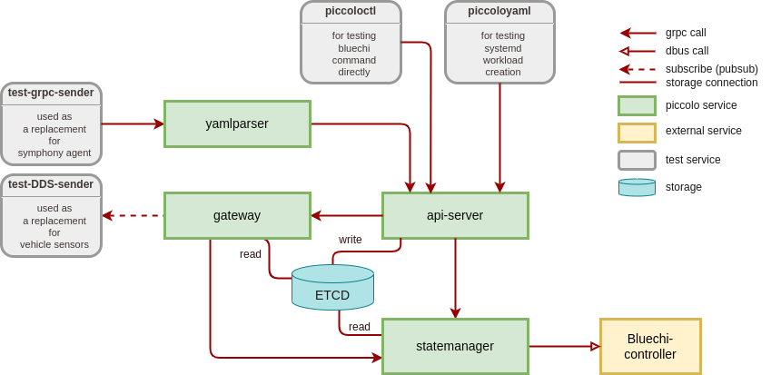

<!--
SPDX-FileCopyrightText: Copyright 2024 LG Electronics Inc.

SPDX-License-Identifier: Apache-2.0
-->

# Piccolo-Bluechi
- [Development](#development)
  - [Environment Setup](#environment-setup)
  - [Code Style](#code-style)
  - [Linting](#linting)
  - [Structure](#structure)
  - [Build](#build)
  - [Static Code Analysis](#static-code-analysis)
  - [Unit Tests](#unit-tests)
  - [Integration Tests](#integration-tests)
  - [Running](#running)
    - [Using Ports](#using-ports)
- [Documentation](#documentation)

## Development

### Environment Setup
For detail, refer to [installation](/doc/docs/getting-started.md#installation).

### Code Style

[rustfmt](https://github.com/rust-lang/rustfmt) is used.
```bash
cargo fmt
```

### Linting

[Clippy](https://doc.rust-lang.org/nightly/clippy/) is used.
```bash
cargo clippy
```

### Structure


For detail, refer to [Structure](/doc/docs/structure.md).

### Build
The first priority is to use Containers, but direct build is also possible. (However, build errors may occur depending on the system.)  
The project is using [cargo](https://doc.rust-lang.org/cargo/) as its build system and command is wrapped in [Makefile](/Makefile).

The binaries and other artifacts (such as the man pages) can be built via:

```bash
make
# same as
cargo build
```

After successfully compiling the binaries, they will be in `./target`.

You can use these directly, but it is recommended to use containers.

```bash
# podman-kube
make image
make install
# docker compose
make up
```
For more details, refer to the [Getting started](/doc/docs/getting-started.md)

### Static Code Analysis
TBD


### Unit tests
Unit tests can be executed using following commands:
```bash
cargo test
```

### Integration tests
TBD

### Running

The following sections describe how to run the built application(s) locally on one machine.  
Refer to [Getting Started](/doc/docs/getting-started.md).

#### Using Ports
```
api-server : 47001
gateway : 47002
statemanager: 47003
yamlparser : 47004
etcd : 2379
```

## Documentation (will be updated)

Files for documentation of this project are located in the [docs](/doc/) directory comprising:

- [api examples](./doc/api-examples/): directory containing source files for different programming languages that use
the D-Bus API of BlueChi, e.g. for starting a systemd unit
- readthedocs files for building the documentation website of BlueChi (see [the README](./doc/README.md) for further information)
- [diagrams.drawio](./doc/diagrams.drawio) file containing all diagrams used for BlueChi
