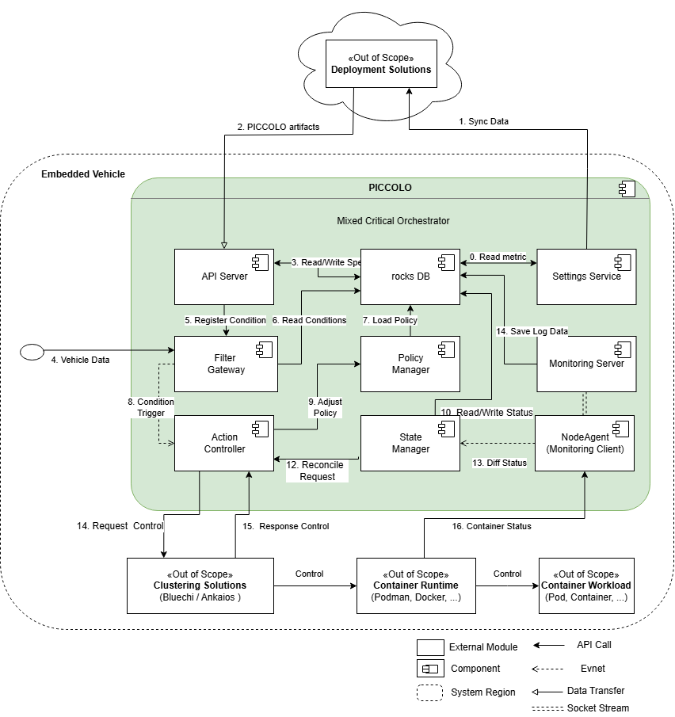

<!--
SPDX-FileCopyrightText: Copyright 2024 LG Electronics Inc.

SPDX-License-Identifier: Apache-2.0
-->

# Piccolo

- [Development](#development)
  - [Environment Setup](#environment-setup)
  - [Code Style](#code-style)
  - [Linting](#linting)
  - [Structure](#structure)
  - [Build](#build)
  - [Static Code Analysis](#static-code-analysis)
  - [Unit Tests](#unit-tests)
  - [Integration Tests](#integration-tests)
  - [Running](#running)
    - [Using Ports](#using-ports)
- [Documentation](#documentation)

## Development

### Environment Setup

For detail, refer to [installation](/doc/docs/getting-started.md#installation).

### Code Style

[rustfmt](https://github.com/rust-lang/rustfmt) is used.

```bash
# in src directory
cargo fmt
```

### Linting

[Clippy](https://doc.rust-lang.org/nightly/clippy/) is used.

```bash
# in src directory
cargo clippy
```

### Structure



For detail, refer to [Structure](/doc/docs/structure.md).

### Build

The first priority is to use Containers, but direct build is also possible. (However, build errors may occur depending on the system.)  
The project is using [cargo](https://doc.rust-lang.org/cargo/) as its build system and command is wrapped in [Makefile](/Makefile).

The binaries and other artifacts (such as the man pages) can be built via:

```bash
make build
# same as
cd src/ && cargo build
```

After successfully compiling the binaries, they will be in `./src/target`.

You can use these directly, but it is recommended to use containers.

```bash
make image
make install
```

For more details, refer to the [Getting started](/doc/docs/getting-started.md)

### Static Code Analysis

TBD

### Unit tests

Unit tests can be executed using following commands:

```bash
# in src directory
cargo test
```

### Integration tests

TBD

### Running

The following sections describe how to run the built application(s) locally on one machine.  
Refer to [Getting Started](/doc/docs/getting-started.md).

#### Using Ports

```Text
gRPC
apiserver : 47001
gateway : 47002
statemanager: 47003

REST
apiserver : 47099

etcd : 2379, 2380
```

## Documentation

Files for documentation of this project are located in the [doc](/doc/) directory comprising:

- [Examples](/examples/version-display/): directory containing all files and guides for performing example
- [piccolo.drawio](/doc/images/piccolo.drawio) file containing all diagrams used for Piccolo

<!-- markdownlint-disable-file MD033 no-inline-html -->