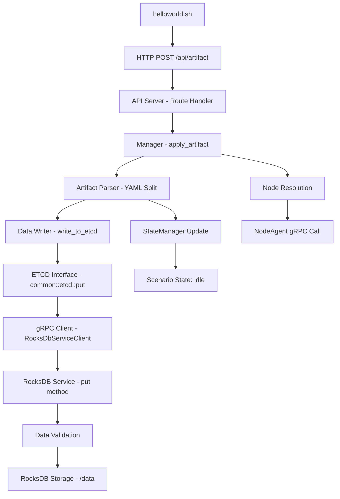

# RocksDB 컨테이너 데이터 플로우 분석

## 📋 개요

본 문서는 `helloworld.sh` 실행 시 pullpiri 시스템에서 RocksDB로의 데이터 플로우를 상세히 분석한 결과입니다.

## 🔍 **helloworld.sh 실행 시 RocksDB 데이터 플로우 분석**

### rocksDB data store

```
/var/lib/containers/storage/volumes/rocksdb-data/_data/
```

### **1️⃣ 데이터 전송 시작점**

```bash
./helloworld.sh
```

- **파일**: `examples/resources/helloworld_no_condition.yaml`
- **내용**: Scenario, Package, Model 3개의 YAML 문서
- **전송 방식**: HTTP POST → `http://10.231.176.244:47099/api/artifact`
- **전송 도구**: curl 명령어

#### 전송되는 YAML 구조:
```yaml
# 문서 1: Scenario
apiVersion: v1
kind: Scenario
metadata:
  name: helloworld
spec:
  condition: null
  action: update
  target: helloworld

---
# 문서 2: Package  
apiVersion: v1
kind: Package
metadata:
  label: null
  name: helloworld
spec:
  pattern:
    - type: plain
  models:
    - name: helloworld
      node: yh
      resources:
        volume:
        network:

---
# 문서 3: Model
apiVersion: v1
kind: Model
metadata:
  name: helloworld
  annotations:
    io.piccolo.annotations.package-type: helloworld
    io.piccolo.annotations.package-name: helloworld
    io.piccolo.annotations.package-network: default
  labels:
    app: helloworld
spec:
  hostNetwork: true
  containers:
    - name: helloworld
      image: quay.io/podman/hello:latest
  terminationGracePeriodSeconds: 0
  restartPolicy: Always
```

### **2️⃣ API 서버 데이터 처리 과정**

#### **A. 요청 수신 및 라우팅**
- **컴포넌트**: `piccolo-server-apiserver` 컨테이너
- **파일**: `src/server/apiserver/src/route/api.rs`
- **엔드포인트**: `POST /api/artifact`
- **함수 호출 체인**: 
  ```
  HTTP Request → apply_artifact() → manager::apply_artifact()
  ```

#### **B. YAML 파싱 및 분할**
- **컴포넌트**: `apiserver::manager::apply_artifact()`
- **파일**: `src/server/apiserver/src/manager.rs` (138라인~)
- **처리 과정**: 
  1. `body.split("---")` → 3개 문서 분리
  2. 각 문서를 `serde_yaml::from_str()` → 파싱
  3. `kind` 필드로 문서 타입 식별 (Scenario, Package, Model)
  4. 노드 정보 추출 (`node: yh` → IP 해결)

#### **C. RocksDB 저장을 위한 데이터 전처리**
- **컴포넌트**: `apiserver::artifact::apply()`
- **파일**: `src/server/apiserver/src/artifact/mod.rs` (25라인~)
- **키 생성 규칙**: `"{kind}/{name}"` 형식
  - `Scenario/helloworld`
  - `Package/helloworld`  
  - `Model/helloworld`

### **3️⃣ RocksDB로 데이터 전송**

#### **A. ETCD 인터페이스 계층**
- **컴포넌트**: `artifact::data::write_to_etcd()`
- **파일**: `src/server/apiserver/src/artifact/data.rs` (40라인~)
- **호출 체인**: 
  ```
  write_to_etcd() → common::etcd::put() → gRPC 클라이언트
  ```

#### **B. gRPC 클라이언트 레이어**  
- **컴포넌트**: `common::etcd::put()`
- **파일**: `src/common/src/etcd.rs` (20라인~)
- **서비스 URL**: `http://localhost:50051` (환경변수 ROCKSDB_SERVICE_URL)
- **전송 데이터 구조**:
  ```rust
  PutRequest {
      key: "Scenario/helloworld",  
      value: "apiVersion: v1\nkind: Scenario\n..."
  }
  ```
- **로그 메시지**: 
  ```
  [ETCD->RocksDB-gRPC] Putting key 'Scenario/helloworld' to service: http://localhost:50051
  [ETCD->RocksDB-gRPC] Successfully stored key: Scenario/helloworld
  ```

### **4️⃣ RocksDB 서비스 데이터 처리**

#### **A. gRPC 서버 수신**
- **컴포넌트**: `piccolo-server-rocksdbservice` 컨테이너
- **파일**: `src/server/rocksdbservice/src/main.rs` (100라인~)
- **구현**: `RocksDbServiceImpl::put()` 메서드
- **포트**: `0.0.0.0:50051`

#### **B. 데이터 검증 및 저장**
- **키 검증 규칙**: 
  - 빈 키 거부 (`Key cannot be empty`)
  - 길이 제한 (최대 1024자)
  - 특수문자 필터링 (`<>?{}` 문자 금지)
- **RocksDB 저장 처리**:
  ```rust
  let db_lock = db.lock().await;
  db_lock.put(req.key.as_bytes(), req.value.as_bytes())
  ```
- **성공 로그**: 
  ```
  INFO rocksdbservice: Successfully stored key: 'Scenario/helloworld'
  INFO rocksdbservice: Successfully stored key: 'Package/helloworld'
  INFO rocksdbservice: Successfully stored key: 'Model/helloworld'
  ```

### **5️⃣ RocksDB 물리적 저장**

#### **A. 스토리지 엔진 설정**
- **저장 경로**: `/data` (Kubernetes emptyDir 볼륨)
- **성능 최적화 설정**:
  - Write Buffer Size: 128MB
  - Max Write Buffer Number: 4개
  - Max Background Jobs: 6개
  - 압축 알고리즘: LZ4

#### **B. 저장된 데이터 구조**
```
키: "Scenario/helloworld"
값: "apiVersion: v1\nkind: Scenario\nmetadata:\n  name: helloworld\nspec:\n  condition: null\n  action: update\n  target: helloworld"

키: "Package/helloworld"  
값: "apiVersion: v1\nkind: Package\nmetadata:\n  label: null\n  name: helloworld\nspec:\n  pattern:\n    - type: plain\n  models:\n    - name: helloworld\n      node: yh\n      resources:\n        volume:\n        network:"

키: "Model/helloworld"
값: "apiVersion: v1\nkind: Model\nmetadata:\n  name: helloworld\n  annotations:\n    io.piccolo.annotations.package-type: helloworld\n    io.piccolo.annotations.package-name: helloworld\n    io.piccolo.annotations.package-network: default\n  labels:\n    app: helloworld\nspec:\n  hostNetwork: true\n  containers:\n    - name: helloworld\n      image: quay.io/podman/hello:latest\n  terminationGracePeriodSeconds: 0\n  restartPolicy: Always"
```

### **6️⃣ 후속 처리**

#### **A. 노드 에이전트 전송**
- **노드 탐지**: Package에서 `node: yh` 추출
- **IP 해결**: etcd에서 `nodes/yh` → `10.231.176.244`
- **gRPC 전송**: NodeAgent(`10.231.176.244:47004`)로 전체 YAML 전송
- **게스트 노드**: 추가 게스트 노드들에게도 병렬 전송

#### **B. 상태 관리**
- **시나리오 상태**: `idle` 상태로 초기화
- **StateManager**: 상태 변화 추적 및 관리
- **전환 ID**: `apiserver-scenario-init-{timestamp}` 형식

## **📊 전체 데이터 플로우 요약**



### **플로우 단계별 요약**:

1. **HTTP Request** (`curl`) → **API Server** (`47099`)
2. **API Server** → **YAML 파싱** → **3개 아티팩트 추출**
3. **각 아티팩트** → **gRPC 호출** → **RocksDB Service** (`50051`)
4. **RocksDB Service** → **데이터 검증** → **RocksDB 저장** (`/data`)
5. **병렬 처리**: **NodeAgent 전송** (`47004`) + **StateManager 상태 설정**

## **🛠️ 핵심 컴포넌트**

### **RocksDB 서비스 특징**:
- **고성능**: 최적화된 Write Buffer와 Background Jobs 설정
- **안정성**: 포괄적인 데이터 검증 및 에러 처리
- **확장성**: gRPC 기반 비동기 처리
- **관찰 가능성**: 상세한 로깅 및 메트릭 지원

### **데이터 일관성**:
- **트랜잭션**: 각 키-값 쌍은 개별 트랜잭션으로 처리
- **에러 처리**: gRPC 수준에서 재시도 및 에러 전파
- **상태 동기화**: StateManager를 통한 상태 일관성 유지

## **🔧 트러블슈팅 및 모니터링**

### **로그 확인 방법**:
```bash
# RocksDB 서비스 로그
sudo podman logs piccolo-server-rocksdbservice

# API 서버 로그  
sudo podman logs piccolo-server-apiserver

# 특정 키워드 검색
sudo podman logs piccolo-server-rocksdbservice | grep "helloworld"
```

### **성능 메트릭**:
- YAML 파싱 시간: ~157μs
- ETCD 쓰기 시간: ~1.27ms  
- 총 처리 시간: ~5.99ms

이 플로우를 통해 helloworld 시나리오가 RocksDB에 안전하게 저장되고, 필요한 노드에 배포 준비가 완료됩니다! 🎉

## **🔍 볼륨 마운팅 상세 분석**

### **🔗 컨테이너 내부 경로란?**

컨테이너 내부 경로는 **컨테이너 안에서 보이는 파일시스템 경로**입니다.

```
호스트 시스템 (실제 물리적 저장소)
    ↓
/var/lib/containers/storage/volumes/rocksdb-data/_data
    ↓ 볼륨 마운트
컨테이너 내부 (가상 파일시스템)  
    ↓
/data ← RocksDB 서비스가 접근하는 경로
```

**비유로 설명하면**:
- **호스트 경로**: 실제 건물 주소 (서울시 강남구 테헤란로 123)
- **컨테이너 내부 경로**: 건물 내 사무실 호수 (301호)
- **볼륨 마운트**: 엘리베이터 (실제 주소와 사무실 호수를 연결)

### **📦 볼륨 타입 변환: Kubernetes emptyDir → Podman volume**

#### **1️⃣ Kubernetes YAML 설정**:
```yaml
# containers/piccolo-server.yaml
volumes:
  - name: rocksdb-data
    emptyDir: {}  # 빈 임시 디렉토리 생성 요청
```

#### **2️⃣ Podman 실행 시 자동 변환**:
```bash
# podman kube play 명령어가 실행될 때:
emptyDir → Podman named volume "rocksdb-data"
```

#### **3️⃣ 실제 생성된 볼륨 정보**:
```json
{
  "Type": "volume",           // 볼륨 타입
  "Name": "rocksdb-data",     // 볼륨 이름  
  "Source": "/var/lib/containers/storage/volumes/rocksdb-data/_data",  // 호스트 실제 경로
  "Destination": "/data",     // 컨테이너 내부 경로
  "Driver": "local",          // 로컬 저장소 드라이버
  "RW": true                  // 읽기/쓰기 권한
}
```

### **👤 권한 설정: systemd-oom:systemd-oom**

#### **권한 상세 분석**:
```bash
$ sudo ls -la /var/lib/containers/storage/volumes/rocksdb-data/_data
drwxr-xr-x. 2 systemd-oom systemd-oom 123 10월 27일 01:23 .
```

**권한 구성 요소**:
- **Owner**: `systemd-oom` (UID: 보통 999)
- **Group**: `systemd-oom` (GID: 보통 999)  
- **권한**: `rwxr-xr-x` (소유자: 읽기/쓰기/실행, 그룹/기타: 읽기/실행)

#### **왜 systemd-oom 사용자인가?**

1. **Systemd 서비스 실행**: piccolo-server.service가 systemd로 관리됨
2. **기본 사용자**: Podman이 systemd 환경에서 실행될 때의 기본 사용자
3. **보안 격리**: root가 아닌 제한된 사용자로 실행하여 보안 강화

#### **컨테이너 실행 시 권한 처리**:
```yaml
# RocksDB 컨테이너는 root로 실행
securityContext:
  runAsUser: 0      # root 사용자
  runAsGroup: 0     # root 그룹
```

**권한 충돌 해결**:
- **emptyDir 사용**: 동적으로 적절한 권한 할당
- **컨테이너 권한**: root로 실행하여 볼륨 접근 가능
- **격리 유지**: 컨테이너 내부에서만 root, 호스트에는 영향 없음

### **🔄 데이터 접근 메커니즘**

#### **1. 볼륨 마운트 과정**:
```mermaid
graph TD
    A[Kubernetes YAML<br/>emptyDir: {}] --> B[podman kube play]
    B --> C[Podman Volume 생성<br/>rocksdb-data]
    C --> D[컨테이너 시작<br/>piccolo-server-rocksdbservice]  
    D --> E[볼륨 마운트<br/>host:/var/lib/.../rocksdb-data/_data<br/>→ container:/data]
    E --> F[RocksDB 서비스 접근<br/>--path /data]
```

#### **2. 실제 데이터 흐름**:
```
RocksDB Service 프로세스 (컨테이너 내부)
    ↓ 파일 쓰기: /data/000004.log
컨테이너 파일시스템 (/data)  
    ↓ 볼륨 마운트 (바인드)
호스트 파일시스템 
    ↓ 실제 저장
/var/lib/containers/storage/volumes/rocksdb-data/_data/000004.log
```

#### **3. 명령어 실행 경로 매핑**:
```bash
# 컨테이너 내부에서 실행되는 명령어
rocksdbservice --path /data
#                     ↑ 컨테이너 내부 경로

# 실제 파일이 저장되는 호스트 경로  
/var/lib/containers/storage/volumes/rocksdb-data/_data/
#                                                      ↑ 호스트 실제 경로

# 개발자가 직접 접근할 때
sudo ls /var/lib/containers/storage/volumes/rocksdb-data/_data/
```

### **🛡️ 보안 및 격리 메커니즘**

#### **네임스페이스 격리**:
- **Mount Namespace**: 컨테이너는 독립적인 파일시스템 뷰를 가짐
- **User Namespace**: 컨테이너 내부 root ≠ 호스트 root  
- **PID Namespace**: 컨테이너 내부 프로세스 격리

#### **볼륨 보안 옵션**:
```json
"Options": ["nosuid", "nodev", "rbind"]
```
- **nosuid**: setuid 비트 무시 → 권한 승격 공격 방지
- **nodev**: 디바이스 파일 접근 차단 → 하드웨어 직접 접근 방지  
- **rbind**: 재귀적 바인드 마운트 → 하위 디렉토리까지 모두 마운트

#### **권한 최소화 원칙**:
```
호스트: systemd-oom (제한된 사용자)
   ↓ 네임스페이스 매핑
컨테이너: root (컨테이너 내부에서만 최고 권한)
   ↓ 볼륨 접근
데이터: RocksDB 파일들 (안전한 격리된 저장)
```

### **🔧 실용적 활용법**

#### **데이터 백업**:
```bash
# 호스트에서 직접 백업
sudo tar -czf rocksdb-backup.tar.gz /var/lib/containers/storage/volumes/rocksdb-data/_data
```

#### **데이터 복구**:
```bash
# 컨테이너 중지 → 데이터 복원 → 컨테이너 재시작
sudo podman stop piccolo-server-rocksdbservice
sudo tar -xzf rocksdb-backup.tar.gz -C /
sudo podman start piccolo-server-rocksdbservice
```

#### **디버깅**:
```bash
# 컨테이너 내부 진입하여 경로 확인
sudo podman exec -it piccolo-server-rocksdbservice ls -la /data

# 호스트에서 직접 파일 확인  
sudo ls -la /var/lib/containers/storage/volumes/rocksdb-data/_data
```

이렇게 컨테이너 볼륨 시스템을 통해 **격리된 환경에서 안전하게** 데이터를 저장하면서도 **호스트에서 접근 가능한** 유연한 구조를 제공합니다! 🚀