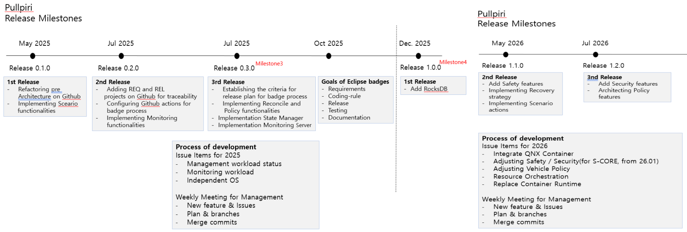
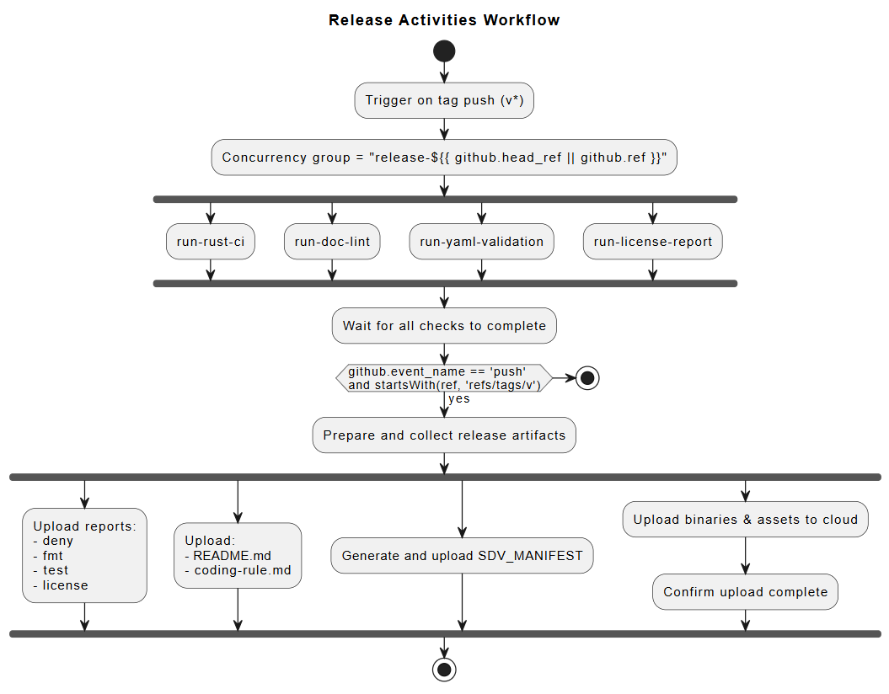
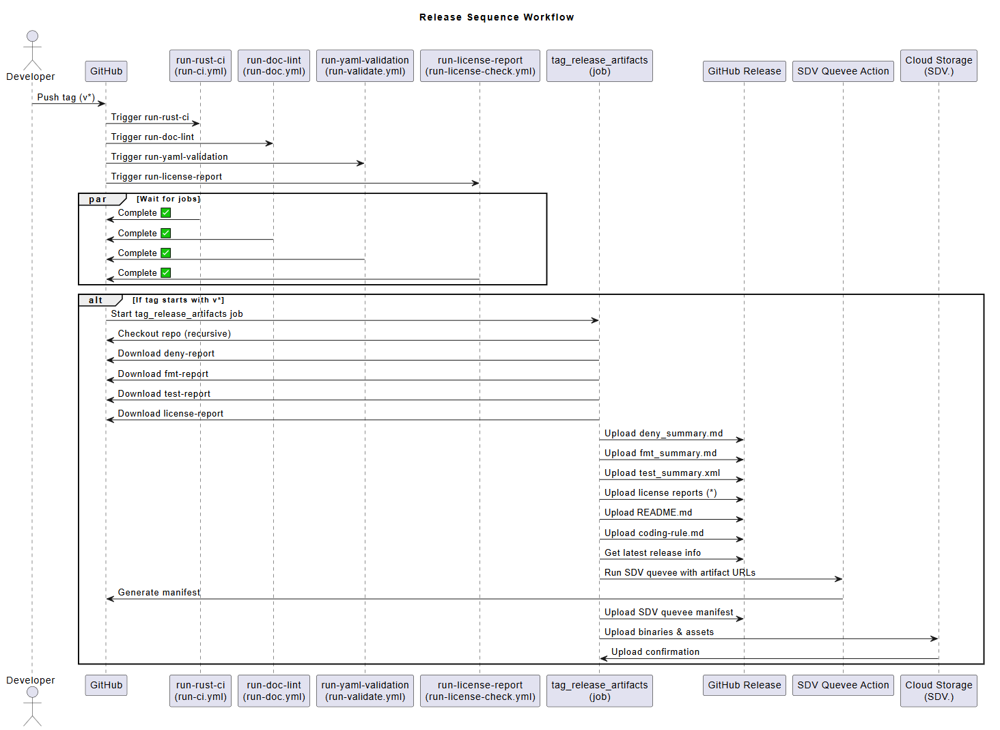

<!--
SPDX-FileCopyrightText: Copyright 2024-25 LG Electronics Inc.

SPDX-License-Identifier: Apache-2.0
-->

# Pullpiri

- [Release Management](#release-management)
  - [Release Plan](#release-plan)
  - [Release Process](#release-process)
    - [Release workflow](#release-workflow)

## Release Management

### Release Plan



### Release Process

This Project is integrated with usage of Github Actions
(CI/CD Pipeline workflow) for release process.
The release artifacts are generated by the using the below commands:

```bash
# In the project directory
git tag vX.X.XX (eg. git tag v1.0.00)
git push origin vX.X.XX
```

Once the TAG is pushed, the Github Actions triggers the building
of release artifacts as defined in the Release workflow sections.
finally the Release notes for the respective release is generated
and managed with the help of
[release notes](https://docs.github.com/en/repositories/releasing-projects-on-github/automatically-generated-release-notes).

#### Release workflow





<!-- markdownlint-disable-file MD033 no-inline-html -->
