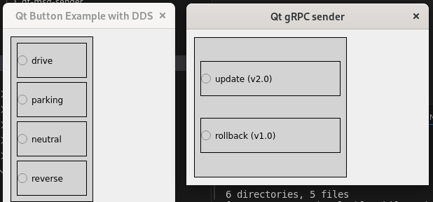
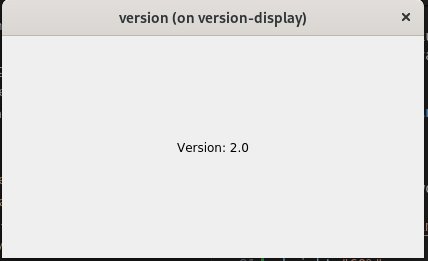
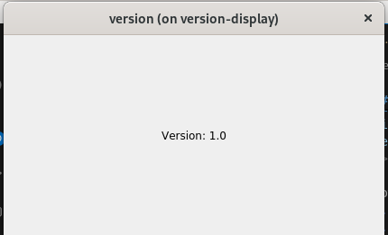

# version-display example

## Build test application
This container image only show `version:x.0` in monitor.
```bash
# in 'doc/examples/version-display/app' directory
podman build --no-cache --build-arg VERSION=1.0 -t version-display:1.0 .
podman build --no-cache --build-arg VERSION=2.0 -t version-display:2.0 .
```

You can see
```
# podman images
REPOSITORY                   TAG   IMAGE ID      CREATED        SIZE
...
localhost/version-display    2.0   d1b0cd9eb6c2  12 hours ago   566 MB
localhost/version-display    1.0   892206770723  12 hours ago   566 MB
...
```

## Build dds/grpc message sender

There are 2 msg sender application written in pyqt.
```bash
# in 'doc/examples/version-display/qt-msg-sender' directory
podman build --no-cache -t pyqt-dds-sender:1.0 -f pyqt-dds-sender/Dockerfile .
podman build --no-cache -t pyqt-grpc-sender:1.0 -f pyqt-grpc-sender/Dockerfile .
```
You can see,
```
# podman images
localhost/pyqt-grpc-sender   1.0   ede75e404c1b  6 hours ago    950 MB
localhost/pyqt-dds-sender    1.0   7a9e5b7a6580  7 hours ago    917 MB
```

## Running Piccolo
```bash
# in top folder,
make image
```
Then,
```
# podman images
REPOSITORY                   TAG     IMAGE ID      CREATED        SIZE
localhost/piccolo-gateway    1.0     5df0f9b55414  4 hours ago    84.7 MB
localhost/piccolo            1.0     590a847ef028  4 hours ago    36.3 MB
```

Now,
```bash
# in top folder,
make install
```

You can find,
```
# podman ps | grep piccolo
fe7721ed  localhost/piccolo:1.0                  ...   piccolo-yamlparser
8fc4a363  localhost/piccolo:1.0                  ...   piccolo-api-server
52842bbf  localhost/piccolo:1.0                  ...   piccolo-statemanager
0083aafd  gcr.io/etcd-development/etcd:v3.5.11   ...   piccolo-etcd
1ac934af  localhost/piccolo-gateway:1.0          ...   piccolo-gateway

# tree /root/piccolo_yaml/version-display/
/root/piccolo_yaml/version-display/
├── version-display_1.0.kube
├── version-display_1.0.yaml
├── version-display_2.0.kube
└── version-display_2.0.yaml

# tree /etc/containers/systemd/
/etc/containers/systemd/
└── piccolo
    ├── etcd-data
    │   └── member
    │       ├── ...
    │       └── ...
    ├── example
    ├── piccolo.kube
    └── piccolo.yaml
```

## Running container example
```bash
make tinstall
```
Then there are two X11 applications.



Now, if you press the following buttons sequentially, the color of buttons are changed to green.
1. update button (in Qt gRPC sender)
2. parking (in Qt button Example...)

And, you can see version-display container window.



Simillary, if you press the following buttons sequentially, the color of buttons are changed to green.
1. rollback button (in Qt gRPC sender)
2. reverse (in Qt button Example...)



## Clean up

```bash
make uninstall
make tuninstall
```